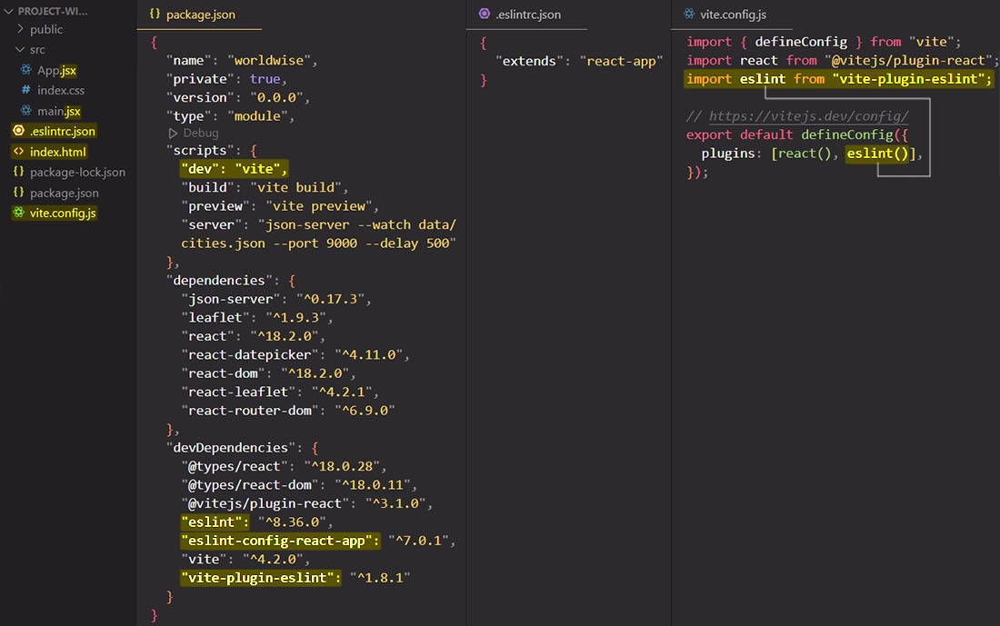

# Create a React project with Vite

To create a React project with Vite, you need to follow these steps:

1. In your VSCode terminal, go to the folder where you want to create your React project. Instead of `npx create-react-app my-app` (the old way of creating a React App with the help of create-react-app), you need to install Vite with ==**`npm create vite@latest`**==. If you are using this command for the first time, it will ask you to install the Vite package, and so then you just hit Enter or Y to confirm that.

2. After you create your React App, you need to go to the newly created folder and ==install manually the dependencies with `npm install` or `npm i`==. With Create React App, you didn't have to do that because with Create React App the newly created folder would already contain the node modules folder, but ==with Vite you need to install the dependencies manually==.

3. The great thing about Create React App is that it already comes with all the important developer tools pre-installed, and the most important one of those is by far ESLint. ==With Vite you now need to manually config ESLint in your project==, so each time then you set up a new project with Vite, you need to manually config ESLint.

   To configure ESLint, you need to install a few NPM packages:

   - `eslint` itself;
   - `vite-plugin-eslint`;
   - `eslint-config-react-app`.

   The command in VSCode to install al these packages is ==`npm install eslint vite-plugin-eslint eslint-config-react-app --save-dev`==. With `--save-dev` you save all these packages as `devDependecies`.

4. Next, you need to actually ==config your project to integrate with these packages==. For that you need to ==create a new file called `.eslintrc.json` with an `{"extends": "react-app"}` object.== The `.eslintrc.json` file basically configure the behavior of ESLint, and in this case what you want to do is to _extend the default rules of ESLint with those React rules that you just installed_.

5. Finally, you also need to ==config your Vite project with the `vite.config.js` file.== On `vite.config.js` file you can configure all kinds of things about development and building of your project, but here all you need to do is to ==add the ESLint plugin to `plugins` array==.

> Note: The file structure created with Vite is different that the file structure created with Create-React-App:
>
> - ==`index.html` is outside of the `public` folder== (React really doesn't care about this structure and it doesn't even know, basically, what the structure of the folder is. React really only is concerned about displaying components onto the screen, it doesn't care about the file structure.);
> - instead of `.js` file extension, now you have ==`.jsx` file extension== (`.jsx` file extension stands for JavaScript JSX, so it's pretty much the same as a JavaScript file, but Vite really needs this to be `.jsx` files and not just `.js` files.). Vite need the ==`.jsx` file extension only if you have a component that return JSX markup==. If you have a custom hook you need to use the `.js` file extension);
> -  the entry point is not `index.js`, instead is ==`main.jsx`==;
> - to start the application you don't write in your VSCode terminal the `npm run start` command, but you need to write ==`npm run dev`== command.

## References

1. [Vite](https://vitejs.dev/)
1. [The Ultimate React Course: React, Redux & More - Jonas Schmedtmann](https://www.udemy.com/course/the-ultimate-react-course/)
