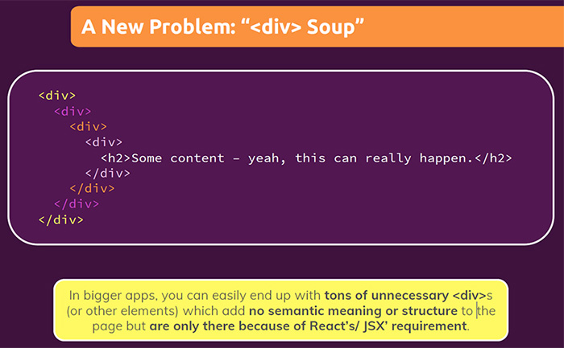

# JSX limitations & workarounds

You ==can’t return more than one "root" JSX element== (you also can’t store more than one "root" JSX element in a variable).

> **Note**: JSX is that markup you return in your components, which in the end will be rendered to the real DOM by React. That's what JSX is and you use it all the time.


## The solution

The solution is to ==always wrap adjacent elements==. You can use as a wrapper any element (`div`, `p`, `header`), or you can also use a custom component. The main thing that matters is that ==you only have one value which you return or which you store it in a variable==.


## Creating a wrapper component

A ==wrapping element== it's an element which ==won't render anything to the DOM==, but the requirement is not that there must be one root component being rendered to the DOM, ==the requirement just is that there must be **one root element that you return** _or_ that you **store in a variable**==.

```react
// Build a wrapper component
const Wrapper = props => {
  return props.children;
};

export default Wrapper;
```

```react
// Wrap JSX elements with the help of wrapper component
const CustomEl = props => {
  return (
    <Wrapper>
        <h1>Hi there!<h1/>
        <p>Lorem ipsum doloret...<p/>
    </Wrapper>
  );
};

export default CustomEl;
```

## A new problem: "`<div>` soup"

In bigger apps, you can easily end up with tons of unnecessary `<div>`s (or other elements) which add ==no semantic meaning or structure== to the page, but ==are only there because of React's/ JSX requirement==.



## `React.Fragment` or shorthand syntax `<></>`

A common pattern in React is for a component to return multiple elements. ==Fragments let you group a list of children **without adding extra nodes to the DOM**.==

==You can access the **Fragment component** with `React.Fragment`, or in some projects you can also use the **shortcut syntax `<></>`**. These two syntaxes (`React.Fragment` & shortcut syntax) **render empty wrappers**, which don't render any actual HTML element to the DOM==. It's just built into React, but I showed you our custom wrapper, so that you understand what these built-in wrappers do.


> **Note**: You can use the shorthand syntax `<></>` the same way you’d use any other element, except that it doesn’t support _keys_ or _attributes_.
>
> ```react
> render() {
> return (
>  <>
>    <ChildA />
>    <ChildB />
>    <ChildC />
>  </>
> );
> }
> ```
>
> Shortcut syntax depends on your project set-up, because your build workflow needs to support shortcut syntax, and that's the same as our custom wrapper component.

## References

1. [React - The Complete Guide (incl Hooks, React Router, Redux) - Maximilian Schwarzmüller](https://www.udemy.com/course/react-the-complete-guide-incl-redux/)
