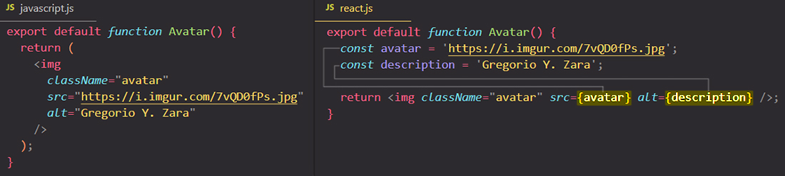
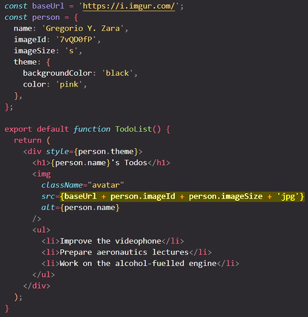
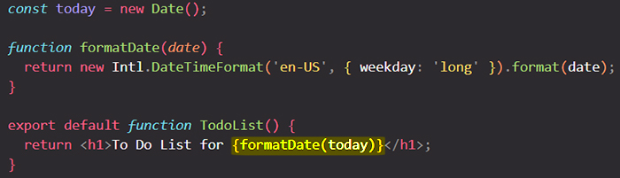
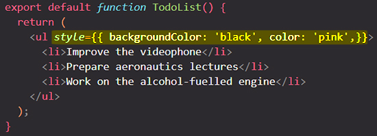
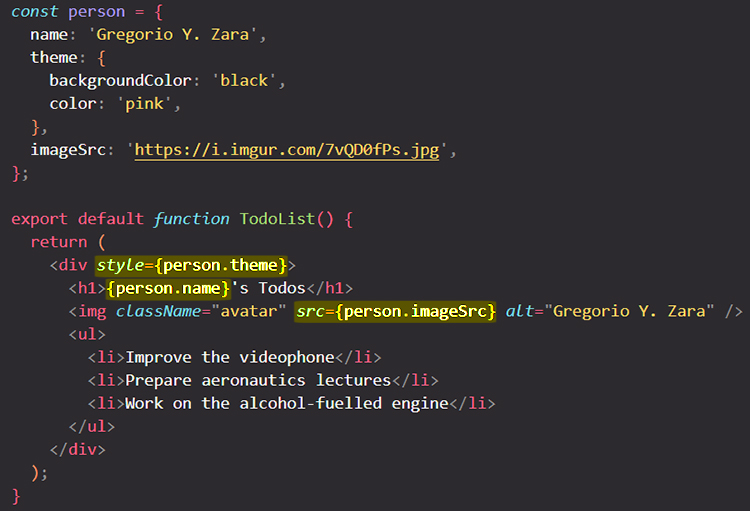

# Outputting dynamic data & working with expressions in JSX markup

JSX lets you write HTML-like markup inside a JavaScript file, keeping rendering logic and content in the same place. ==Sometimes you will want to add a little JavaScript logic or reference a dynamic property inside the JSX markup. In this situation, you can use  <code>{}</code> in your JSX markup to open a window to JavaScript==.

You will learn:

- How to pass strings with quotes
- How to reference a JavaScript variable inside JSX with curly braces
- How to call a JavaScript function inside JSX with curly braces
- How to use a JavaScript object inside JSX with curly braces

## JavaScript in JSX with Curly Braces

JSX lets you put markup into JavaScript. Curly braces let you “escape back” into JavaScript so that you can embed some variable from your code and display it to the user or to write some expressions. For example, this will display `user.name`:

```react
return <h1>{user.name}</h1>
```

==You can write expressions in JSX markup with the help of **curly brackets `{}`**==. Any JavaScript expression will work between curly braces, including function calls.

 ==JSX is a special way of writing JavaScript. That means it’s possible to use JavaScript inside it — with curly braces `{}`==.

## Using curly braces: a window into the JavaScript world

==You can only use curly braces in **two ways** inside JSX:==

1. ==**As text** directly inside a JSX tag:== `<h1>{name}'s To Do List</h1>` works, but `<{tag}>Gregorio Y. Zara's To Do List</{tag}>` will not.
2. ==**As attributes** immediately following the `=` sign:== `src={avatar}` will read the `avatar` variable, but `src="{avatar}"` will pass the string `"{avatar}"`.

### JSX curly braces & JSX attributes

When you want to pass a string attribute to JSX, you put it in single or double quotes. In first JavaScript file, `"https://i.imgur.com/7vQD0fPs.jpg"` and `"Gregorio Y. Zara"` are being passed as strings. But what if you want to _dynamically_ specify the `src` or `alt` text? You could **use a value from JavaScript by replacing `" "` with `{ }`**.

==You can also “escape into JavaScript” from JSX attributes==, but you have to use curly braces _instead of_ quotes:



Notice the difference between `className="avatar"`, which specifies an `"avatar"` CSS class name that makes the image round, and `src={avatar}` that reads the value of the JavaScript variable called `avatar`. That’s because ==curly braces let you work with JavaScript right there in your markup!==

### Write any expression inside JSX curly braces

==You can put more complex expressions inside the JSX curly braces too==, for example, [string concatenation](https://javascript.info/operators#string-concatenation-with-binary):



> **Note**: In the above example, `style={{}}` is not a special syntax, but a regular `{}` object inside the `style={ }` JSX curly braces. You can use the `style` attribute when your styles depend on JavaScript variables.

==Any JavaScript expression will work between curly braces, including function calls== like `formatDate()`:



### Using “double curlies”: CSS and other objects in JSX 

In addition to strings, numbers, and other JavaScript expressions, ==you can even pass objects in JSX==. Objects are also denoted with curly braces, like `{ name: "Hedy Lamarr", inventions: 5 }`. Therefore, ==to pass a JS object in JSX, you must wrap the object in another pair of curly braces==: `person={{ name: "Hedy Lamarr", inventions: 5 }}`.

You may see this with inline CSS styles in JSX. React does not require you to use inline styles (CSS classes work great for most cases). But when you need an inline style, you pass an object to the `style` attribute:



> **Note**: The next time you see `{{ ... }}` in JSX, know that it’s nothing more than an object inside the JSX curlies!

### More fun with JavaScript objects and curly braces

You can move several expressions into one object, and reference them in your JSX inside curly braces:



==JSX is very minimal as a templating language because it lets you organize data and logic using JavaScript==.

## Summary

You can only use curly braces in two ways inside JSX:

- ==**as text** directly inside a JSX tag==: `<<span>h1>{name}'s To Do List<</span>/h1>` works, but `<{tag}>Gregorio Y. Zara's To Do List<span><</span>/{tag}>` will not.
- ==**as attributes** immediately following the `=` sign==: `src={avatar}` will read the `avatar` variable, but `src="{avatar}"` will pass the string "{avatar}".

Now you know almost everything about JSX:

- JSX attributes inside quotes are passed as strings;
- Curly braces let you bring JavaScript logic and variables into your markup;
- They work inside the JSX tag content or immediately after `=` in attributes;
- `{{ ... }}` is not special syntax: it’s a JavaScript object tucked inside JSX curly braces.

## References

1. [React - The Complete Guide (incl Hooks, React Router, Redux) - Maximilian Schwarzmüller](https://www.udemy.com/course/react-the-complete-guide-incl-redux/)
1. [JavaScript in JSX with Curly Braces - beta.reactjs.org](https://beta.reactjs.org/learn/javascript-in-jsx-with-curly-braces)