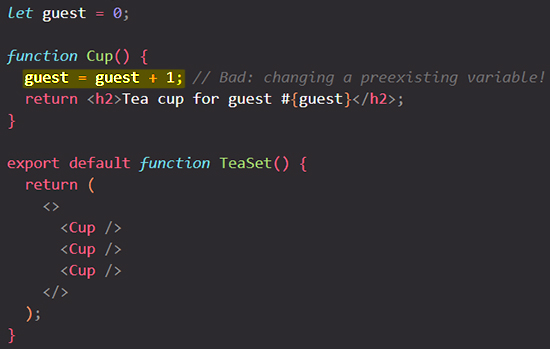
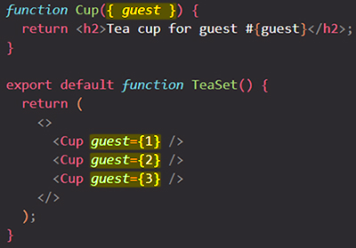
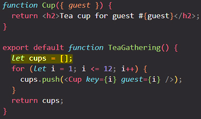

# Keeping components pure

Some JavaScript functions are *pure.* ==Pure functions only perform a calculation and nothing more==. By strictly only writing your components as pure functions, you can avoid an entire class of baffling bugs and unpredictable behavior as your codebase grows. To get these benefits, though, there are a few rules you must follow.

You will learn:

- What purity is and how it helps you avoid bugs
- How to keep components pure by **keeping changes out of the render phase**
- How to use Strict Mode to find mistakes in your components

## Purity: Components as formulas 

In computer science (and especially the world of functional programming), [a pure function](https://wikipedia.org/wiki/Pure_function) is a function with the following characteristics:

- ==**It minds its own business**. It does _not change any objects or variables that existed before it was called_==.
- ==**Same inputs, same output**. Given the _same inputs_, a pure function should always return the _same result_==.

> **IMPORTANT**: React is designed around this concept. **React assumes that every component you write is a pure function**. This means that **React components you write must always return the same JSX given the same inputs**.

You could think of your components as recipes: if you follow them and don’t introduce new ingredients during the cooking process, you will get the same dish every time. That “dish” is the JSX that the component serves to React to [render.](https://beta.reactjs.org/learn/render-and-commit)

## Side Effects: (un)intended consequences

==React’s **_rendering process_ must always be pure**. Components should **only *return* their JSX**, and **_not change_ any objects or variables that existed before rendering** — that would make them impure!==

The above component is _reading and writing_ a `guest` variable declared outside of it. This means that **calling the `Cup` component multiple times will produce different JSX!** And what’s more, if *other* components read `guest`, they will produce different JSX too, depending on when they were rendered! That’s not predictable.

You can fix this component by [passing `guest` as a prop instead](https://beta.reactjs.org/learn/passing-props-to-a-component):

Now your component is pure, as the JSX it returns only depends on the `guest` prop.

> **IMPORTANT**: ==In general, you should not expect your components to be rendered in any particular order==. It doesn’t matter if you call `<Cup guest={1}>` before or after `<Cup guest={3}>`: both components will **resolve independently of each other**. In the same way, ==each component should only “think for itself”, and not attempt to coordinate with or depend upon others during rendering. Rendering is like a school exam: **each component should calculate JSX on their own!**==

### Detecting impure calculations with StrictMode

==Although you might not have used them all yet, in React there are three kinds of inputs that you can read while rendering: **[props](https://beta.reactjs.org/learn/passing-props-to-a-component)**, **[state](https://beta.reactjs.org/learn/state-a-components-memory)**, and **[context.](https://beta.reactjs.org/learn/passing-data-deeply-with-context)** You should always treat these inputs as **read-only**==.

==When you want to *change* something in response to user input, **you should [set state](https://beta.reactjs.org/learn/state-a-components-memory) instead of writing to a variable**. You should never change preexisting variables or objects while your component is rendering.==

==React offers a “Strict Mode” in which it calls each component’s function twice during development. **By calling the component functions twice, Strict Mode helps find components that break these rules.**==

Notice how the original example of calling `<Cup>` displayed “Guest #2”, “Guest #4”, and “Guest #6” instead of “Guest #1”, “Guest #2”, and “Guest #3”. **The original function was impure, so calling it twice broke it. But the fixed pure version works even if the function is called twice every time**. ==**Pure functions only calculate, so calling them twice won’t change anything**== — just like calling `double(2)` twice doesn’t change what’s returned, and solving y = 2x twice doesn’t change what y is. **Same inputs, same outputs. Always**.

Strict Mode has no effect in production, so it won’t slow down the app for your users. To opt into Strict Mode, you can wrap your root component into `<React.StrictMode>`. Some frameworks do this by default.

### Local mutation: Your component’s little secret 

In the above example, the problem was that the component changed a *preexisting* variable while rendering. This is often called a **“mutation”** to make it sound a bit scarier. ==Pure functions don’t mutate variables outside of the function’s scope or objects that were created _before_ the call== — that makes them impure!

However, ==**it’s completely fine to change variables and objects that you’ve just created while rendering.**== In this example, you create an `[]` array, assign it to a `cups` variable, and then `push` a dozen cups into it:

If the `cups` variable or the `[]` array were created outside the `TeaGathering` function, this would be a huge problem! You would be changing a *preexisting* object by pushing items into that array.

However, it’s fine because you’ve created them *during the same render*, inside `TeaGathering`. No code outside of `TeaGathering` will ever know that this happened. This is called **“local mutation”** — it’s like your component’s little secret.

## Where you *can* cause side effects

While functional programming relies heavily on purity, at some point, somewhere, *something* has to change. That’s kind of the point of programming! These changes — updating the screen, starting an animation, changing the data — are called **side effects.** ==They’re things that happen *“on the side”*, not during rendering==.

==In React, **side effects usually belong inside [event handlers.](https://beta.reactjs.org/learn/responding-to-events)**== Event handlers are functions that React runs when you perform some action — for example, when you click a button. ==Even though event handlers are defined *inside* your component, they don’t run *during* rendering! **So event handlers don’t need to be pure.**==

==If you’ve exhausted all other options and can’t find the right event handler for your side effect, you can still attach it to your returned JSX with a [`useEffect`](https://beta.reactjs.org/reference/react/useEffect) call in your component. This tells React to execute it later, _after_ rendering, when side effects are allowed. **However, this approach should be your last resort.**==

When possible, try to express your logic with rendering alone. You’ll be surprised how far this can take you!

## Why does React care about purity?

Writing pure functions takes some habit and discipline. But it also unlocks marvelous opportunities:

- ==Your components could run in a **different environment**== — for example, on the server! Since they return the same result for the same inputs, one component can serve many user requests.
- ==You can improve performance by **[skipping rendering](https://beta.reactjs.org/reference/react/memo) components whose inputs have not changed**==. This is safe because pure functions always return the same results, so they are safe to cache.
- ==If some data changes in the middle of rendering a deep component tree, React can restart rendering without wasting time to finish the outdated render==. Purity makes it safe to stop calculating at any time.

## Summary

- A component must be pure, meaning:
  - **It minds its own business.** It should not change any objects or variables that existed before rendering.
  - **Same inputs, same output.** Given the same inputs, a component should always return the same JSX.
- Rendering can happen at any time, so components should not depend on each others’ rendering sequence.
- You should not mutate any of the inputs that your components use for rendering. That includes props, state, and context. To update the screen, [“set” state](https://beta.reactjs.org/learn/state-a-components-memory) instead of mutating preexisting objects.
- Strive to express your component’s logic in the JSX you return. When you need to “change things”, you’ll usually want to do it in an event handler. As a last resort, you can `useEffect`.

## References

1. [Keeping Components Pure - beta.reactjs.org](https://beta.reactjs.org/learn/keeping-components-pure)