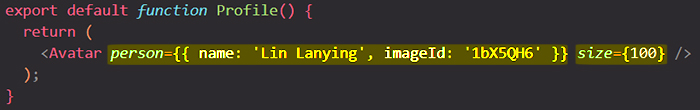

# Passing Data via props

==React components use **_props_ to communicate** with each other. Every parent component can pass some information to its child components by giving them props. Props might remind you of HTML attributes, but you can pass any JavaScript value through them, including objects, arrays, functions, and even JSX markup! Props are the information that you pass to a JSX tag, or you can see them as the **"attributes"** of your custom HTML elements==.

React will ensure that we get **one parameter in every component** which we use as a component, and that one parameter will be an **object** which holds all the received **attributes as properties**, hence the name props for the overall concept. Therefore, we get one parameter, and you can name that parameter whatever you want. Typically, _it's named props to make it clear that is the object which holds all the values we get for the attributes on our custom element_.

props is a super important concept because it allows you to ==make your components _reusable_==, and it ==allows you to _pass data_ from a component to another component==.

_props are not limited to **dynamically** set values. We can do that, but we don't have to. We also **hard coded** value in props_. ==The main idea behind props is always the same though: we wanna make sure that **we can pass data into our components** to make them **configurable** and **reusable**==.

props are our way of **passing data** from component A to B, and it's also totally fine to have a **component which just passes data on**. We pass data from a component to a direct child component, so to a component which is used in that other components JSX code, and we can't skip such a component.

```react
const Component = (props) => {
    return <div>
    	<h1>Hello!</h1>
        <span>{props.introduction}</span>
    </div>
}

const App = () => {
    return <div>
    	<Component introduction='My name is Tom and I like football!' />
    </div>
}
```

> **Note**: The convention for props _which hold functions_ is to start their name with **"on"**:
>
> ```react
> <Cart onHideModal={hideModalHandler} />
> <Header onShowModal={showModalHandler} />
> ```



## Props let you think about parent and child components independently

```react
function Avatar({ person, size }) {
  // person and size are available here
}

function Profile() {
  return (
    <Avatar
      person={{ name: 'Lin Lanying', imageId: '1bX5QH6' }}
      size={100}
    />
  );
}
```

==Props let you think about parent and child components independently==. For example, you can change the `person` or the `size` props inside `Profile` without having to think about how `Avatar` uses them. Similarly, you can change how the `Avatar` uses these props, without looking at the `Profile`.

You can think of props like “knobs” that you can adjust. They serve the same role as arguments serve for functions — in fact, props _are_ the only argument to your component! React component functions accept a single argument, a `props` object:

```react
function Avatar(props) {
  let person = props.person;
  let size = props.size;
  // ...
}
```

==Usually you don’t need the whole `props` object itself, so you can **destructure** it into individual props==:

```react
function Avatar({ person, size }) {
  // ...
}
```

## Specifying a default value for a prop

If you want to give a prop a default value to fall back on when no value is specified, you can do it with the destructuring by putting `=` and the default value right after the parameter:

```react
function Avatar({ person, size = 100 }) {
  // ...
}
```

Now, if `<Avatar person={...} />` is rendered with no `size` prop, the `size` will be set to `100`. The default value is only used if the `size` prop is missing or if you pass `size={undefined}`. But if you pass `size={null}` or `size={0}`, the default value will **not** be used.

## Forwarding props with the spread syntax

Sometimes, passing props gets very repetitive:

```react
function Profile({ person, size, isSepia, thickBorder }) {
  return (
    <div className="card">
      <Avatar
        person={person}
        size={size}
        isSepia={isSepia}
        thickBorder={thickBorder}
      />
    </div>
  );
}
```

There’s nothing wrong with repetitive code — it can be more legible. But at times you may value conciseness. ==Some components forward all of their props to their children==, like how this `Profile` does with `Avatar`. Because they don’t use any of their props directly, it can make sense to use a more concise “spread” syntax:

```react
function Profile(props) {
  return (
    <div className="card">
      <Avatar {...props} />
    </div>
  );
}
```

This forwards all of `Profile`’s props to the `Avatar` without listing each of their names. **Use spread syntax with restraint.** If you’re using it in every other component, something is wrong. Often, it indicates that you should split your components and pass children as JSX.

#### Another example

```react
const Input = (props) => {
  return (
    <div>
      <label htmlFor={props.input.id}>{props.label}</label>
      <input {...props.input} />
    </div>
  );
};
// props.input will be an object

const MealItemForm = (props) => {
  return (
    <form>
      <Input
        label='Amount'
        input={{ // this object will be spread to the <input {...props.input} />
          id: 'amount_' + props.id,
          type: 'number',
          min: '1',
          max: '5',
          step: '1',
          defaultValue: '1',
        }}
      />
      <button>+ Add</button>
    </form>
  );
};
```

## Passing JSX as children: `props.children`

It is common to nest built-in browser tags:

```react
<div>
  
</div>
```

Sometimes you’ll want to nest your own custom components the same way:

```react
<Card>
  <Avatar />
</Card>
```

When you nest content inside a JSX tag, the parent component will receive that content in a prop called `children`. For example, the `Card` component below will receive a `children` prop set to `<Avatar />` and render it in a wrapper div:

```react
import Avatar from './Avatar.js';

function Card({ children }) {
  return (
    <div className="card">
      {children}
    </div>
  );
}

export default function Profile() {
  return (
    <Card>
      <Avatar
        size={100}
        person={{
          name: 'Katsuko Saruhashi',
          imageId: 'YfeOqp2'
        }}
      />
    </Card>
  );
}
```

Try replacing the `<Avatar>` inside `<Card>` with some text to see how the `Card` component can wrap any nested content. It doesn’t need to “know” what’s being rendered inside of it. You will see this flexible pattern in many places.

==You can think of a component with a `children` prop as having a “hole” that can be “filled in” by its parent components with arbitrary JSX markup==. You will often use the `children` prop for visual wrappers: panels, grids, and so on.


## How props change over time

The `Clock` component below receives two props from its parent component: `color` and `time`. (The parent component’s code is omitted because it uses [state](https://beta.reactjs.org/learn/state-a-components-memory), which we won’t dive into just yet).

```react
export default function Clock({ color, time }) {
  return (
    <h1 style={{ color: color }}>
      {time}
    </h1>
  );
}
```

This example illustrates that ==**a component may receive different props over time**. Props are not always static!== Here, the `time` prop changes every second, and the `color` prop changes when you select another color. ==Props reflect a component’s data at any point in time, rather than only in the beginning==.

==However, props are [immutable](https://en.wikipedia.org/wiki/Immutable_object) — a term from computer science meaning “unchangeable”. When a component needs to change its props (for example, in response to a user interaction or new data), it will have to “ask” its parent component to pass it _different props_ — a new object! Its old props will then be cast aside, and eventually the JavaScript engine will reclaim the memory taken by them==.

==**Don’t try to “change props”.** When you need to respond to the user input (like changing the selected color), you will need to “set state”==, which you can learn about in [State: A Component’s Memory.](https://beta.reactjs.org/learn/state-a-components-memory)

## Summary

- To pass props, add them to the JSX markup, just like you would with HTML attributes.
- To read props, use the function destructuring syntax: `Avatar({ person, size })`.
- You can specify a default value like `size = 100`, which is used for missing and `undefined` props.
- You can forward all props with `<Avatar {...props} />` JSX spread syntax, but don’t overuse it!
- Nested JSX markup like `<Card><Avatar/></Card>` will appear as `Card` component’s `children` prop.
- Props are read-only snapshots in time: every render receives a new version of props.
- You can’t change props. When you need interactivity, you’ll need to set state.

## References

1. [React - The Complete Guide (incl Hooks, React Router, Redux) - Maximilian Schwarzmüller](https://www.udemy.com/course/react-the-complete-guide-incl-redux/)
1. [Passing Props to a Component - beta.reactjs.org](https://beta.reactjs.org/learn/passing-props-to-a-component)
