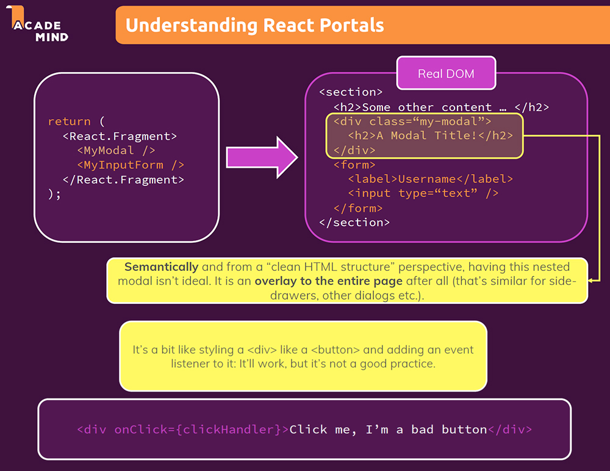
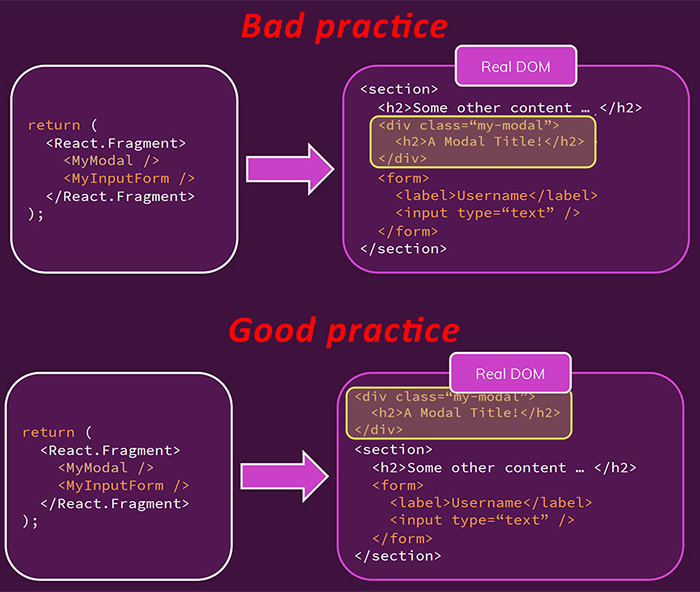
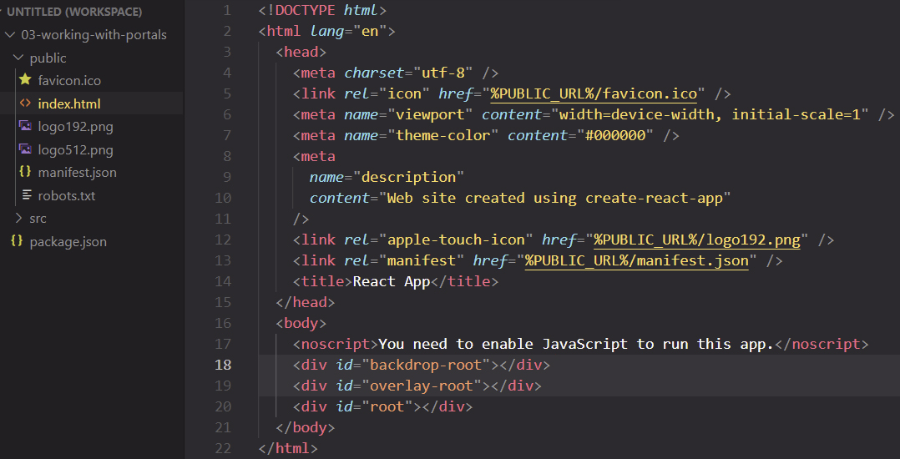
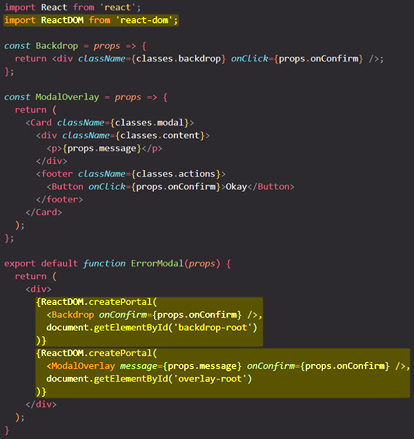

# React Portals

## Rendering to a different part of the DOM

==Portals let your components render some of their children into a different place in the DOM==. This lets a part of your component “escape” from whatever containers it may be in. For example, a component can display a modal dialog or a tooltip that appears above and outside of the rest of the page.

With Portals you end up with ==semantically more correct HTML markup==.

`ReactDOM.createPortal()` lets you ==render some children into a different part of the DOM==.

You can use a Portal to ==keep the structure that you have in your JSX markup==, so to keep writing your components the way you want to write them, so that you have no friction when you wanna pass data around and so on, but to still ==render the JSX markup differently (in other place) in the real DOM== and to, for example, render the `myModal` HTML content somewhere else than it would normally go to.

So ==the JSX markup structure on the left hasn't changed, but the rendered HTML code is a bit different from our JSX markup==. The idea behind Portals is that the rendered HTML content is moved somewhere else that the place where JSX component is place in your app.

## How to use a Portal

Portals need two things:

- you need a ==**place** you wanna port the component to==;
- you need to let the component know that it should have a ==**portal to that place**==.

Now, to mark that place, you go into the public folder, and there into the HTML file which is being rendered in the end. There you could create multiple roots, for different kinds of components, that should be ported there.

You use Portals with the help of `ReactDOM.createPortal()` by passing some JSX, and the DOM node where it should be rendered.

> **Note**: The `ReactDOM.createPortal()` method is actually not defined on React, but on another library that comes together with React, the **ReactDOM library**. You can ==imagine React being the library that has all the React features, state management etc, and **ReactDOM uses React to bring that logic and these features into the web browser**==, so to make them compatible to working with the DOM. Put in other words, the React library itself doesn't care whether you run it in an environment that has a DOM, or if you would use it to build a native app. For example, you can use React Native in conjunction with React, to build native mobile apps. So **ReactDOM is kind of the adapter for React to the browser**.

==`ReactDOM.createPortal()` method takes **two arguments**==. The first argument need to be a component that return JSX markup or only some JSX markup. The second argument is a pointer to the container in the real DOM where the JSX markup in your component should be rendered in.

React will put the DOM nodes for the JSX you passed inside of the DOM node you provided. Without a portal, the second `<Backdrop/>` and `<ModalOverlay/>` would be placed inside the parent `
`, but the portal “teleported” it into the `document.getElementById('backdrop-root')` and `document.getElementById('overlay-root')`.

==A portal only changes the physical placement of the DOM node. In every other way, the JSX you render into a portal acts as a child node of the React component that renders it==. For example, the child can access the context provided by the parent tree, and events still bubble up from children to parents according to the React tree.

## Event Bubbling Through Portals

Even though a portal can be anywhere in the DOM tree, it behaves like a normal React child in every other way. Features like context work exactly the same regardless of whether the child is a portal, as the portal still exists in the _React tree_ regardless of position in the _DOM tree_.

This includes event bubbling. An event fired from inside a portal will propagate to ancestors in the containing _React tree_, even if those elements are not ancestors in the _DOM tree_.

## Final thoughts

Wherever you would normally just use a component, you can use `ReactDOM.createPortal()` to portal that component's HTML content somewhere else, only in the actual DOM that is being rendered. In JSX, in your components, you continue working with those components as you did before.

## References

1. [React - The Complete Guide (incl Hooks, React Router, Redux) - Maximilian Schwarzmüller](https://www.udemy.com/course/react-the-complete-guide-incl-redux/)
1. [Portals - reactjs.org](https://reactjs.org/docs/portals.html)
1. [createPortal - beta.reactjs.org](https://beta.reactjs.org/apis/react-dom/createPortal)
