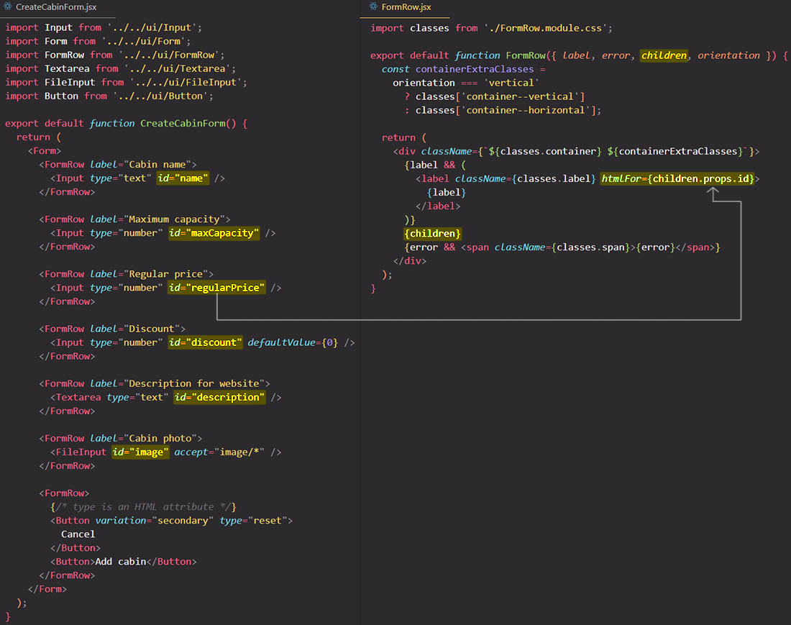
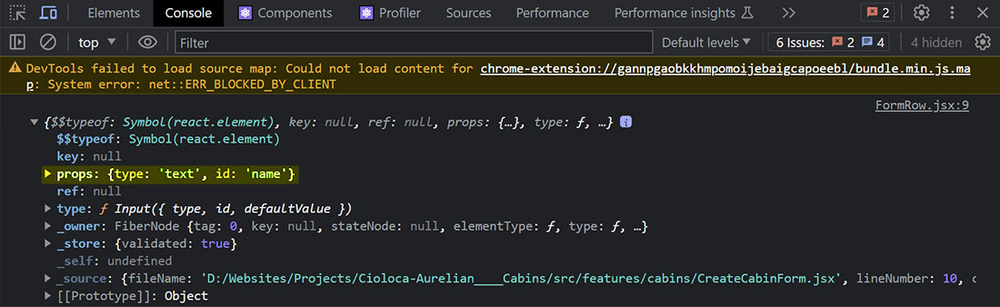
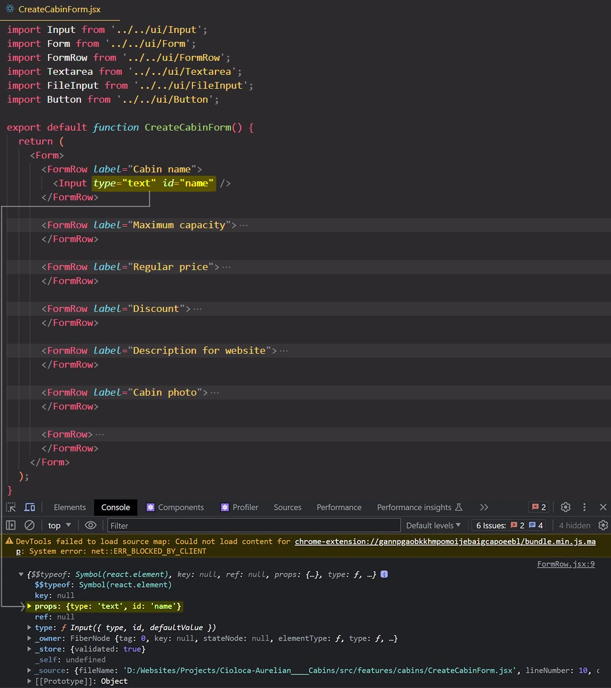

# Set an element attribute/prop that depends on it’s children element props via `props.children`

You can set an element attribute or prop that depends on it's children element props via `children` prop.

Remember that `props.children` is a object that contain some properties that you can use in your app. The most used property is `props`.

## References

1. [The Ultimate React Course: React, Redux & More - Jonas Schmedtmann](https://www.udemy.com/course/the-ultimate-react-course/)
