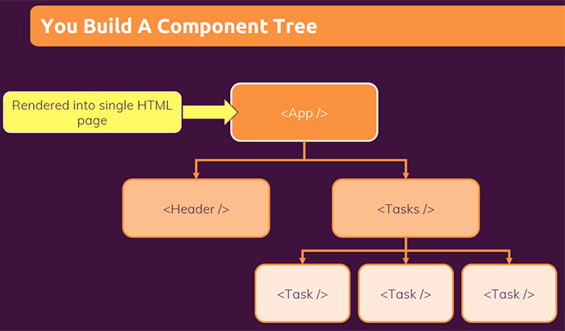

# Splitting a component into multiple components

As you work on your React app and React components, you will notice in any project that your components eventually become bigger and bigger, as you have more and more logic and JSX markup in them. This is something which will naturally happen, that is why React has the component concept.

This concept of components that React have allows you to ==split your application into smaller building blocks==, where every building block/component is focused on ==one core task==, you could say, and then you build your overall UI by ==combining these building blocks/components==. By doing that, you ==keep every component on its own relatively _small_ and _manageable_==, you keep its code base small and manageable, and you still can build a complex UI.

You can declare many components in one file, but large files can get difficult to navigate. To solve this, you can *export* a component into its own file, and then *import* that component from another file. Now, there is no rule when to build a new component, whereas as adding more to an existing component.

## Importing and exporting components

==The magic of components lies in their **reusability**: you can create components that are composed of other components. But as you nest more and more components, it often makes sense to start splitting them into different files. This lets you keep your files easy to scan and **reuse** components in more places==.

You can move a component into another file in three steps:

1. **Make** a new JavaScript file to put the component in
2. **Export** your function component from that file (using either [default](https://developer.mozilla.org/docs/Web/JavaScript/Reference/Statements/export#using_the_default_export) or [named](https://developer.mozilla.org/docs/Web/JavaScript/Reference/Statements/export#using_named_exports) exports)
3. **Import** it in the file where you’ll use the component (using the corresponding technique for importing [default](https://developer.mozilla.org/docs/Web/JavaScript/Reference/Statements/import#importing_defaults) or [named](https://developer.mozilla.org/docs/Web/JavaScript/Reference/Statements/import#import_a_single_export_from_a_module) exports).

>**Note**: You may encounter files that leave off the `.js` file extension like so:
>
>```react
>import Gallery from './Gallery';
>```
>
>Either `'./Gallery.js'` or `'./Gallery'` will work with React.

## Default vs named exports

==There are two primary ways to export values with JavaScript: **default** exports and **named** exports==. So far, our examples have only used default exports. But you can use one or both of them in the same file. ==A file can have no more than one _default_ export, but it can have as many _named_ exports as you like==.

==How you export your component dictates how you must import it==. You will get an error if you try to import a default export the same way you would a named export! This chart can help you keep track:

| Syntax  | Export statement                      | Import statement                        |
| ------- | ------------------------------------- | --------------------------------------- |
| Default | `export default function Button() {}` | `import Button from './button.js';`     |
| Named   | `export function Button() {}`         | `import { Button } from './button.js';` |

When you write a *default* import, you can put any name you want after `import`.

> **Note**: **People often use default exports if the file exports only one component, and use named exports if it exports multiple components and values.** ==Regardless of which coding style you prefer, always give meaningful names to your component functions and the files that contain them==. Components without names, like `export default () => {}`, are discouraged because they make debugging harder.
>
> To reduce the potential confusion between default and named exports, some teams choose to only stick to one style (default or named), or avoid mixing them in a single file.

## Multiple components per one file

==Components are regular JavaScript functions, so **you can keep multiple components in the same file**. This is convenient when **components are relatively small or tightly related to each other**==. If the file gets crowded, you can always move your custom components to separate files.

==You can have multiple components per one file==, and that this might make sense if a component is really only getting used in that file and not in other files. Thus far, we always had one component per file, and that generally is a good rule to keep, but if you have ==a component that is really only getting used by the other component in that file==, having both components in the same file can make sense too.

```react
const Backdrop = (props) => {
  return <div className={classes.backdrop} onClick={props.onClose}/>;
};

const ModalOverlay = (props) => {
  return (
    <div className={classes.modal}>
      <div className={classes.content}>{props.children}</div>
    </div>
  );
};

const portalElement = document.getElementById('overlays');

const Modal = (props) => {
  return (
    <Fragment>
      {ReactDOM.createPortal(<Backdrop onClose={props.onClose} />, portalElement)}
      {ReactDOM.createPortal(
        <ModalOverlay>{props.children}</ModalOverlay>,
        portalElement
      )}
    </Fragment>
  );
};

export default Modal;
```

## You build a component tree

You can declare many components in one file, but large files can get difficult to navigate. To solve this, you can export a component into its own file, and then import that component from another file.

==Is considered a good and best practice to put new components into new files, so that you have **one file per component**==, and that will mean that in a React project you will end up with dozens or hundreds of files, because on React project you'll have dozens or hundreds of components, and that's absolutely normal.



## Separation of concerns

React is all about splitting your app into small building blocks (components), where every building block (component) has a **clear task**, and therefore your ==code stays **maintainable** and **manageable**==. Having a separation of concerns helps us with keeping our code base small and manageable, instead of having one large file which holds all the HTML markup and all the JavaScript logic.

If we split our code across multiple files, then we'll have small pieces of code which are easy to manage and maintain.

## References

1. [React - The Complete Guide (incl Hooks, React Router, Redux) - Maximilian Schwarzmüller](https://www.udemy.com/course/react-the-complete-guide-incl-redux/)
1. [Importing and Exporting Components - beta.reactjs.org](https://beta.reactjs.org/learn/importing-and-exporting-components)
