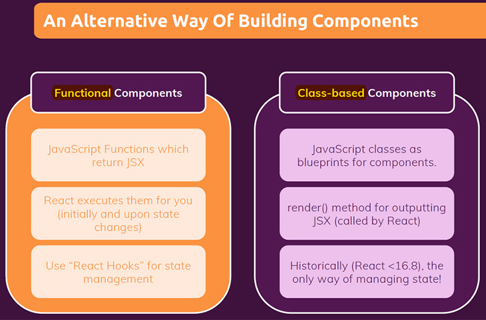

# Building a first custom component

Before you start to build a component, you need to create first a React project. The easiest way of getting started with a React project is to use a tool called [Create React App](https://github.com/facebook/create-react-app).

==Conceptually, components are just JavaScript functions==. They accept arbitrary inputs (called props) and return JSX markup describing what should appear on the screen. The simplest way to define a component is to write a JavaScript function:

```react
function Welcome(props) {
  return <h1>Hello, {props.name}</h1>;
}
```

==A **React component** is basically just a **custom HTML element**. The key difference between custom and built-in HTML elements is that _custom components names must always start with a capital letter while HTML tags must be lowercase_. And indeed **your own custom components must always start with a capital letter**==, so that React is able to detect that is a custom component. Because _the simple rule which React applies is that lowercase elements are built-in HTML elements, so it will look for them as built-in elements, whereas elements starting with an uppercase character are elements defined by you or some other developer_.

```react
// Custom components names must always start with a capital letter while HTML tags must be lowercase
function MyButton() {
  return (
    <button>
      I'm a button
    </button>
  );
}

function App() {
  return (
    <div>
      <h1>Welcome to my app</h1>
      <MyButton />
    </div>
  );
}
```

> **Note**: _Components are just JavaScript functions which then return JSX markup (HTML markup)_, and of course the HTML markup do you return in a component depends on what the components should render on the screen.

## There are always 3 steps to build a custom component

#### 1. _Create_ a custom component and _export_ it

```react
const CustomComponent = () => {
  // code here
};

export default CustomComponent; // the "export default" keywords specify the main component in the file.
```

#### 2. _Import_ the custom component in the file where you wanna use it

```react
import CustomComponent from './path/CustomComponent'
```

#### 3. _Use_ the custom component

```react
const OtherComponent = () => {
  return (
      <div>
          <CustomComponent/>
      </div>
  )
};
```

> **Note**: These custom components are not really HTML elements which end up on the screen, you just use them in your code, in your React code, in your JSX markup. What ends up on the screen are just the HTML elements. _In the end, what ends up on the screen are just default HTML elements_.

## An Alternative Way Of Building Components



## References

1. [React - The Complete Guide (incl Hooks, React Router, Redux) - Maximilian Schwarzmüller](https://www.udemy.com/course/react-the-complete-guide-incl-redux/)
1. [Components and Props - reactjs.org](https://reactjs.org/docs/components-and-props.html)
