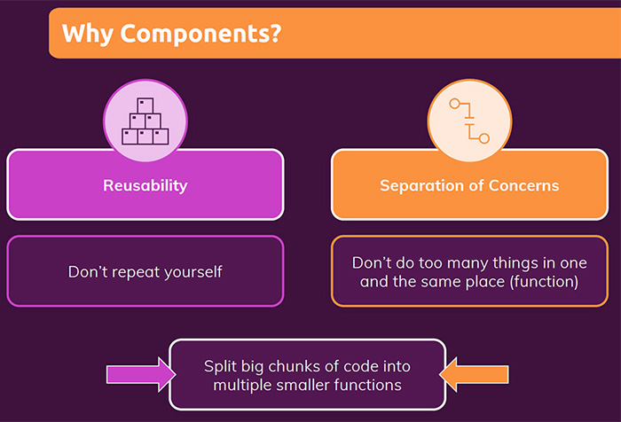
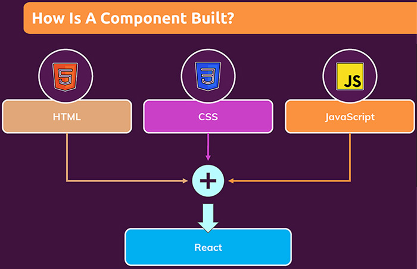

# What are components? And why is React all about them?

==React is a JavaScript library for **building user interfaces (UI)**==. HTML, CSS & JavaScript are about building UI as well. React makes building complex, interactive and reactive UI simpler. You use libraries like React because that ==simplifies building UI==. You don't need React to build an app, you can build any website without React, but if you have more ==complex UI== and if you use something like React, it all of a sudden becomes ==much easier to build complex applications==.

If you use React you ==won't have to focus on all the nitty-gritty details== and it will be ==less error prone==, because ==you will be able to focus on your core **business logic** that makes up your application, instead of having to focus on the actual steps==, for example updating the page when something happens somewhere. That's why you want to use libraries like React, and to make that work simpler for you, ==React embraces a concept called **"components"**==.

> **Note**: With just Vanilla JavaScript, you have to write every single step that should be taken to build your application. You want to create an element, you want to set its content, you want to add classes, you want to add an event listener, then what should happen when that event occurs. Every single step needs to be described. This way of build applications is called **Imperative Way**.

## What is a component?

React apps are made out of components. ==A component is a piece of the UI that has its own logic and appearance==. A component can be as small as a button, or as large as an entire page.

Conceptually, ==components are just JavaScript functions== that accept arbitrary inputs (called **props**) and return **JSX markup ** describing what should appear on the screen. A component in React is just a JavaScript function, a special kind of function, special regarding what it returns (_it does return JSX markup_), but other than that it's just a JavaScript function.

==Components are **_reusable_ building blocks** in your UI. Components are in the end just a combination of **HTML** markup, **CSS** code for styling and possibly **JavaScript** code for some logic==.

> **Note**: You don't have to reuse a component to make it a component, it's just one of its traits that a component is reusable.

## Why components?

React is all about components because the UI in the end is made up of components. ==React is all about **splitting your UI into small building blocks (components)**, where every building block (component) has a **clear task**, and therefore your **code stays _maintainable_ and _manageable_**==, and React will do the heavy lifting of rendering something onto the screen and of combining all your components.

Components let you split the UI into independent, reusable pieces, and think about each piece in isolation.

### Components & separation of concerns

Having a separation of concerns helps you with ==keeping your code base _small_ and _manageable_, instead of having one large file which holds all the HTML markup and all the JavaScript logic==. For the entire UI you have ==small separated units (components)==, where every component has ==one specific task it focuses on==. If you ==split your code across multiple files==, then you will have small pieces of code which are ==easy to manage and maintain==.

These of course are **not concepts or ideas React invented**. If you take a step back from React and you think about programming in general, then of course in any programming language and no matter what you are building, you tend to work with functions and you **split your code into multiple small functions**, which then may call each other to outsource logic into a function, to separate concerns and to be **able to execute the same code multiple times** if you need to. _React just picks up that concept of functions and of separating code across functions, and translates it to the front-end web application world where you built an entire UI by **splitting your code into multiple components**, which you then can mix and match as you need to_.

## How is a component built?

==Components are **reusable building blocks** in your UI==. Components are in the end just a combination of **HTML** markup, **CSS** code for styling and possibly **JavaScript** code for some logic. Mostly React components are about combining HTML and JavaScript and then of course, you also can add CSS, but _CSS is not the focus of React_.

## References

1. [React - The Complete Guide (incl Hooks, React Router, Redux) - Maximilian Schwarzmüller](https://www.udemy.com/course/react-the-complete-guide-incl-redux/)
1. [Components and Props - reactjs.org](https://reactjs.org/docs/components-and-props.html)
