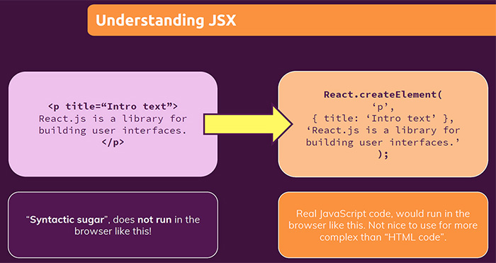

# Writing markup with JSX

JSX is a ==**syntax extension** for JavaScript that lets you **write HTML-like markup inside a JavaScript file**.== JSX produces React “elements”.

==JSX markup is basically **HTML markup inside of JavaScript**==. JSX stands for _JavaScript XML_ because _HTML in the end is XML_, you could say. JSX lets you put HTML markup into JavaScript.

## JSX: Putting markup into JavaScript

The web has been built on HTML, CSS, and JavaScript. ==For many years, web developers kept content in HTML, design in CSS, and logic in JavaScript — often in separate files! Content was marked up inside HTML while the page’s logic lived separately in JavaScript. But as the Web became more interactive, logic increasingly determined content. JavaScript was in charge of the HTML! This is why **in React, rendering logic and markup live together in the same place — components**==.

> **Note**: _Keeping a button’s rendering logic and markup together ensures that they stay in sync with each other on every edit_. Conversely, details that are unrelated, such as the button’s markup and a sidebar’s markup, are isolated from each other, making it safer to change either of them on their own.

==**Each React component is a JavaScript function** that may contain some markup that React renders into the browser. React components use a _syntax extension_ called JSX to represent that markup==. JSX looks a lot like HTML, but it is a bit stricter, has a few more rules than HTML and can display dynamic information.

JSX lets you put markup into JavaScript.

## JSX is only syntactic sugar for the `React.createElement()`

==Fundamentally, JSX just provides _syntactic sugar_ for the `React.createElement(component, props, ...children)` function==:

```react
<MyButton color="blue" shadowSize={2}>
  Click Me
</MyButton>

// compiles into:
React.createElement(
  MyButton,
  {color: 'blue', shadowSize: 2},
  'Click Me'
)
```



Since JSX compiles into calls to `React.createElement`, the `React` library must also always be in scope from your JSX code. For example, both of the imports are necessary in this code, even though `React` and `CustomButton` are not directly referenced from JavaScript:

```react
import React from 'react';
import CustomButton from './CustomButton';

function WarningButton() {
  // return React.createElement(CustomButton, {color: 'red'}, null);
  return <CustomButton color="red" />;
}
```

> **Note**: In the past, in older React projects, you actually needed to use `import React from 'react'` in all your React component files, or to be precise, in all files where you used JSX markup. You'll still see a lot of React projects out there which have these imports therefore. Behind the scene the JSX markup is translate to `Reacte.createElement(component, props, ...children)`. ==Each JSX element is just **syntactic sugar** for calling `React.createElement(component, props, ...children)`==.

## You can store JSX markup in variables

==You can **store JSX content in variables**==. You are not limited to using JSX only if you return it, you can also use it to create a value, which is stored in a variable:

```react
const content = <p>Text to render</p>;
// or
const expensesContent = filteredExpenses.map((item) => (
    <ExpenseItem
        key={item.id}
        title={item.title}
        amount={item.amount}
        date={item.date}
     />
));
```

## The Rules of JSX

JSX is stricter than HTML. You have to close tags like `<br />`. Your component also can’t return multiple JSX tags. You have to wrap them into a shared parent, like a `<div>...</div>` or an empty `<>...</>` wrapper.

#### 1. Return a single root element

==To return multiple elements from a component, **wrap them with a single parent tag** or you can write `<>` and `</>` instead==. The `<></>` is a empty tag called _[Fragment.](https://beta.reactjs.org/reference/react/Fragment)_ Fragments let you group things without leaving any trace in the browser HTML tree.

> Why do multiple JSX tags need to be wrapped? JSX looks like HTML, but under the hood it is transformed into plain JavaScript objects. You can’t return two objects from a function without wrapping them into an array. This explains why you also can’t return two JSX tags without wrapping them into another tag or a Fragment.

#### 2. Close all the tags

==JSX requires tags to be explicitly closed==: self-closing tags like `` must become ``, and wrapping tags like `<li>oranges` must be written as `<li>oranges</li>`.

#### 3. camelCase all most of the things!

==JSX turns into JavaScript and attributes written in JSX become keys of JavaScript objects==. In your own components, you will often want to read those attributes into variables. But JavaScript has limitations on variable names; for example, their names can’t contain dashes or be reserved words like `class`.

This is why, in React, many HTML and SVG attributes are written in camelCase. For example, instead of `stroke-width` you use `strokeWidth`. Since `class` is a reserved word, in React you write `className` instead, named after the [corresponding DOM property](https://developer.mozilla.org/en-US/docs/Web/API/Element/className).

## References

1. [Writing markup with JSX - beta.reactjs.org](https://beta.reactjs.org/learn/writing-markup-with-jsx)
