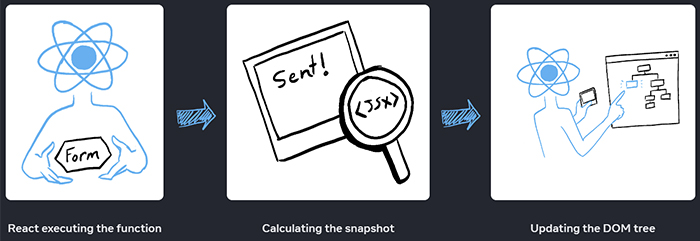
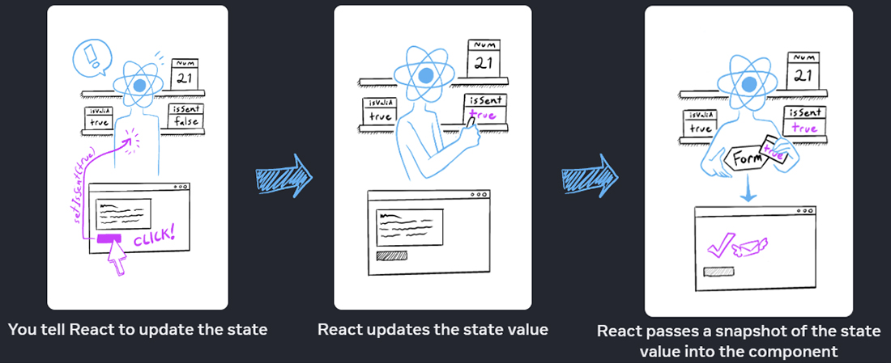
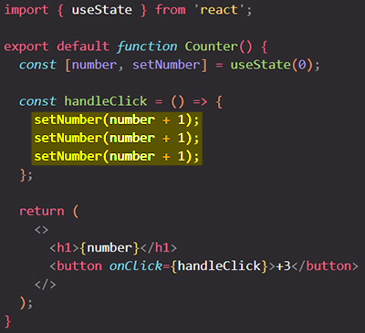
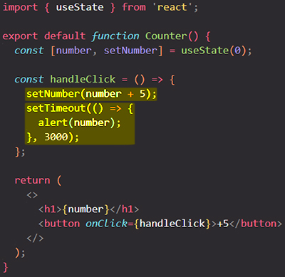
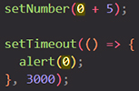
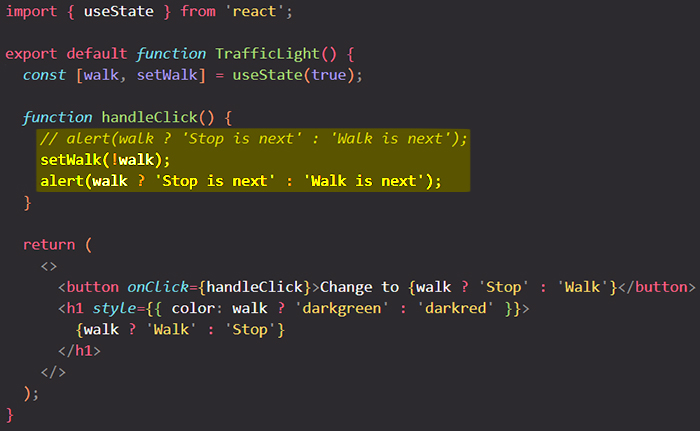

# State as a snapshot

==State variables might look like regular JavaScript variables that you can read and write to. However, _state behaves more like a snapshot_. **Setting it does not change the state variable you already have, but instead triggers a re-render**==.

You will learn:

- How setting state triggers re-renders
- When and how state updates
- Why state does not update immediately after you set it
- How event handlers access a “snapshot” of the state

## Setting state _triggers_ renders 

You might think of your UI as changing directly in response to the user event like a click. In React, it works a little differently from this mental model. You know that ==**setting state requests a re-render** from React. This means that for an interface to react to the event, you need to *update the state*==.

Let’s take a closer look at the _relationship between **state** and **rendering**_.

## _Rendering_ takes a snapshot in time 

==**"Rendering" means that React is calling your component**, which is a function. The JSX you return from that function is like a snapshot of the UI in time. Its props, event handlers, and local variables were all calculated **using its state at the time of the render**==.

When React re-renders a component:

1. React calls your function again.
2. Your function returns a new JSX snapshot.
3. React then updates the screen to match the snapshot you’ve returned.



==As a _component’s memory_, state is not like a regular variable that disappears after your function returns. State actually "lives" in React itself — as if on a shelf! — _outside of your function_. When React calls your component, **it gives you a snapshot of the state for that particular render**. Your component returns a snapshot of the UI with a fresh set of props and event handlers in its JSX, all calculated **using the state values from that render**!==



### A little experiment

Here’s a little experiment to show you how this works. In this example, you might expect that clicking the “+3” button would increment the counter three times because it calls `setNumber(number + 1)` three times.



==_Notice that `number` only increments once per click!_ **Setting state only changes it for the _next_ render**.== During the first render, `number` was `0`. This is why, in *that render’s* `onClick` handler, the value of `number` is still `0` even after `setNumber(number + 1)` was called.

Here is what this button’s click handler tells React to do:

1. `setNumber(number + 1)` : `number` is `0` so `setNumber(0 + 1)`
   - React prepares to change `number` to `1` on the next render.
2. `setNumber(number + 1)` : `number` is `0` so `setNumber(0 + 1)` 
   - React prepares to change `number` to `1` on the next render.
3. `setNumber(number + 1)` : `number` is `0` so `setNumber(0 + 1)` 
   - React prepares to change `number` to `1` on the next render.

==Even though you called `setNumber(number + 1)` three times, in *this render’s* event handler `number` is always `0`, so you set the state to `1` three times==. This is why, after your event handler finishes, React re-renders the component with `number` equal to `1` rather than `3`.

You can also visualize this by mentally substituting state variables with their values in your code. Since the `number` state variable is `0` for *this render*, its event handler looks like this:

```react
const handleClick = () => {
  setNumber(0 + 1);
  setNumber(0 + 1);
  setNumber(0 + 1);
};
```

For the next render, `number` is `1`, so *that render’s* click handler looks like this:

```react
const handleClick = () => {
  setNumber(1 + 1);
  setNumber(1 + 1);
  setNumber(1 + 1);
};
```

This is why clicking the button again will set the counter to `2`, then to `3` on the next click, and so on. 

### Example with a timer

If you put a timer on the alert, it only fires *after* the component re-rendered? Would it say will alert “0” or “5”? It would be "0". Why?



If you use the substitution method, you can see the “snapshot” of the state passed to the alert:



==The state stored in React may have changed by the time the alert runs, but it was scheduled using a snapshot of the state at the time the user interacted with it!==

==**A state variable’s value never changes within a render,** even if its event handler’s code is asynchronous==. Inside *that render’s* `onClick`, the value of `number` continues to be `0` even after `setNumber(number + 5)` was called. Its value was “fixed” when React “took the snapshot” of the UI by calling your component.

==**Setting state only changes it for the _next_ render**. **A state variable’s value never changes within a render,** even if its event handler’s code is asynchronous. **React keeps the state values “fixed” within one render’s event handlers.** You don’t need to worry whether the state has changed while the code is running==.

But what if you wanted to read the latest state before a re-render? You’ll want to use a [state updater function](https://react.dev/learn/queueing-a-series-of-state-updates). You will learn that in the next chapter: Understanding State Scheduling & Batching.

## Example

Add an `alert` to the click handler. When the light is green and says “Walk”, clicking the button should say “Stop is next”. When the light is red and says “Stop”, clicking the button should say “Walk is next”. Does it make a difference whether you put the `alert` before or after the `setWalk` call?



==Whether you put it before or after the `setWalk` call makes no difference. That render’s value of `walk` is fixed. **Calling `setWalk` will only change it for the _next_ render**, but will not affect the event handler from the previous render.==

## Summary

- Setting state requests a new render.
- React stores state outside of your component, as if on a shelf.
- ==When you call `useState`, React gives you a snapshot of the state _for that render_==.
- Variables and event handlers don’t “survive” re-renders. Every render has its own event handlers.
- ==Every render (and functions inside it) will always “see” the snapshot of the state that React gave to *that* render==.
- You can mentally substitute state in event handlers, similarly to how you think about the rendered JSX.
- Event handlers created in the past have the state values from the render in which they were created.

## References

1. [State as a Snapshot - beta.reactjs.org](https://beta.reactjs.org/learn/state-as-a-snapshot)