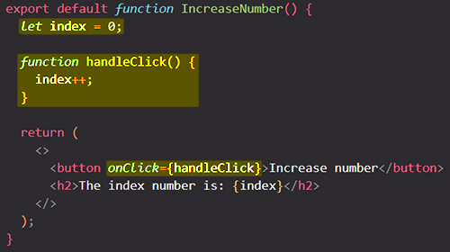
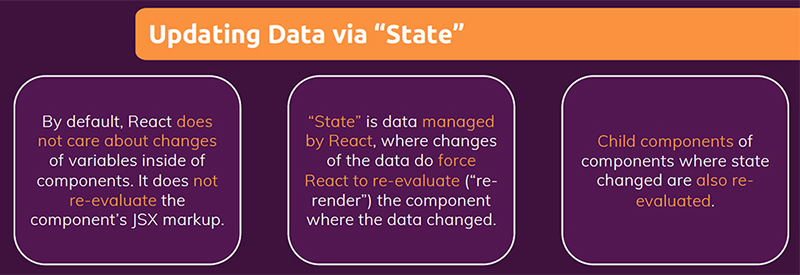

# State: a component's memory

==Components often need to change what’s on the screen as a result of an interaction==. Typing into the form should update the input field, clicking “next” on an image carousel should change which image is displayed, clicking “buy” should put a product in the shopping cart. ==Components need to “remember” things==: the current input value, the current image, the shopping cart. In React, this kind of component-specific memory is called **state**.

You will learn:

- How to add a state variable with the [`useState`](https://beta.reactjs.org/reference/react/useState) Hook
- What pair of values the `useState` Hook returns
- How to add more than one state variable
- Why state is called local

## When a regular variable isn’t enough

Here’s a component that increase a number. Clicking the “Increase number” button should show the increased number by changing the `index` to `1`, then `2`, and so on. However, this won’t work:



==The `handleClick` event handler is **updating a local variable**, `index`. But two things prevent that change from being visible:==

1. ==**Local variables don’t persist between renders.**== When React renders this component a second time, it renders it from scratch — it doesn’t consider any changes to the local variables.
2. ==**Changes to local variables won’t trigger renders.**== React doesn’t realize it needs to render the component again with the new data.

==To **update a component with new data**, two things need to happen:==

1. ==**Retain** the data between renders.==
2. ==**Trigger** React to render the component with new data (re-rendering).==

==The [`useState`](https://beta.reactjs.org/reference/react/useState) Hook provides those two things:==

1. ==A **state variable** to retain the data between renders.==
2. ==A **state setter function** to update the variable and trigger React to render the component again.==

## Adding a state variable 

To add a state variable, import `useState` from React at the top of the file, then ==replace the local variable with a state variable==:


> **Note**: The `[]` syntax is called [array destructuring](https://javascript.info/destructuring-assignment) and it lets you _read values from an array_. ==The array returned by `useState` always has exactly two items: `index` is a **state variable** and `setIndex` is the **setter function**==.

In React, `useState`, as well as any other function starting with ”`use`”, is called a Hook.==Hooks are special functions that are **only available while React is [rendering](https://beta.reactjs.org/learn/render-and-commit#step-1-trigger-a-render)**==. They let you “hook into” different React features.

> **IMPORTANT**: **Hooks — functions starting with `use` — can only be called at the top level of your components or [your own Hooks.](https://beta.reactjs.org/learn/reusing-logic-with-custom-hooks)** You can’t call Hooks inside conditions, loops, or other nested functions. Hooks are functions, but it’s helpful to think of them as unconditional declarations about your component’s needs. You “use” React features at the top of your component similar to how you “import” modules at the top of your file.



## Anatomy of `useState` 

==When you call `useState`, you are telling React that you want this component to remember something==:

```react
const [index, setIndex] = useState(0);
```

In this case, you want React to remember `index`.

> **Naming convention**: The convention is to name this pair like `const [something, setSomething]`. You could name it anything you like, but conventions make things easier to understand across projects.

==The only argument to `useState` is the **initial value** of your state variable==. In this example, the `index`’s initial value is set to `0` with `useState(0)`.

Every time your component renders, ==`useState` gives you an array containing two values:==

1. ==The **state variable** (`index`) with the **value you stored**.==
2. ==The **state setter function** (`setIndex`) which can update the state variable and **trigger React to render the component again**.==

Here’s how that happens in action:

```react
const [index, setIndex] = useState(0);
```

1. **Your component renders the first time.** Because you passed `0` to `useState` as the initial value for `index`, it will return `[0, setIndex]`. React remembers `0` is the latest state value.
2. **You update the state.** When a user clicks the button, it calls `setIndex(index + 1)`. `index` is `0`, so it’s `setIndex(1)`. This tells React to remember `index` is `1` now and triggers another render.
3. **Your component’s second render.** React still sees `useState(0)`, but because React *remembers* that you set `index` to `1`, it returns `[1, setIndex]` instead.
4. And so on!

## Giving a component multiple state variables 

==You can have as many state variables of as many types as you like in one component. It is a good idea to have multiple state variables if their state is unrelated, but if you find that you often change two state variables together, it might be better to combine them into a single one==. For example, if you have a form with many fields, it’s more convenient to have a single state variable that holds an object than state variable per field.

## How does React know which state to return? 

You might have noticed that the `useState` call does not receive any information about *which* state variable it refers to. There is no “identifier” that is passed to `useState`, so how does it know which of the state variables to return? Does it rely on some magic like parsing your functions? The answer is no.

Instead, to enable their concise syntax, Hooks **rely on a stable call order on every render of the same component.** This works well in practice because if you follow the rule above (“only call Hooks at the top level”), Hooks will always be called in the same order. Additionally, a [linter plugin](https://www.npmjs.com/package/eslint-plugin-react-hooks) catches most mistakes.

Internally, React holds an array of state pairs for every component. It also maintains the current pair index, which is set to `0` before rendering. Each time you call `useState`, React gives you the next state pair and increments the index. You can read more about this mechanism in [React Hooks: Not Magic, Just Arrays.](https://medium.com/@ryardley/react-hooks-not-magic-just-arrays-cd4f1857236e)

## State is isolated and private 

==State is local to a component instance on the screen. In other words, **if you render the same component multiple times, each copy will have completely isolated state!** Changing one of them will not affect the other.==

==This is what makes state different from regular variables that you might declare at the top of your module. State is not tied to a particular function call or a place in the code, but it’s “local” to the specific place on the screen. You can rendered a component multiple times and each component's state is stored separately==.

==Also parent components doesn’t “know” anything about their child component's state or even whether it has any. Unlike props, **state is fully private to the component declaring it.** The parent component can’t change it. This lets you add state to any component or remove it without impacting the rest of the components.==

==What if you wanted some child components to keep their states in sync? The right way to do it in React is to *remove* state from child components and add it to their closest shared parent==.

## Props vs State

There are two types of “model” data in React: props and state. The two are very different:

- ==**Props** are like arguments you pass to a function==. They let a parent component pass data to a child component and customize its appearance. For example, a `Form` can pass a `color` prop to a `Button`.
- ==**State** is like a component’s memory==. It lets a component keep track of some information and change it in response to interactions. For example, a `Button` might keep track of `isHovered` state.

Props and state are different, but they work together. A parent component will often keep some information in state (so that it can change it), and _pass it down_ to child components as their props.

## Summary

- Use a state variable when a component needs to “remember” some information between renders.
- State variables are declared by calling the `useState` Hook.
- Hooks are special functions that start with `use`. They let you “hook into” React features like state.
- Hooks might remind you of imports: they need to be called unconditionally. Calling Hooks, including `useState`, is only valid at the top level of a component or another Hook.
- The `useState` Hook returns a pair of values: the current state and the function to update it.
- You can have more than one state variable. Internally, React matches them up by their order.
- State is private to the component. If you render it in two places, each copy gets its own state.

## References

1. [State: A Component's Memory - beta.reactjs.org](https://beta.reactjs.org/learn/state-a-components-memory)