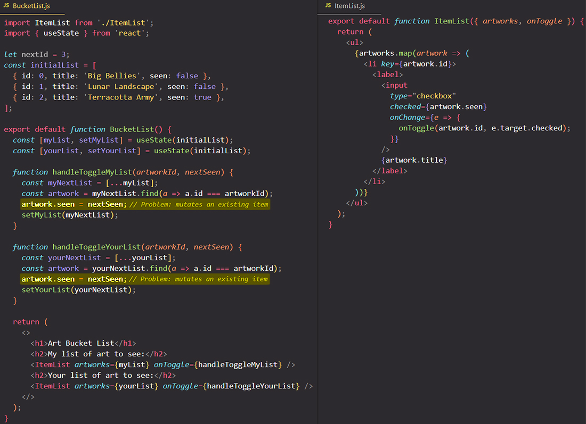

# Updating arrays in state

==Arrays are mutable in JavaScript, but you should **treat arrays as immutable when you store them in state**. Just like with objects, when you want to update an array stored in state, you need to create a new one (or make a copy of an existing one), and then set state to use the new array==.

You will learn:

- How to add, remove, or change items in an array in React state
- How to update an object inside of an array

## Updating arrays without mutation

==In JavaScript, arrays are just another kind of object. [Like with objects](https://beta.reactjs.org/learn/updating-objects-in-state), **you should treat arrays in React state as read-only**==. This means that you shouldn’t reassign items inside an array like `arr[0] = 'bird'`, and you also shouldn’t use methods that mutate the array, such as `push()` and `pop()`.

==Instead, every time you want to update an array, you’ll want to pass a *new* array to your state setting function==. To do that, you can create a new array from the original array in your state by calling its non-mutating methods like `filter()` and `map()`. Then you can set your state to the resulting new array.

Here is a reference table of common array operations. ==When **dealing with arrays inside React state**, you will need to avoid the methods in the left column, and instead prefer the methods in the right column:==

| Operation | AVOID (mutates the array)           | PREFER (returns a new array)                                 |
| --------- | ----------------------------------- | ------------------------------------------------------------ |
| adding    | `push`, `unshift`                   | `concat`, `[...arr]` spread syntax ([example](https://beta.reactjs.org/learn/updating-arrays-in-state#adding-to-an-array)) |
| removing  | `pop`, `shift`, `splice`            | `filter`, `slice` ([example](https://beta.reactjs.org/learn/updating-arrays-in-state#removing-from-an-array)) |
| replacing | `splice`, `arr[i] = ...` assignment | `map` ([example](https://beta.reactjs.org/learn/updating-arrays-in-state#replacing-items-in-an-array)) |
| sorting   | `reverse`, `sort`                   | copy the array first ([example](https://beta.reactjs.org/learn/updating-arrays-in-state#making-other-changes-to-an-array)) |

> **Pitfall**: Unfortunately, [`slice`](https://developer.mozilla.org/en-US/docs/Web/JavaScript/Reference/Global_Objects/Array/slice) and [`splice`](https://developer.mozilla.org/en-US/docs/Web/JavaScript/Reference/Global_Objects/Array/splice) are named similarly but are very different:
>
> - `slice` lets you copy an array or a part of it.
> - `splice` **mutates** the array (to insert or delete items).
>
> In React, you will be using `slice` (no `p`!) a lot more often because you don’t want to mutate objects or arrays in state.

### Adding to an array 

`push()` will mutate an array, which you don’t want. Instead, ==create a *new* array which contains the existing items and a new item at the end. There are multiple ways to do this, but the easiest one is to use the **`...` [array spread syntax](https://developer.mozilla.org/en-US/docs/Web/JavaScript/Reference/Operators/Spread_syntax#spread_in_array_literals)**==:

```react
setArray( // Replace the state
  [ // with a new array
    ...originalArray, // that contains all the old items
    { id: nextId++, name: name } // and one new item at the end
  ]
);
```

The array spread syntax also lets you prepend an item by placing it *before* the original array:

```react
setArray([
  { id: nextId++, name: name },
  ...originalArray // Put old items at the end
]);
```

In this way, ==spread can do the job of both `push()` by adding to the end of an array and `unshift()` by adding to the beginning of an array==.

### Removing from an array 

==The easiest way to remove an item from an array is to *filter it out*. In other words, you will produce a new array that will not contain that item.== To do this, use the `filter` method:

```react
setArray(
  originalArray.filter(a => a.id !== item.id)
);
```

Here, `originalArray.filter(a => a.id !== item.id)` means “create an array that consists of those `item` whose IDs are different from `item.id`”, then request a re-render with the resulting array. Note that `filter` does not modify the original array.

### Transforming an array 

==If you want to change some or all items of the array, you can use `map()` to create a **new** array. The function you will pass to `map()` can decide what to do with each item, based on its data or its index (or both).==

### Replacing items in an array 

It is particularly common to want to replace one or more items in an array. Assignments like `arr[0] = 'bird'` are mutating the original array, so instead you’ll want to use `map()` for this as well.

==To replace an item, create a new array with `map()`. Inside your `map()` call, you will receive the item index as the second argument. Use it to decide whether to return the original item (the first argument) or something else==:

```react
function handleIncrementClick(index) {
  const nextCounters = counters.map((c, i) => {
    if (i === index) {
      return c + 1; // Increment the clicked counter
    } else {
      return c; // The rest haven't changed
    }
  });
    
  setCounters(nextCounters);
};
```

### Inserting into an array 

==Sometimes, you may want to insert an item at a particular position that’s neither at the beginning nor at the end. To do this, you can use the `...` array spread syntax together with the `slice()` method==. The `slice()` method lets you cut a “slice” of the array. To insert an item, you will create an array that spreads the slice *before* the insertion point, then the new item, and then the rest of the original array:

```react
function handleClick() {
  const insertAt = 1; // Could be any index
  const nextArtists = [
    // Items before the insertion point:
    ...artists.slice(0, insertAt),
      
    // New item:
    { id: nextId++, name: name },
      
    // Items after the insertion point:
    ...artists.slice(insertAt)
  ];
    
  setArtists(nextArtists);
};
```

### Making other changes to an array 

==There are some things you can’t do with the spread syntax and non-mutating methods like `map()` and `filter()` alone. For example, you may want to reverse or sort an array. The JavaScript `reverse()` and `sort()` methods are mutating the original array, so you can’t use them directly. **However, you can copy the array first, and then make changes to it.**==

```react
function handleClick() {
  const nextList = [...list];
  nextList.reverse();
  setList(nextList);
}
```

==However, **even if you copy an array, you can’t mutate existing items _inside_ of it directly.** This is because copying is shallow — the new array will contain the same items as the original one. So if you modify an object inside the copied array, you are mutating the existing state.== For example, code like this is a problem.

```react
const nextList = [...list];
nextList[0].seen = true; // Problem: also mutates list[0]
setList(nextList);
```

==Although `nextList` and `list` are two different arrays, **`nextList[0]` and `list[0]` point to the same object.**== So by changing `nextList[0].seen`, you are also changing `list[0].seen`. This is a state mutation, which you should avoid! You can solve this issue in a similar way to [updating nested JavaScript objects](https://react.dev/learn/updating-objects-in-state#updating-a-nested-object) — by copying individual items you want to change instead of mutating them.

## Updating objects inside arrays 

==Objects are not *really* located “inside” arrays. They might appear to be “inside” in code, but each object in an array is a separate value, to which the array “points”.==

==**When updating nested state, you need to create copies from the point where you want to update, and all the way up to the top level.**==

The problem is in code like this:



==Although the `myNextList` array itself is new, the *items themselves* are the same as in the original `myList` array. So changing `artwork.seen` changes the *original* artwork item==. That artwork item is also in `yourArtworks`, which causes the bug. Bugs like this can be difficult to think about, but thankfully they disappear if you **avoid mutating state**.

**You can use `map()` to substitute an old item with its updated version without mutation.**

```react
setMyList(myList.map(artwork => {
  if (artwork.id === artworkId) {
    return { ...artwork, seen: nextSeen }; // Create a new object with changes
  } else {
    return artwork; // No changes
  }
});
```

Here, `...` is the object spread syntax used to [create a copy of an object.](https://react.dev/learn/updating-objects-in-state#copying-objects-with-the-spread-syntax) With this approach, none of the existing state items are being mutated, and the bug is fixed.

==In general, **you should only mutate objects that you have just created.** If you were inserting a *new* artwork, you could mutate it, but if you’re dealing with something that’s already in state, you need to make a copy==.

## Summary

- You can put arrays into state, but you can’t change them.
- Instead of mutating an array, create a *new* version of it, and update the state to it.
- You can use the `[...arr, newItem]` array spread syntax to create arrays with new items.
- You can use `filter()` and `map()` to create new arrays with filtered or transformed items.

## References

1. [Updating Arrays in State - beta.reactjs.org](https://beta.reactjs.org/learn/updating-arrays-in-state)