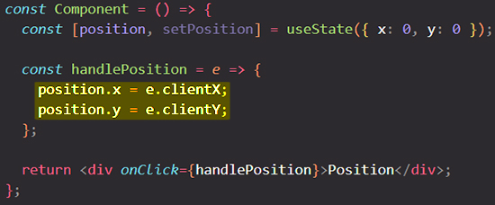
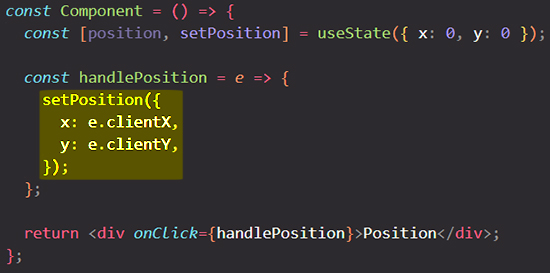

# Updating objects in state

State can hold any kind of JavaScript value, including objects. But ==you shouldn’t change objects that you hold in the React state directly. Instead, when you want to update an object, you need to create a new one (or make a copy of an existing one), and then set the state to use that copy==.

You will learn:

- How to correctly update an object in React state
- How to update a nested object without mutating it
- What immutability is, and how not to break it

## What’s a mutation?

You can store any kind of JavaScript value in state.

```react
const [x, setX] = useState(0);
```

So far you’ve been working with numbers, strings, and booleans. These kinds of JavaScript values are “immutable”, meaning unchangeable or “read-only”. You can trigger a re-render to *replace* a value:

```react
setX(5);
```

The `x` state changed from `0` to `5`, but the *number `0` itself* did not change. ==It’s not possible to make any changes to the built-in primitive values like numbers, strings, and booleans in JavaScript==.

Now consider an object in state:

```react
const [position, setPosition] = useState({ x: 0, y: 0 });
```

Technically, it ==is possible to change the _contents_ of the object itself. This is called a **mutation**==:

```react
position.x = 5;
```

==However, although objects in React state are technically mutable, you should **treat objects _as if_ they were immutable** (unchangeable or “read-only”) — like numbers, booleans, and strings. Instead of mutating them like `position.x = 5`, you should **_always_ replace them**==.

## Treat state as read-only

This code modifies the object assigned to `position` from [the previous render](https://beta.reactjs.org/learn/state-as-a-snapshot#rendering-takes-a-snapshot-in-time). But without using the state setting function, React has no idea that object has changed, so React does not do anything in response. While mutating state can work in some cases, we don’t recommend it. You should ==treat _any JavaScript object_ that you put into state as **read-only**==.



To actually trigger a re-render, **create a _new_ object and pass it to the state setting function**:



With `setPosition`, you’re telling React:

- Replace `position` with this _new_ object;
- And _render_ this component again.

### Local mutation is fine

==Mutation is only a problem when you change *existing* objects that are already in state==. Mutating an object you’ve just created is okay because *no other code references it yet.* Changing it isn’t going to accidentally impact something that depends on it. This is called a "local mutation". ==You can even do local mutation _while rendering_==. Very convenient and completely okay!

Code like this is a problem because it modifies an *existing* object in state:

```react
position.x = e.clientX;
position.y = e.clientY;
```

But code like this is **absolutely fine** because you’re mutating a fresh object you have *just created*:

```react
const nextPosition = {};
nextPosition.x = e.clientX;
nextPosition.y = e.clientY;
setPosition(nextPosition);

// In fact, it is completely equivalent to writing this:
setPosition({
  x: e.clientX,
  y: e.clientY
});
```

## Copying objects with the spread syntax

In the previous example, the `position` object is always created fresh from the current cursor position. But often you will want to ==include *existing* data as a part of the new object you’re creating. For example, you may want to update *only one* field in a form, but _keep the previous values_ for all other fields==.

You can use the `...` [object spread syntax](https://developer.mozilla.org/en-US/docs/Web/JavaScript/Reference/Operators/Spread_syntax#spread_in_object_literals) so that you _don’t need to copy every property separately_:

```react
onst [item, setItem] = useState({
    item1: '',
	item2: '',
	item3: '',
});

setItem({
	...item, // Copy the old fields
	item1: 'value', // But override this one
});
```

==Note that the `...` spread syntax is "shallow" — it only copies things one level deep==. This makes it fast, but it also means that if you want to update a nested property, you’ll have to use it more than once.

### Updating a nested object 

Consider a nested object structure like this:

```react
const [person, setPerson] = useState({
  name: 'Niki de Saint Phalle',
  artwork: {
    title: 'Blue Nana',
    city: 'Hamburg',
    image: 'https://i.imgur.com/Sd1AgUOm.jpg',
  }
});
```

If you wanted to update `person.artwork.city`, it’s clear how to do it with mutation:

```react
person.artwork.city = 'New Delhi';
```

But ==in React, you treat state as immutable!== In order to change `city`, you would first need to produce the new `artwork` object (pre-populated with data from the previous one), and then produce the new `person` object which points at the new `artwork`:

```react
const nextArtwork = { ...person.artwork, city: 'New Delhi' };
const nextPerson = { ...person, artwork: nextArtwork };
setPerson(nextPerson);

// Or, written as a single function call:
setPerson({
  ...person, // Copy other fields
  artwork: { // but replace the artwork
    ...person.artwork, // with the same one
    city: 'New Delhi' // but in New Delhi!
  }
});
```

## Objects are not really nested

An object like this appears “nested” in code:

```react
let obj = {
  name: 'Niki de Saint Phalle',
  artwork: {
    title: 'Blue Nana',
    city: 'Hamburg',
    image: 'https://i.imgur.com/Sd1AgUOm.jpg',
  }
};
```

However, ==“nesting” is an inaccurate way to think about how objects behave. When the code executes, there is no such thing as a “nested” object. You are really looking at two different objects==:

```react
let obj1 = {
  name: 'Niki de Saint Phalle',
  artwork: obj2
};

let obj2 = {
  title: 'Blue Nana',
  city: 'Hamburg',
  image: 'https://i.imgur.com/Sd1AgUOm.jpg',
};
```

The `obj2` object is not “inside” `obj1`. For example, `obj3` could “point” at `obj2` too:

```react
let obj1 = {
  name: 'Niki de Saint Phalle',
  artwork: obj2
};

let obj2 = {
  title: 'Blue Nana',
  city: 'Hamburg',
  image: 'https://i.imgur.com/Sd1AgUOm.jpg',

};

let obj3 = {
  name: 'Copycat',
  artwork: obj2
};
```

==If you were to mutate `obj3.artwork.city`, it would affect both `obj1.artwork.city` and `obj2.city`. This is because `obj3.artwork`, `obj1.artwork`, and `obj2` are the _same object_. This is difficult to see when you think of objects as “nested”. Instead, they are separate objects “pointing” at each other with properties.==

## Why is mutating state not recommended in React?

There are a few reasons:

- **Debugging:** If you use `console.log` and don’t mutate state, your past logs won’t get clobbered by the more recent state changes. So you can clearly see how state has changed between renders.
- **Optimizations:** Common React [optimization strategies](https://react.dev/reference/react/memo) rely on skipping work if previous props or state are the same as the next ones. If you never mutate state, it is very fast to check whether there were any changes. If `prevObj === obj`, you can be sure that nothing could have changed inside of it.
- **New Features:** The new React features we’re building rely on state being [treated like a snapshot.](https://react.dev/learn/state-as-a-snapshot) If you’re mutating past versions of state, that may prevent you from using the new features.
- **Requirement Changes:** Some application features, like implementing Undo/Redo, showing a history of changes, or letting the user reset a form to earlier values, are easier to do when nothing is mutated. This is because you can keep past copies of state in memory, and reuse them when appropriate. If you start with a mutative approach, features like this can be difficult to add later on.
- **Simpler Implementation:** Because React does not rely on mutation, it does not need to do anything special with your objects. It does not need to hijack their properties, always wrap them into Proxies, or do other work at initialization as many “reactive” solutions do. This is also why React lets you put any object into state—no matter how large—without additional performance or correctness pitfalls.

## Summary

- Treat all state in React as immutable.
- When you store objects in state, mutating them will not trigger renders and will change the state in previous render “snapshots”.
- Instead of mutating an object, create a *new* version of it, and trigger a re-render by setting state to it.
- You can use the `{...obj, something: 'newValue'}` object spread syntax to create copies of objects.
- Spread syntax is shallow: it only copies one level deep.
- To update a nested object, you need to create copies all the way up from the place you’re updating.


## References

1. [Updating Objects in State - beta.reactjs.org](https://beta.reactjs.org/learn/updating-objects-in-state)