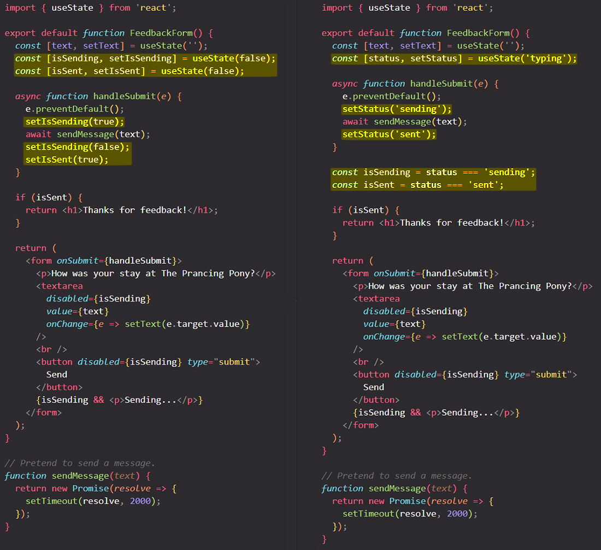

# Choosing the state structure

Structuring state well can make a difference between a component that is pleasant to modify and debug, and one that is a constant source of bugs. The most important principle is that state shouldn’t contain redundant or duplicated information. If there’s unnecessary state, it’s easy to forget to update it, and introduce bugs!

You will learn:

- When to use a single vs multiple state variables
- What to avoid when organizing state
- How to fix common issues with the state structure

## Principles for structuring state 

==When you write a component that holds some state, you’ll have to make choices about how many state variables to use and what the shape of their data should be==. While it’s possible to write correct programs even with a suboptimal state structure, there are a few principles that can guide you to make better choices:

1. ==**Group related state**==. If you always _update two or more state variables at the same time_, consider merging them into a single state variable.
2. ==**Avoid contradictions in state**==. When the state is structured in a way that several pieces of state may contradict and "disagree" with each other, you leave room for mistakes. Try to avoid this.
3. ==**Avoid redundant state**==. If you _can calculate some information from the component’s props or its existing state variables during rendering_, you should not put that information into that component’s state.
4. ==**Avoid duplication in state**==. When _the same data is duplicated between multiple state variables_, or within nested objects, it is difficult to keep them in sync. Reduce duplication when you can.
5. ==**Avoid deeply nested state**==. _Deeply hierarchical state is not very convenient to update_. When possible, prefer to structure state in a flat way.

The goal behind these principles is to *make state easy to update without introducing mistakes*. ==Removing redundant and duplicate data from state helps ensure that all its pieces stay in sync==.

## Group related state

You might sometimes be unsure between using a single or multiple state variables:

```react
// Should you do this?
const [x, setX] = useState(0);
const [y, setY] = useState(0);

// Or this?
const [position, setPosition] = useState({ x: 0, y: 0 });
```

==If some two state variables **always change together**, it might be a good idea to unify them into a single state variable. Then you won’t forget to always _keep them in sync_==.

Another case where you’ll group data into an object or an array is when _you don’t know how many different pieces of state you’ll need_. For example, it’s helpful when you have a form where the user can add custom fields.

> **Note**: If your state variable is an object, remember that [you can’t update only one field in it](https://react.dev/learn/updating-objects-in-state) without explicitly copying the other fields. For example, you can’t do `setPosition({ x: 100 })` in the above example because it would not have the `y` property at all! Instead, if you wanted to set `x` alone, you would either do `setPosition({ ...position, x: 100 })`, or split them into two state variables and do `setX(100)`.

## Avoid contradictions in state

Here is a hotel feedback form with `isSending` and `isSent` state variables. While this code works, it leaves the door open for “impossible” states. For example, if you forget to call `setIsSent` and `setIsSending` together, you may end up in a situation where both `isSending` and `isSent` are `true` at the same time. The more complex your component is, the harder it is to understand what happened.

Since `isSending` and `isSent` should never be `true` at the same time, it is better to replace them with one `status` state variable that may take one of \*three\* valid states: `'typing'` (initial), `'sending'`, and `'sent'`:



You can still declare some constants for readability:

```react
const isSending = status === 'sending';
const isSent = status === 'sent';
```

But they’re not state variables, so you don’t need to worry about them getting out of sync with each other.

## Avoid redundant state 

==If you can calculate some information _from the component’s props_ or _its existing state variables_ during rendering, you should not put that information into that component’s state==.

Imagine that you have a form that has three state variables: `firstName`, `lastName` and `fullName`. However, `fullName` is redundant. You can always calculate `fullName` from `firstName` and `lastName` during render, so remove it from state.


Here, ==`fullName` is *not* a state variable. Instead, it’s **calculated during render**. As a result, the change handlers don’t need to do anything special to update it. When you call `setFirstName` or `setLastName`, you trigger a re-render, and then the next `fullName` will be calculated from the fresh data==.

### Don’t mirror props in state

A common example of redundant state is code like this:

```react
function Message({ messageColor }) {
  const [color, setColor] = useState(messageColor);
}
```

Here, a `color` state variable is initialized to the `messageColor` prop. The problem is that ==if the parent component passes a different value of `messageColor` later (for example, `'red'` instead of `'blue'`), the `color` state variable would not be updated! **The state is only initialized during the first render**==.

This is why “mirroring” some prop in a state variable can lead to confusion. Instead, use the `messageColor` prop directly in your code. This way ==it won’t get out of sync with the prop passed from the parent component==. If you want to give it a shorter name, use a constant:

```react
function Message({ messageColor }) {
  const color = messageColor;
}
```

==“Mirroring” props into state only makes sense when you want to **ignore all updates for a specific prop**==. By convention, start the prop name with `initial` or `default` to clarify that its new values are ignored:

```react
function Message({ initialColor }) {
  // The `color` state variable holds the *first* value of `initialColor`. Further changes to the `initialColor` prop are ignored.
  const [color, setColor] = useState(initialColor);
}
```

## Avoid duplication in state

This menu list component lets you choose a single travel snack out of several. Currently, it stores the selected item as an object in the `selectedItem` state variable. However, this is not great: **the contents of the `selectedItem` is the same object as one of the items inside the `items` list.** This means that the information about the item itself is duplicated in two places.


Instead of a `selectedItem` object (which creates a duplication with objects inside `items`), you hold the `selectedId` in state, and *then* get the `selectedItem` by searching the `items` array for an item with that ID.

The state used to be duplicated like this:

- `items = [{ id: 0, title: 'pretzels'}, ...]`
- `selectedItem = {id: 0, title: 'pretzels'}`

But after the change it’s like this:

- `items = [{ id: 0, title: 'pretzels'}, ...]`
- `selectedId = 0`

The duplication is gone, and you only keep the essential state! Now if you edit the *selected* item, the message below will update immediately. This is because `setItems` triggers a re-render, and `items.find(...)` would find the item with the updated title. You didn’t need to hold *the selected item* in state, because only the *selected ID* is essential. The rest could be calculated during render.

## Avoid deeply nested state 

Imagine a travel plan consisting of planets, continents, and countries. You might be tempted to structure its state using nested objects and arrays:

```react
const initialTravelPlan = {
  id: 0,
  title: '(Root)',
  childPlaces: [
    {
      id: 1,
      title: 'Earth',
      childPlaces: [
        {
          id: 2,
          title: 'Asia',
          childPlaces: [
            {
              id: 3,
              title: 'China',
              childPlaces: [],
            },
            {
              id: 4,
              title: 'Hong Kong',
              childPlaces: [],
            },
          ],
        },
        {
          id: 5,
          title: 'Europe',
          childPlaces: [
            {
              id: 6,
              title: 'Croatia',
              childPlaces: [],
            },
            {
              id: 7,
              title: 'France',
              childPlaces: [],
            },
          ],
        },
      ],
    },
    {
      id: 8,
      title: 'Moon',
      childPlaces: [
        {
          id: 9,
          title: 'Rheita',
          childPlaces: [],
        },
        {
          id: 10,
          title: 'Piccolomini',
          childPlaces: [],
        },
      ],
    },
    {
      id: 11,
      title: 'Mars',
      childPlaces: [
        {
          id: 12,
          title: 'Corn Town',
          childPlaces: [],
        },
        {
          id: 13,
          title: 'Green Hill',
          childPlaces: [],
        },
      ],
    },
  ],
};
```

Now let’s say you want to add a button to delete a place you’ve already visited. How would you go about it? Updating nested state involves making copies of objects all the way up from the part that changed. Deleting a deeply nested place would involve copying its entire parent place chain. Such code can be very verbose.

==If the state is too nested to update easily, consider making it “flat”==. Here is one way you can restructure this data. ==Instead of a tree-like structure where each `place` has an array of *its child places*, you can have each place hold an array of *its child place IDs*==. Then you can store a mapping from each place ID to the corresponding place.

```react
export const initialTravelPlan = {
  0: {
    id: 0,
    title: '(Root)',
    childIds: [1, 8],
  },
  1: {
    id: 1,
    title: 'Earth',
    childIds: [2, 5],
  },
  2: {
    id: 2,
    title: 'Asia',
    childIds: [3, 4],
  },
  3: {
    id: 3,
    title: 'China',
    childIds: [],
  },
  4: {
    id: 4,
    title: 'Hong Kong',
    childIds: [],
  },
  5: {
    id: 5,
    title: 'Europe',
    childIds: [6, 7],
  },
  6: {
    id: 6,
    title: 'Croatia',
    childIds: [],
  },
  7: {
    id: 7,
    title: 'France',
    childIds: [],
  },
  8: {
    id: 8,
    title: 'Moon',
    childIds: [9, 11],
  },
  9: {
    id: 9,
    title: 'Rheita',
    childIds: [],
  },
  10: {
    id: 10,
    title: 'Piccolomini',
    childIds: [],
  },
  11: {
    id: 11,
    title: 'Mars',
    childIds: [12, 13],
  },
  12: {
    id: 12,
    title: 'Corn Town',
    childIds: [],
  },
  13: {
    id: 13,
    title: 'Green Hill',
    childIds: [],
  },
};
```

Now that the state is “flat” (also known as “normalized”), updating nested items becomes easier.

In order to remove a place now, you only need to update two levels of state:

- The updated version of its *parent* place should exclude the removed ID from its `childIds` array.
- The updated version of the root “table” object should include the updated version of the parent place.

You can nest state as much as you like, but making it “flat” can solve numerous problems. It makes state easier to update, and it helps ensure you don’t have duplication in different parts of a nested object.

Sometimes, you can also reduce state nesting by moving some of the nested state into the child components. This works well for ephemeral UI state that doesn’t need to be stored, like whether an item is hovered.

## Summary

- If two state variables always update together, consider merging them into one.
- Choose your state variables carefully to avoid creating “impossible” states.
- Structure your state in a way that reduces the chances that you’ll make a mistake updating it.
- Avoid redundant and duplicate state so that you don’t need to keep it in sync.
- Don’t put props *into* state unless you specifically want to prevent updates.
- For UI patterns like selection, keep ID or index in state instead of the object itself.
- If updating deeply nested state is complicated, try flattening it.

## References

1. [Choosing the State Structure - beta.reactjs.org](https://beta.reactjs.org/learn/choosing-the-state-structure)