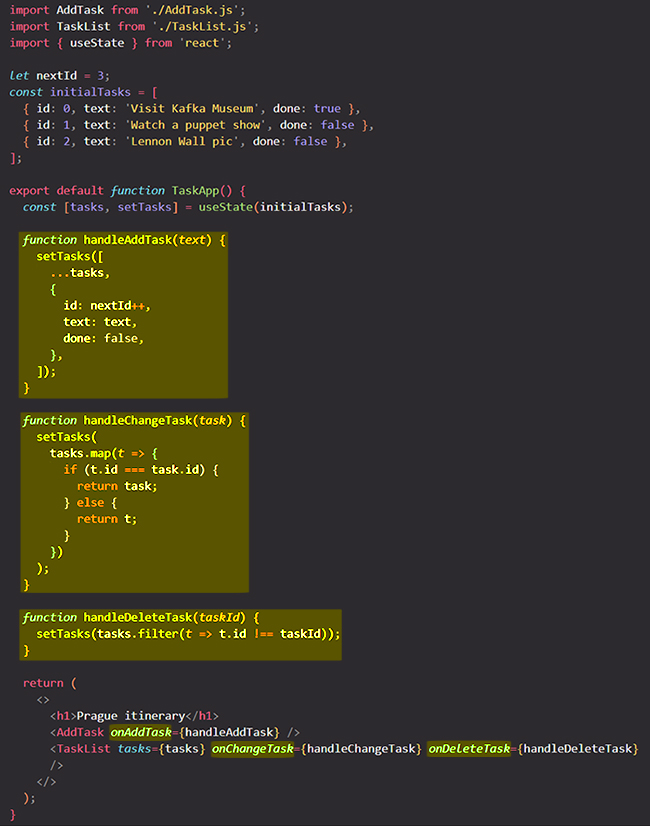
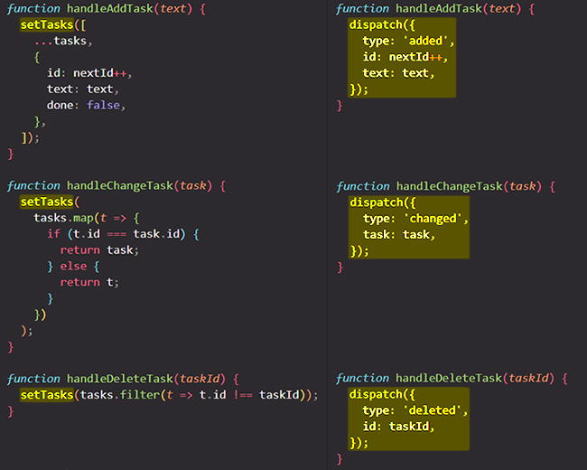
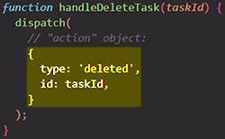
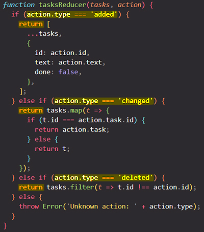
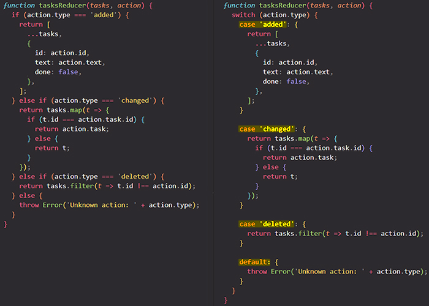
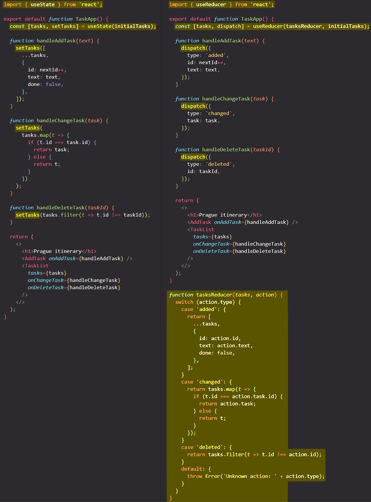
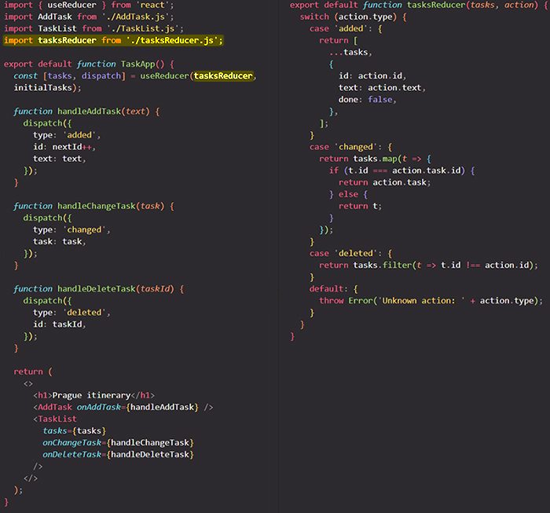

# Extracting state logic into a Reducer

==Components with many state updates spread across many event handlers can get overwhelming. For these cases, you can _consolidate all the state update logic outside your component in a single function_, called a **reducer**.==

You will learn:

- What a reducer function is
- How to refactor `useState` to `useReducer`
- When to use a reducer
- How to write one well

## Consolidate state logic with a reducer 

As your components grow in complexity, it can get harder to see at a glance all the different ways in which a component’s state gets updated. For example, the `TaskApp` component below holds an array of `tasks` in state and ==uses three different event handlers to add, remove, and edit tasks==:



==Each of its event handlers calls `setTasks` in order to update the state==. As this component grows, so does the amount of state logic sprinkled throughout it. To reduce this complexity and ==**keep all your logic in one easy-to-access place**, you can _move that state logic into a single function **outside** your component_, called a "reducer"==.

==Reducers are a different way to handle state. You can migrate from `useState` to `useReducer` in three steps:==

1. ==Move from **setting state** to **dispatching actions**.==
2. ==Write a **reducer function**.==
3. ==Use the reducer from your component.==

## Step 1: Move from _setting state_ to _dispatching actions_ 

Your event handlers currently specify *what to do* by setting state: Remove all the state setting logic. What you are left with are three event handlers:

- `handleAddTask(text)` is called when the user presses “Add”.
- `handleChangeTask(task)` is called when the user toggles a task or presses “Save”.
- `handleDeleteTask(taskId)` is called when the user presses “Delete”.



==Managing state with reducers is slightly different from directly setting state. Instead of telling React **“what to do”** by setting state, you specify **“what the user just did”** by dispatching “actions” from your event handlers==. The state update logic will live elsewhere! So instead of “setting `tasks`” via an event handler, you’re dispatching an “added/changed/deleted a task” action. This is more descriptive of the user’s intent.

==The object you pass to `dispatch` is called an **“action”**==:



==It is a regular JavaScript object. You decide what to put in it, but generally it should contain the minimal information about *what happened*.==

> **Note**: An action object can have any shape. By convention, it is common to give it a string `type` that describes what happened, and pass any additional information in other fields. The `type` is specific to a component, so in this example either `'added'` or `'added_task'` would be fine. Choose a name that says what happened!
>
> ```react
> dispatch({
>   // specific to component
>   type: 'what_happened',
>   // other fields go here
> });
> ```

## Step 2: Write a reducer function 

==A reducer function is where you will put your state logic. It takes two arguments, the **current state** and the **action object**, and it returns the next state==:

```react
function yourReducer(state, action) {
  // return next state for React to set
}
```

==**React will set the state to what you return from the reducer**.==

To move your state setting logic from your event handlers to a reducer function in this example, you will:

1. Declare the current state (`tasks`) as the first argument.
2. Declare the `action` object as the second argument.
3. Return the *next* state from the reducer (which React will set the state to).

Here is all the state setting logic migrated to a reducer function:



Because the reducer function takes state (`tasks`) as an argument, you can **declare it outside of your component.** This decreases the indentation level and can make your code easier to read.

> **Note**: The code above uses if/else statements, but it’s a convention to use [switch statements](https://developer.mozilla.org/docs/Web/JavaScript/Reference/Statements/switch) inside reducers. The result is the same, but it can be easier to read switch statements at a glance.
>
> 
>
> We recommend wrapping each `case` block into the `{` and `}` curly braces so that variables declared inside of different `case`s don’t clash with each other. Also, a `case` should usually end with a `return`. If you forget to `return`, the code will “fall through” to the next `case`, which can lead to mistakes!
>
> If you’re not yet comfortable with switch statements, using if/else is completely fine.

## Step 3: Use the reducer from your component 

Finally, you need to hook up the `tasksReducer` to your component. Import the `useReducer` Hook from React:

```react
import {useReducer} from 'react';
```

Then you can replace `useState`:

```react
const [tasks, setTasks] = useState(initialTasks);
```

with `useReducer` like so:

```react
const [tasks, dispatch] = useReducer(tasksReducer, initialTasks);
```

==The `useReducer` Hook is similar to `useState` — you must pass it an initial state and it returns a stateful value and a way to set state (in this case, the dispatch function).== But it’s a little different.

The `useReducer` Hook takes two arguments:

1. A reducer function
2. An initial state

And it returns:

1. A stateful value
2. A dispatch function (to “dispatch” user actions to the reducer)



If you want, ==you can even move the reducer to a different file==:



==Component logic can be easier to read when you separate concerns like this. Now the event handlers only specify *what happened* by dispatching actions, and the reducer function determines *how the state updates* in response to them==.

## Writing reducers well 

Keep these two tips in mind when writing reducers:

- ==Reducers must be pure==. Similar to [state updater functions](https://react.dev/learn/queueing-a-series-of-state-updates), reducers run during rendering! (Actions are queued until the next render.) This means that reducers [must be pure](https://react.dev/learn/keeping-components-pure) — same inputs always result in the same output. They should not send requests, schedule timeouts, or perform any side effects (operations that impact things outside the component). They should update [objects](https://react.dev/learn/updating-objects-in-state) and [arrays](https://react.dev/learn/updating-arrays-in-state) without mutations.
- ==Each action describes a single user interaction, even if that leads to multiple changes in the data==. For example, if a user presses “Reset” on a form with five fields managed by a reducer, it makes more sense to dispatch one `reset_form` action rather than five separate `set_field` actions. If you log every action in a reducer, that log should be clear enough for you to reconstruct what interactions or responses happened in what order. This helps with debugging!

## Summary

- To convert from `useState` to `useReducer`:
  1. Dispatch actions from event handlers.
  2. Write a reducer function that returns the next state for a given state and action.
  3. Replace `useState` with `useReducer`.

- Reducers require you to write a bit more code, but they help with debugging and testing.
- Reducers must be pure.
- Each action describes a single user interaction.

## References

1. [Extracting State Logic into a Reducer - react.dev](https://react.dev/learn/extracting-state-logic-into-a-reducer)