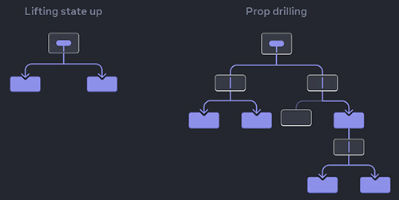

# Introducing React Context (Context API)

Usually, you will pass information from a parent component to a child component via props. But passing props can become verbose and inconvenient if you have to pass them through many components in the middle, or if many components in your app need the same information. _Context_ lets the parent component make some information available to any component in the tree below it—no matter how deep—without passing it explicitly through props.

## The problem with passing props

[Passing props](https://beta.reactjs.org/learn/passing-props-to-a-component) is a great way to explicitly pipe data through your UI tree to the components that use it. But passing props can become verbose and inconvenient when you need to pass some prop deeply through the tree, or if many components need the same prop. The nearest common ancestor could be far removed from the components that need data, and [lifting state up](https://beta.reactjs.org/learn/sharing-state-between-components) that high can lead to a situation sometimes called “prop drilling”.

Wouldn’t it be great if there were a way to “teleport” data to the components in the tree that need it without passing props? With React’s context feature, there is!

## Context: an alternative to passing props

Context lets a parent component provide data to the entire tree below it.

I'm talking about a problem, where you are ==passing a lot of data through a lot of components via props==. Now it is quite common that you pass data to components through props, but ==it's always a problem if you **forward state** through multiple components==. In small apps that's not necessarily a problem, but in big apps, the **chain of forwarding** might become longer and longer.

In bigger apps, you could easily build such ==**"props chains"**==, which are ==used to **forward data** through components to other components==. That's something you can do and that's not necessarily bad, but the bigger your app gets, the more inconvenient it is to do that. Instead, it would be nicer if we could use props in a component to only receive the data this component really needs from its parent, and not to forward other data through the parent, which the parent doesn't ever manage, nor need itself.



For that we got a ==**component-wide**==, "behind the scenes" State Storage, built into React. We have a concept called ==React Context==, and this then allows us to, for example, ==trigger a action in that component-wide State Storage, and then directly pass that to the component that is interested, without building such a long "prop chain"==. So as I mentioned, we have this React Context Concept, which allows us to ==**manage state**== kind of behind the scenes in React, such that we actually are able to ==directly change state from any component== in our app, and ==directly pass state to any component== in our app, _without building such a "props chain"_.

> **Note**: React Context provides a way to ==pass data through the component tree without having to pass props down manually at every level==.


## React Context

React Context allows us to ==manage **wide state**== and provides a way to ==pass data through the component tree without having to pass props== down manually at every level ("props chain").

In a typical React application, ==data is passed top-down (parent to child) via props==, but such usage can be cumbersome for ==certain types of props== (e.g. locale preference, UI theme) that are required by many components within an application. ==Context provides a way to share values like these between components, without having to explicitly pass a `prop` through every level of the tree==.

Context is designed to ==**share data that can be considered "global"** for a tree of React components==, such as the current authenticated user, theme, or preferred language. Context is primarily used when some ==data needs to be accessible by _many_ components at different nesting levels==. Using Context, we can ==avoid passing props through intermediate elements==.

> **Warning**: ==Apply Context sparingly (sparingly = cu cumpătare) because it **MAKES COMPONENT REUSE MORE DIFFICULT** !!!== If you would use Context instead of props, every component would do the same thing, it would be bound to the same Context, so it might be less reusable.
>
> If you only want to avoid passing some props through many levels, component composition is often a simpler solution than Context.

You can have ==multiple Contexts for multiple global states== and of course, you can also use ==just one Context for a bigger state==, that's all up to you. The good thing is we can set up a ==**dynamic context**==, where we don't just pass **data** to other components, but also **functions**. Therefore, we're can using this app-wide or component-wide context object to manage our state and to manage the function/functions that changes the state.

## Examples

For example, consider a Page component that passes a `user` and `avatarSize` prop several levels down so that deeply nested `Link` and `Avatar` components can read it.

```react
<Page user={user} avatarSize={avatarSize} />
// ... which renders ...
<PageLayout user={user} avatarSize={avatarSize} />
// ... which renders ...
<NavigationBar user={user} avatarSize={avatarSize} />
// ... which renders ...
<Link href={user.permalink}>
    <Avatar user={user} size={avatarSize} />
</Link>
```

It might feel redundant to pass down the `user` and `avatarSize` props through many levels if in the end only the `Avatar` component really needs it. It’s also annoying that whenever the `Avatar` component needs more props from the top, you have to add them at all the intermediate levels too.

## References

1. [React - The Complete Guide (incl Hooks, React Router, Redux) - Maximilian Schwarzmüller](https://www.udemy.com/course/react-the-complete-guide-incl-redux/)
1. [Passing Data Deeply with Context - beta.reactjs.org](https://beta.reactjs.org/learn/passing-data-deeply-with-context)
