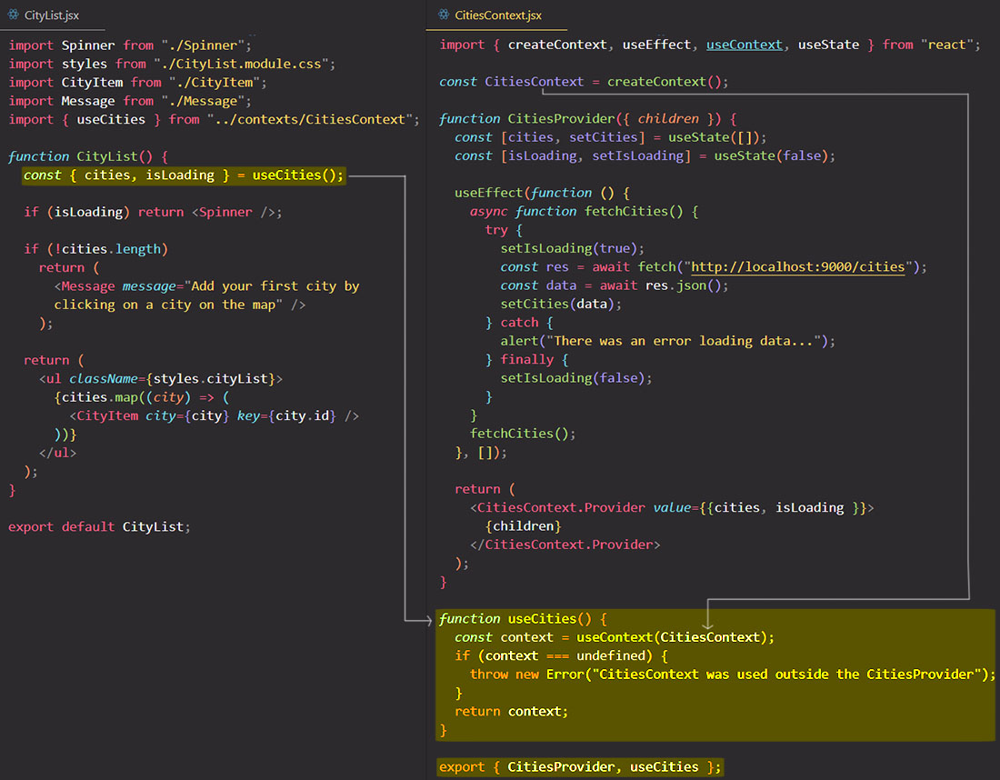

# Making Context dynamic: scaling up with `useState` or `useReducer`

Reducers let you consolidate a component’s state update logic. Context lets you pass information deep down to other components. You can combine reducers and context together to manage state of a complex screen.

With this approach, a parent component with complex state manages it with a reducer. Other components anywhere deep in the tree can read its state via context. They can also dispatch actions to update that state.

You will learn:

- How to combine a reducer with context
- How to avoid passing state and dispatch through props
- How to keep context and state logic in a separate file

## Combining a reducer with context 

Let say that you have an app with a top-level component that have inside some state and that state is managed by a reducer. The reducer function inside of it contains all of the state update logic. ==A reducer helps keep the event handlers short and concise==. However, as your app grows, you might run into another difficulty.

==The state and `dispatch` functions are only available in that top-level component which contain them. To let other components read the state or trigger the `dispatch` functions, you have to explicitly pass down the current state and the event handlers that change it as props. In a small app this works well, but if you have tens or hundreds of components in the middle, passing down all state and functions can be quite frustrating!==

==This is why, as an alternative to passing state and `dispatch` functions through props, you might want to put them into context. This way, any component below in the tree can read the state and `dispatch` functions without the repetitive "prop drilling".==

Here is how you can combine a reducer with context:

1. **Create** the context
2. **Put** state and dispatch into context
3. **Use** context anywhere in the tree

## Building & using a custom `Context.Provider` component

This way of moving all wiring into a single file like `auth-context.js` ==keeps the components clean and uncluttered, focused on what they display rather than where they get the data==.

==As your app grows, you may have many context-reducer pairs like this==. This is a powerful way to scale your app and lift state up without too much work whenever you want to access the data deep in the tree. 

### Another pattern

## References

1. [Scaling Up with Reducer and Context - react.dev](https://react.dev/learn/scaling-up-with-reducer-and-context)