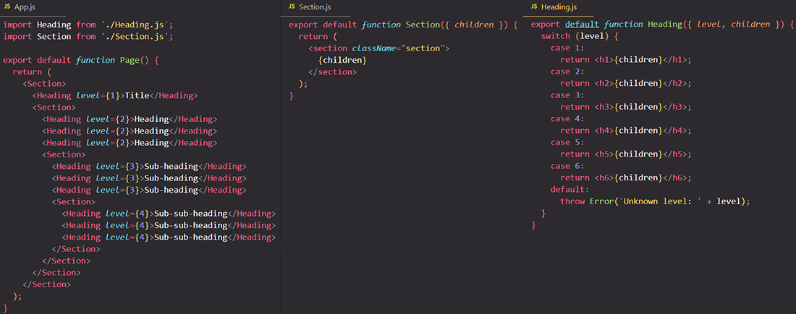
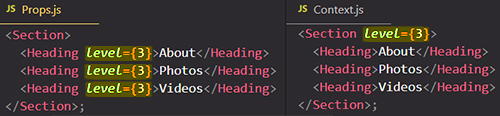
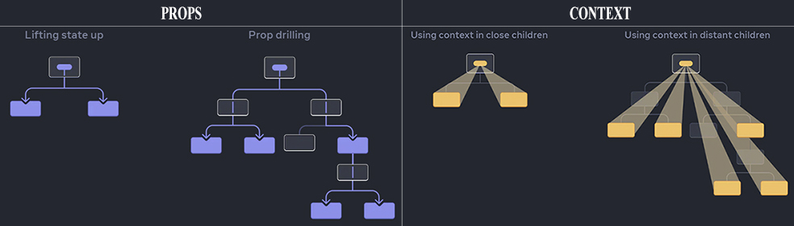

# How to pass information without “prop drilling”: passing data deeply with Context

Usually, you will pass information from a parent component to a child component via props. But passing props can become verbose and inconvenient if you have to pass them through many components in the middle, or if many components in your app need the same information. ==_Context_ lets the parent component make some information available to any component in the tree below it — no matter how deep — without passing it explicitly through props==.

You will learn:

- What “prop drilling” is
- How to replace repetitive prop passing with context
- Common use cases for context
- Common alternatives to context

## The problem with passing props

[Passing props](https://beta.reactjs.org/learn/passing-props-to-a-component) is a great way to explicitly pipe data through your UI tree to the components that use it. But passing props can become verbose and inconvenient when you need to **pass some prop deeply through the tree**, or if **many components need the same prop**. The nearest common ancestor could be far removed from the components that need data, and [lifting state up](https://beta.reactjs.org/learn/sharing-state-between-components) that high can lead to a situation sometimes called “prop drilling”.

Now it is quite common that you pass data to components through props, but ==it's always a problem if you **forward state** through multiple components==. In small apps that's not necessarily a problem, but in big apps, the **chain of forwarding** might become longer and longer.


Wouldn’t it be great if there were a way to “teleport” data to the components in the tree that need it without passing props? With React's context feature, there is!

## Context: an alternative to passing props

==Context lets a parent component provide data to the entire tree below it.== 

Consider this `Heading` component that accepts a `level` for its size and let’s say you want multiple headings within the same `Section` to always have the same size:



Currently, you pass the `level` prop to each `<Heading>` separately. It would be nice if you could pass the `level` prop to the `<Section>` component instead and remove it from the `<Heading>`. This way you could enforce that all headings in the same section have the same size:



But how can the `<Heading>` component know the level of its closest `<Section>`? ==That would require some way for a child to “ask” for data from somewhere above in the tree.== You can’t do it with props alone. This is where context comes into play. You will do it in three steps:

1. ==**Create** a context.== (You can call it `LevelContext`, since it’s for the heading level.)
2. ==**Use** that context from the component that needs the data.== (`Heading` will use `LevelContext`.)
3. ==**Provide** that context from the component that specifies the data.== (`Section` will provide `LevelContext`.)

==Context lets a parent — even a distant one! — provide some data to the entire tree inside of it.==



## Step 1: Create the context 

==First, you need to create the context. You’ll need to **export it from a file** so that your components can use it:==


==The only argument to `createContext` is the **default value**.== Here, `1` refers to the biggest heading level, but you could pass any kind of value (even an object). You will see the significance of the default value in the next step.

> **Note**: `createContext`'s argument is **only used** when a component does not have a matching Provider above it in the tree. This argument can be helpful for testing components in isolation without wrapping components with a Provider. If you don’t provide the context, React will use the value that you pass as an argument to `createContext`.

> **Note**: You can have _multiple Contexts for multiple global states_ and of course, you can also use just _one Context for a bigger state_, that's all up to you.

## Step 2: Use the context

Import the `useContext` Hook from React and your context:

```react
import { useContext } from 'react';
import { LevelContext } from './store/LevelContext.js';
```

Currently, the `Heading` component reads `level` from props. Instead, remove the `level` prop and read the value from the context you just imported, `LevelContext`:


`useContext` tells React that the `Heading` component wants to read the `LevelContext`.

> **Note**: `useContext` is a Hook. Just like `useState` and `useReducer`, you can only call a Hook immediately inside a React component (not inside loops or conditions).

Now that the `Heading` component doesn’t have a `level` prop, you don’t need to pass the level prop to `Heading` in your JSX anymore. Update the JSX so that it’s the `Section` that receives `level` instead:


Notice this example doesn’t quite work, yet! All the headings have the same size because ==even though you’re **using** the context, you have not **provided** it yet. React doesn’t know where to get it!==

==If you don’t provide the context, React will use the default value== you’ve specified in the previous step. In this example, you specified `1` as the argument to `createContext`, so `useContext(LevelContext)` returns `1`, setting all those headings to `<h1>`. Let’s fix this problem by having each `Section` provide its own context.

> **Note**: Now by using use/consuming the context, ==the component that use the context will be re-evaluated by React whenever the context changes!==

## Step 3: Provide the context

==Every context object comes with a Provider React component, that **allows consuming** components to subscribe to context changes. You need to **provide the context**, which basically tells React "Hey, here's my context! *All components that are wrapped by it should have access to it*".== Providing means that you wrap in JSX markup all the components that should be able to tap into that context, so that should be able to listen/subscribe to that context. ==Any component that's not wrapped will not be able to listen/subscribe to the context==.

The Provider component accepts a `value` prop to be passed to consuming components that are descendants of that Provider. One Provider can be connected to many consumers. Providers can be nested to override values deeper within the tree. ==All consumers that are descendants of a Provider will re-render whenever the Provider’s `value` prop changes.==

> **Note**: Technically, you don't need a Provider component if you had passed a default value to `createContext`, but in reality, you will use context to have a value which can change and that will only be possible with a Provider component.
>
> Passing `undefined` as a `Context.Provider` "value" prop does not cause consuming components to use the value passed as an argument to `createContext`.
>
> The good thing is ==you can set up a **dynamic Context** where you don't just pass **data** to other components but also **functions** that change that data.==

The `Section` component currently renders its children:


==Wrap them with a **context provider**== to provide the `LevelContext` to them:


==This tells React: “if any component inside this `<Section>` asks for `LevelContext`, give them this `level`.” The component will use the value of the nearest `<LevelContext.Provider>` in the UI tree above it.==


It’s the same result as the original code, but you did not need to pass the `level` prop to each `Heading` component! Instead, it “figures out” its heading level by asking the closest `Section` above:

1. You pass a `level` prop to the `<Section>`.
2. `Section` wraps its children into `<LevelContext.Provider value={level}>`.
3. `Heading` asks the closest value of `LevelContext` above with `useContext(LevelContext)`.

## Using and providing context from the same component 

Currently, you still have to specify each section’s `level` manually:


Since ==context lets you read information from a component above==, each `Section` could read the `level` from the `Section` above, and pass `level + 1` down automatically. Here is how you could do it:


With this change, you don’t need to pass the `level` prop *either* to the `<Section>` or to the `<Heading>`:


Now both `Heading` and `Section` read the `LevelContext` to figure out how “deep” they are. And the `Section` wraps its children into the `LevelContext` to specify that anything inside of it is at a “deeper” level.

> **Note**: This example uses heading levels because they show visually how nested components can override context. But context is useful for many other use cases too. You can pass down any information needed by the entire subtree: the current color theme, the currently logged in user, and so on.

## Context passes through intermediate components

In a typical React application, ==data is passed top-down (parent to child) via props==, but such usage can be cumbersome for ==certain types of props== (e.g. locale preference, UI theme) that are required by many components within an application. ==Context provides a way to share values like these between components, without having to explicitly pass a `prop` through every level of the tree==.

Context is designed to ==**share data that can be considered "global"** for a tree of React components==, such as the current authenticated user, theme, or preferred language. Context is primarily used when some ==data needs to be accessible by _many_ components at different nesting levels==. Using Context, you can ==avoid passing props through intermediate elements==.

==You can insert as many components as you like between the component that provides context and the one that uses it.== This includes both built-in components like `<div>` and components you might build yourself.

==Context lets you write components that “adapt to their surroundings” and display themselves differently depending on _where_ (or, in other words, **in which context**) they are being rendered.==

How context works might remind you of [CSS property inheritance.](https://developer.mozilla.org/en-US/docs/Web/CSS/inheritance) In CSS, you can specify `color: blue` for a `<div>`, and any DOM node inside of it, no matter how deep, will inherit that color unless some other DOM node in the middle overrides it with `color: green`. ==Similarly, in React, the only way to override some context coming from above is to wrap children into a context provider with a different value.==

In CSS, different properties like `color` and `background-color` don’t override each other. You can set all  `<div>`’s `color` to red without impacting `background-color`. ==Similarly, **different React contexts don’t override each other.** Each context that you make with `createContext()` is completely separate from other ones, and ties together components using and providing *that particular* context. One component may use or provide many different contexts without a problem.==

## Before you use context 

Context is very tempting to use! However, this also means it’s too easy to overuse it. ==Just because you need to pass some props several levels deep doesn’t mean you should put that information into context.==

Here’s a few alternatives you should consider before using context:

1. ==**Start by [passing props.](https://react.dev/learn/passing-props-to-a-component)**== If your components are not trivial, it’s not unusual to pass a dozen props down through a dozen components. It may feel like a slog, but _it makes it very clear which components use which data!_ The person maintaining your code will be glad you’ve made the data flow explicit with props.
2. ==**Extract components and [pass JSX as `children`](https://react.dev/learn/passing-props-to-a-component#passing-jsx-as-children) to them.**== If you pass some data through many layers of intermediate components that don’t use that data (and only pass it further down), this often means that you forgot to extract some components along the way. For example, maybe you pass data props like `posts` to visual components that don’t use them directly, like `<Layout posts={posts} />`. Instead, make `Layout` take `children` as a prop, and render `<Layout><Posts posts={posts} /></Layout>`. This reduces the number of layers between the component specifying the data and the one that needs it.

If neither of these approaches works well for you, consider context. ==In general, if some information is needed by distant components in different parts of the tree, it’s a good indication that context will help you.==

==Context is not limited to static values. If you pass a different value on the next render, React will update all the components reading it below! This is why context is often used in combination with state.==

You can have ==multiple Contexts for multiple global states== and of course, you can also use ==just one Context for a bigger state==, that's all up to you. The good thing is we can set up a ==**dynamic context**==, where we don't just pass **data** to other components, but also **functions**. Therefore, we're can using this app-wide or component-wide context object to manage our state and to manage the function/functions that changes the state.

> #### WARNING !!!
>
> ==Apply Context sparingly (sparingly = cu cumpătare) because it **MAKES COMPONENT REUSE MORE DIFFICULT** !!!== If you would use Context instead of props, every component would do the same thing, it would be bound to the same Context, so it might be less reusable.
>
> If you only want to avoid passing some props through many levels, component composition is often a simpler solution than Context.

## Summary

- Context lets a component provide some information to the entire tree below it.
- To pass context:
  1. Create and export it with `export const MyContext = createContext(defaultValue)`.
  2. Pass it to the `useContext(MyContext)` Hook to read it in any child component, no matter how deep.
  3. Wrap children into `<MyContext.Provider value={...}>` to provide it from a parent.
- Context passes through any components in the middle.
- Context lets you write components that “adapt to their surroundings”.
- Before you use context, try passing props or passing JSX as `children`.

## References

1. [React - The Complete Guide (incl Hooks, React Router, Redux) - Maximilian Schwarzmüller](https://www.udemy.com/course/react-the-complete-guide-incl-redux/)
1. [Passing Data Deeply with Context - beta.reactjs.org](https://beta.reactjs.org/learn/passing-data-deeply-with-context)
