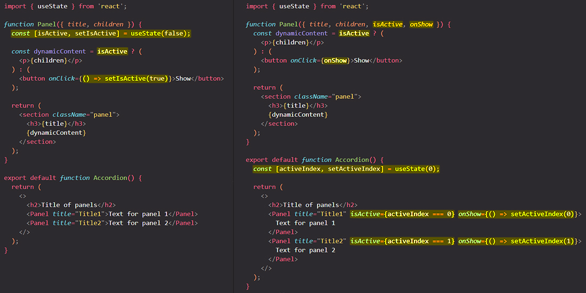
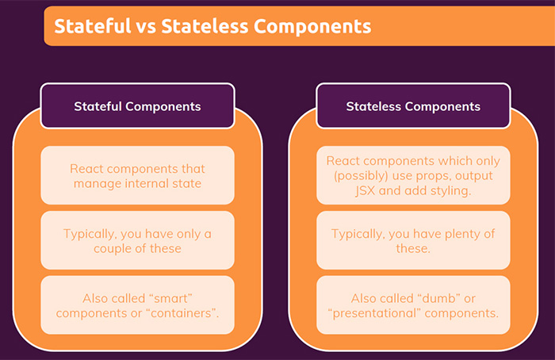
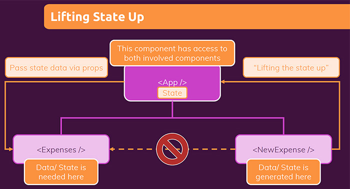
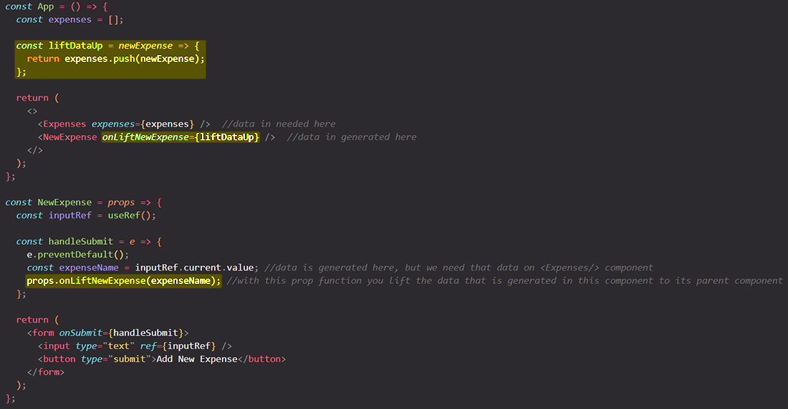

# Sharing state between components: lifting state up

==Sometimes, you want **the state of two or multiple components to always change together**. To do it, remove state from them, move it to their closest common parent, and then pass it down to them via props. This is known as **lifting state up**==.

You will learn:

- How to share state between components by lifting it up
- What are controlled and uncontrolled components

## Lifting state up

In this example, a parent `Accordion` component renders two separate `Panel`s:

- `Accordion`
  - `Panel`
  - `Panel`

Each `Panel` component has a boolean `isActive` state that determines whether its content is visible. Pressing one panel’s button does not affect the other panel — they are independent.

But now let’s say you want to change it so that only one panel is expanded at any given time. With that design, expanding the second panel should collapse the first one. How would you do that?

To coordinate these two panels, you need to ==“lift their state up” to the **closest common parent component**== in three steps:

1. ==**Remove state** from the child components.==
2. ==**Pass hardcoded data** from the common parent.==
3. ==**Add state** to the common parent and **pass it down together with the event handlers** as props.==

This will allow the `Accordion` component to coordinate both `Panel`s and only expand one at a time.



Moving state into the common parent component allowed you to coordinate the two panels. Using the `activeIndex` instead of two `isActive` states ensured that only one panel is active at a given time. And ==passing down the event handler to the child **allowed the child to change the parent’s state**==.

> **IMPORTANT**: ==Lifting state up often changes the nature of what you’re storing as state==. In our case, only one panel should be active at a time. This means that the `Accordion` common parent component needs to keep track of *which* panel is the active one. Instead of a `boolean` value, it could use a number as the index of the active `Panel` for the state variable:
>
> ```react
> const [activeIndex, setActiveIndex] = useState(0);
> ```

## Controlled and uncontrolled components

==It is common to call a component with some **local state** "uncontrolled". A child component that have a state variable that can't be changed by its parent component is called an uncontrolled component==. For example, the original `Panel` component with an `isActive` state variable is uncontrolled because its parent cannot influence whether the panel is active or not.

In contrast, you might say ==a component is "controlled" **when the important data in it is driven by props rather than its own local state**. This lets the parent component fully specify its behavior==. For example, the final `Panel` component with the `isActive` prop is controlled by the `Accordion` component.

==Uncontrolled components are easier to use within their parents because they require less configuration. But they’re less flexible when you want to coordinate them together. Controlled components are maximally flexible, but they require the parent components to fully configure them with props==.

In practice, “controlled” and “uncontrolled” aren’t strict technical terms — each component usually has some mix of both local state and props. However, this is a useful way to talk about how components are designed and what capabilities they offer.

==When writing a component, consider which information in it should be **controlled (via props)**, and which information should be **uncontrolled (via state)**==. But you can always change your mind and refactor later.



## A single source of truth for each state

In a React application, many components will have their own state. Some state may “live” close to the leaf components (components at the bottom of the tree) like inputs. Other state may “live” closer to the top of the app.

==For each unique piece of state, you will choose the component that “owns” it==. This principle is also known as having a “single source of truth”. It doesn’t mean that all state lives in one place — but that for *each* piece of state, there is a *specific* component that holds that piece of information. Instead of duplicating shared state between components, *lift it up* to their common shared parent, and *pass it down* to the children that need it.

Your app will change as you work on it. It is common that you will move state down or back up while you’re still figuring out where each piece of the state “lives”. This is all part of the process!

### Lifting the _data_ up

==You "lift the data up" by utilizing props in the child component to **receive a function from its parent component**==, and when you will call this prop function in your child component, you will pass as a argument the data that you wanna lift up to the parent component.



Consider this basic Component Tree which is roughly what we have in this demo app, where we have an `<App/>` component which in turn renders and `<Expenses/>` and a `<NewExpense/>` component. Now, in this case, the `<NewExpense/>` component is a component which generates some data.



Now it is ==quite common that you do generate or fetch data in a component, but that you might not need that data in that component==. Instead, we need that data in another component, in the `<Expenses/>` component. So naturally we would like to hand that data over but that doesn't work like this, because we have ==**no direct connection between two sibling components**==. Instead, we ==**can only communicate from parent to child and from child to parent**==. That's why in such cases like we have it here, we ==utilize the **closest parent component** which has direct or indirect access to both involved components==, in our case, the `<App/>` component.

The `<App/>` component in our application has access to both `<NewExpense/>` and `<Expenses/>` components, because it renders both components in its returned JSX markup. We can ==store our data in the closest parent component which has access to both involved components, by lifting our data up==.

We are passing data up to some parent component, because we either need that data directly in the `<App/>` component, or as it's the case in our demo app, and as it is quite common, because we then wanna pass that data down to another component via props. You will hear the term ==**Lifting The Data Up**== quite a bit when you were working with React and whenever you hear that, it is about ==moving data from a child component to some parent component, to either use it there or to then pass it down to some other child component==.

Now, it's not always that root `<App/>` component to which you wanna lift your data up. Instead, ==the goal is to lift data just as high as necessary in your Component Tree, _until you have a component which has both access to the component that generate data, as well as the component that need that data_==. That might be the `<App/>` component, but that could also be another component.

## Summary

- When you want to coordinate two components, move their state to their common parent.
- Then pass the information down through props from their common parent.
- Finally, pass the event handlers down so that the children can change the parent’s state.
- It’s useful to consider components as “controlled” (driven by props) or “uncontrolled” (driven by state).

## References

1. [React - The Complete Guide (incl Hooks, React Router, Redux) - Maximilian Schwarzmüller](https://www.udemy.com/course/react-the-complete-guide-incl-redux/)
1. [Sharing State Between Components - beta.reactjs.org](https://beta.reactjs.org/learn/sharing-state-between-components)
