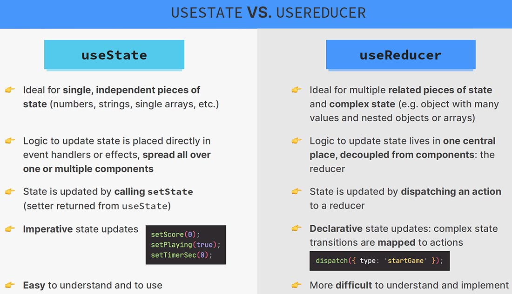

# `useReducer()` vs `useState()` for state management

### `useState()`

`useState()` is your ==main state management tool==. Typically, you start with `useState()` and often it's all you need. It's great for ==independent pieces of state and data==, it's great for simple state, you could say. It's great if state updates are easy and limited to a few kinds of updates. So, if you don't have a lot of different cases that will change a state, and especially ==if you don't have an object as a state== or anything like that. Now, if you do have an object as a state, or a more complex state, `useReducer()` might be interesting.

### `useReducer()`

If you do have an object as a state or a more complex state, `useReducer()` might be interesting because, in general, `useReducer()` is great if you need more power and with more power, I simply mean that you can ==write such a reducer function that can contain more complex state updating logic==, where you always are guaranteed to work with the latest state snapshot, and where you can move that potentially more complex logic out of your component function body into a separate reducer function.

You should especially consider `useReducer()` if you're dealing with related data, with state that is made up of related pieces of state. So when you, for example, have a scenario, as we had it with our form input state. And, in general, `useReducer()` can be helpful if you have more ==complex state updates, if you have different cases, different actions that can change a state==.

You should absolutely not always use `useReducer()`, because often that will be overkill. If you have just a simple state that just switches between two different values for example, using `useReducer()` might be overkill.

## Summary

## Comparing `useState` and `useReducer`

Reducers are not without downsides! Here’s a few ways you can compare them:

- **Code size:** Generally, with `useState` you have to write less code upfront. With `useReducer`, you have to write both a reducer function _and_ dispatch actions. However, ==`useReducer` can help cut down on the code if **many event handlers modify state in a similar way**==.
- **Readability:** `useState` is very easy to read when the state updates are simple. When they get more complex, they can bloat your component’s code and make it difficult to scan. In this case, ==`useReducer` lets you cleanly separate the **_how_** of update logic from the **_what happened_** of event handlers.==
- **Debugging:** When you have a bug with `useState`, it can be difficult to tell _where_ the state was set incorrectly, and _why_. ==With `useReducer`, you can add a console log into your reducer to see every state update, and _why_ it happened (due to which `action`).== If each `action` is correct, you’ll know that the mistake is in the reducer logic itself. However, you have to step through more code than with `useState`.
- **Testing:** A reducer is a pure function that doesn’t depend on your component. This means that you can export and test it separately in isolation. While generally it’s best to test components in a more realistic environment, for complex state update logic it can be useful to assert that your reducer returns a particular state for a particular initial state and action.
- **Personal preference:** Some people like reducers, others don’t. That’s okay. It’s a matter of preference. You can always convert between `useState` and `useReducer` back and forth: they are equivalent!

We recommend using a reducer if you often encounter bugs due to incorrect state updates in some component, and want to introduce more structure to its code. You don’t have to use reducers for everything: feel free to mix and match! You can even `useState` and `useReducer` in the same component.

## References

1. [React - The Complete Guide (incl Hooks, React Router, Redux) - Maximilian Schwarzmüller](https://www.udemy.com/course/react-the-complete-guide-incl-redux/)
1. [The Ultimate React Course: React, Redux & More - Jonas Schmedtmann](https://www.udemy.com/course/the-ultimate-react-course/)
1. [Extracting State Logic into a Reducer - beta.reactjs.org](https://beta.reactjs.org/learn/extracting-state-logic-into-a-reducer)
