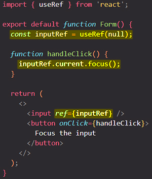
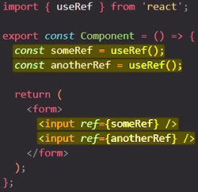
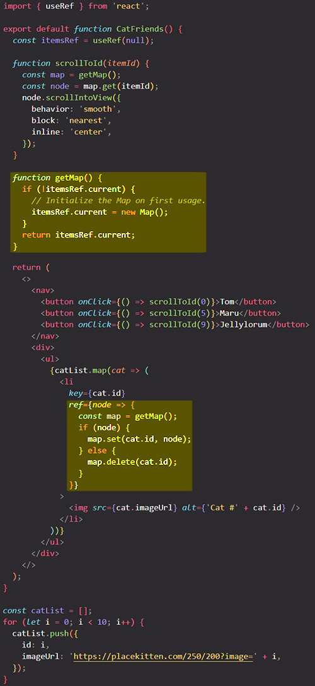
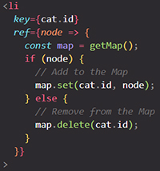

# Manipulating the DOM with Refs

==React automatically updates the DOM to match your render output, so your components won’t often need to manipulate it. However, sometimes you might need access to the DOM elements managed by React== — for example, to focus a node, scroll to it, or measure its size and position. There is no built-in way to do those things in React, so you will need a *ref* to the DOM node.

`ref`s  ==allow you to get **access to a DOM node** and work with it==. With `ref`s you can ==set up a connection between a DOM node and your JavaScript code==.

You will learn:

- How to access a DOM node managed by React with the `ref` attribute
- How the `ref` JSX attribute relates to the `useRef` hook
- How to access another component’s DOM node
- In which cases it’s safe to modify the DOM managed by React

## Getting a ref to the node

To access a DOM node managed by React you need to follow 3 steps:

1. Import the `useRef` hook
2. Use `useRef` to declare a ref inside your component
3. Pass the ref to the DOM node as a `ref` attribute

```react
import { useRef } from 'react';

const Component = () => {
  const myRef = useRef(null);
  return <div ref={myRef}>
};
```

> **Note**: Like all React hooks, `useRef()` is only usable inside of component function.
>
> Just like the `key` attribute, the `ref` attribute is a built-in prop, which ==you can add to any _build-in_ HTML element== because, and that's important, you can connect any HTML element to one of your references; you will very often do that for inputs, because you wanna fetch input data, for example, but you can do with any element.

==The `useRef` hook **returns an object** with a single property called `current`==. Initially, `myRef.current` will be `null`. When React creates a DOM node for this `<div>`, React will put a reference to this node into `myRef.current`. You can then access this DOM node from your event handlers and use the built-in browser APIs defined on it.

```react
// You can use any browser APIs, for example:
myRef.current.scrollIntoView();
```

> **Note**: Similarly to state, refs remain between re-renders. Changing refs don’t trigger re-renders.

### Example: Focusing a text input

In the example below, clicking the button will focus the input:



To implement this:

1. Declare `inputRef` with the `useRef` Hook
2. Pass it as `<input ref={inputRef}>`. This tells React to **put this `<input>`’s DOM node into `inputRef.current`**
3. In the `handleClick` function, read the input DOM node from `inputRef.current` and call `focus()` on it with `inputRef.current.focus()`
4. Pass the `handleClick` event handler to `<button>` with `onClick`

## You can have more than a single ref in a component



## How to manage a list of refs using a ref callback

sometimes you might need a ref to each item in the list, and you don’t know how many you will have. Something like this **wouldn’t work**:

```react
<ul>
  {items.map((item) => {
    // Doesn't work!
    const ref = useRef(null);
    return <li ref={ref} />;
  })}
</ul>
```

This is because **Hooks must only be called at the top-level of your component.** You can’t call `useRef` in a loop, in a condition, or inside a `map()` call.

One possible way around this is to get a single ref to their parent element, and then use DOM manipulation methods like [`querySelectorAll`](https://developer.mozilla.org/en-US/docs/Web/API/Document/querySelectorAll) to “find” the individual child nodes from it. However, this is brittle and can break if your DOM structure changes.

Another solution is to **pass a function to the `ref` attribute.** This is called a [`ref` callback.](https://react.dev/reference/react-dom/components/common#ref-callback) React will call your ref callback with the DOM node when it’s time to set the ref, and with `null` when it’s time to clear it. This lets you maintain your own array or a [Map](https://developer.mozilla.org/en-US/docs/Web/JavaScript/Reference/Global_Objects/Map), and access any ref by its index or some kind of ID.

This example shows how you can use this approach to scroll to an arbitrary node in a long list:



In this example, `itemsRef` doesn’t hold a single DOM node. Instead, it holds a [Map](https://developer.mozilla.org/docs/Web/JavaScript/Reference/Global_Objects/Map) from item ID to a DOM node. ([Refs can hold any values!](https://react.dev/learn/referencing-values-with-refs)) The [`ref` callback](https://react.dev/reference/react-dom/components/common#ref-callback) on every list item takes care to update the Map:



This lets you read individual DOM nodes from the Map later.

## When React attaches the refs 

In React, every update is split in two phases:

- During **render,** React calls your components to figure out what should be on the screen
- During **commit,** React applies changes to the DOM.

==**In general, you don’t want to access refs during rendering. That goes for refs holding DOM nodes as well**. During the first render, the DOM nodes have not yet been created, so `ref.current` will be `null`. And during the rendering of updates, the DOM nodes haven’t been updated yet. So it’s too early to read them==.

==**React sets `ref.current` during the commit**. Before updating the DOM, React sets the affected `ref.current` values to `null`. After updating the DOM, React immediately sets them to the corresponding DOM nodes==.

==**Usually, you will access refs from event handlers.** If you want to do something with a ref, but there is no particular event to do it in, you might need an Effect==.

## Best practices for DOM manipulation with refs 

==Refs are an escape hatch. You should only use them when you have to “step outside React”. Common examples of this include managing focus, scroll position, or calling browser APIs that React does not expose==. If you stick to _non-destructive_ actions like focusing and scrolling, you shouldn’t encounter any problems. However, if you try to **modify** the DOM manually, you can risk conflicting with the changes React is making.

> **Note**: _It is recommended that you don't manipulate the DOM nodes with refs_. Your DOM should really only be manipulated by React.
>
> **Avoid changing DOM nodes managed by React.** Modifying, adding children to, or removing children from elements that are managed by React can lead to inconsistent visual results or crashes. However, this doesn’t mean that you can’t do it at all. It requires caution. **You can safely modify parts of the DOM that React has _no reason_ to update.** For example, if some `<div>` is always empty in the JSX, React won’t have a reason to touch its children list. Therefore, it is safe to manually add or remove elements there.
>
> ==Rarely use `ref`s to manipulate the DOM==. Only in exceptional cases use `ref`s to manipulate the DOM. You can manipulate the DOM without React, and you typically shouldn't do that, but for example if you just wanna reset a value entered by a user in an input element, it is something you can consider doing.

## Summary

- Refs are a generic concept, but most often you’ll use them to hold DOM elements.
- You instruct React to put a DOM node into `myRef.current` by passing `<div ref={myRef}>`.
- Usually, you will use refs for _non-destructive actions_ like focusing, scrolling, or measuring DOM elements.
- A custom component doesn’t expose its DOM nodes by default. You can opt into exposing a DOM node by using `forwardRef` and passing the second `ref` argument down to a specific node.
- Avoid changing DOM nodes managed by React.
- If you do modify DOM nodes managed by React, modify parts that React has no reason to update.

## References

1. [React - The Complete Guide (incl Hooks, React Router, Redux) - Maximilian Schwarzmüller](https://www.udemy.com/course/react-the-complete-guide-incl-redux/)
2. [Manipulating the DOM with Refs - beta.reactjs.org](https://beta.reactjs.org/learn/manipulating-the-dom-with-refs)