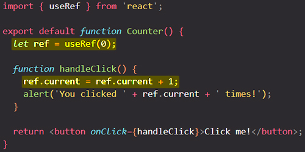
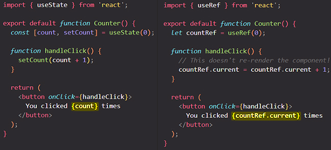

# How to "remember" information without re-rendering: referencing values with `ref`s

==When you want a component to "remember" some information, but you don’t want that information to trigger new renders, you can use a **ref**==:

```react
const ref = useRef(0);
```

==Like state, refs are retained by React between re-renders. However, setting state re-renders a component. Changing a ref does not! You can access the current value of that ref through the `ref.current` property.==

A ref is like a secret pocket of your component that React doesn’t track. For example, you can use refs to store [timeout IDs](https://developer.mozilla.org/en-US/docs/Web/API/setTimeout#return_value), [DOM elements](https://developer.mozilla.org/en-US/docs/Web/API/Element), and other objects that don’t impact the component’s rendering output.

You will learn:

- How to add a ref to your component
- How to update a ref’s value
- How refs are different from state
- How to use refs safely

## Adding a ref to your component

You can add a ref to your component by importing the `useRef` hook from React:

```react
import { useRef } from 'react';
```

==_Inside your component_, call the `useRef` hook and pass the **initial value** that you want to reference as the only argument.== For example, here is a ref to the value `0`:

```react
const ref = useRef(0);
```

==`useRef` returns an **object**== like this:

```react
{ 
  current: 0 // The value you passed to useRef
}
```

==You can access the current value of that ref through the `ref.current` property. This value is intentionally _mutable_, meaning you can both read and write to it.== It’s like a secret pocket of your component that React doesn’t track.

Here, a button will increment `ref.current` on every click:



The ref points to a number, but, like [state](https://beta.reactjs.org/learn/state-a-components-memory), you could point to anything: a string, an object, or even a function. ==Unlike state, ref is a plain JavaScript object with the `current` property that you can read and modify. Note that **the component doesn’t re-render when you modify the `ref.current` value.** Like state, **refs are retained by React between re-renders**. However, setting state re-renders a component but changing a ref does not!==

> **Note**: ==When a piece of information is used for rendering, keep it in **state**. When a piece of information is only needed by event handlers and changing it doesn’t require a re-render, using a **ref** may be more efficient==. You can combine refs and state in a single component.

## Differences between refs and state 

Perhaps you’re thinking refs seem less “strict” than state — you can mutate them instead of always having to use a state setting function, for instance. But in most cases, you’ll want to use state. Refs are an “escape hatch” you won’t need often. Here’s how state and refs compare:

| refs                                                         | state                                                        |
| ------------------------------------------------------------ | ------------------------------------------------------------ |
| `useRef(initialValue)` returns `{ current: initialValue }`   | `useState(initialValue)` returns the current value of a state variable and a state setter function ( `[value, setValue]`) |
| ==Doesn’t trigger re-render when you change it.==            | ==Triggers re-render when you change it.==                   |
| ==Mutable== — you can modify and update `current`’s value outside of the rendering process | ==“Immutable”== — you must use the state setting function to modify state variables to queue a re-render |
| You shouldn’t read (or write) the `current` value during rendering | You can read state at any time. However, each render has its own snapshot of state which does not change |

Below is a counter button that’s implemented with state. Because the `count` value is displayed, it makes sense to use a state value for it. When the counter’s value is set with `setCount()`, React re-renders the component and the screen updates to reflect the new count. If you tried to implement this with a ref, React would never re-render the component, so you’d never see the count change! See how clicking this button **does not update its text**:



==This is why reading `ref.current` during render leads to unreliable code. If you need that, use state instead.==

## When to use refs

==Typically, you will use a ref when your component needs to “step outside” React and communicate with external APIs — often a browser API that won’t impact the appearance of the component==. Here are a few of these rare situations:

- Storing [timeout IDs](https://developer.mozilla.org/docs/Web/API/setTimeout)
- Storing and manipulating [DOM elements](https://developer.mozilla.org/docs/Web/API/Element)
- Storing other objects that aren’t necessary to calculate the JSX.

==If your component needs to store some value, but it doesn’t impact the rendering logic, choose refs==.

## Best practices for refs 

Following these principles will make your components more predictable:

- ==Treat refs as an escape hatch==. Refs are useful when you work with external systems or browser APIs. If much of your application logic and data flow relies on refs, you might want to rethink your approach.
- ==Don’t read or write `ref.current` during rendering==. _If some information is needed during rendering, use state instead._ Since React doesn’t know when `ref.current` changes, even reading it while rendering makes your component’s behavior difficult to predict. The only exception to this is code like `if (!ref.current) ref.current = new Thing()` which only sets the ref once during the first render.

==Limitations of React state don’t apply to refs.== For example, state acts like a snapshot for every render and doesn’t update synchronously. But when you mutate the current value of a ref, it changes immediately:

```react
ref.current = 5;
console.log(ref.current); // 5
```

This is because **the ref itself is a regular JavaScript object**, and so it behaves like one.

==You also don’t need to worry about avoiding mutation when you work with a ref. As long as the object you’re mutating isn’t used for rendering, React doesn’t care what you do with the ref or its contents.==

## Refs and the DOM 

==You can point a ref to any value. However, the most common use case for a ref is to access a DOM element.== For example, this is handy if you want to focus an input programmatically. When you pass a ref to a `ref` attribute in JSX, like `<div ref={myRef}>`, React will put the corresponding DOM element into `myRef.current`.

## Summary

- ==Refs are an escape hatch to hold onto values that **aren’t used for rendering**==. You won’t need them often.
- A ref is a plain JavaScript object with a single property called `current`, which you can read or set.
- You can ask React to give you a ref by calling the `useRef` Hook.
- ==Like state, refs let you **retain information between re-renders** of a component.==
- Unlike state, setting the ref’s `current` value does not trigger a re-render.
- ==Don’t read or write `ref.current` during rendering.== This makes your component hard to predict.

## References

1. [Referencing Values with Refs - beta.reactjs.org](https://beta.reactjs.org/learn/referencing-values-with-refs)