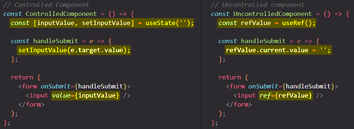

# Controlled vs uncontrolled components

The approach of using `ref`s to interact with DOM elements, specifically with `<input/>` elements, also has a special name. We're talking about uncontrolled components, if you access values with a `ref`. ==Why uncontrolled? Because they're internal state, so the value which is reflected in them is not controlled by React.== You rely on the default behavior of the input, where a user is able to enter something, and that entered value is reflected. And you then just fetch it with a React feature (`ref`s), but you don't feed data back into the `<input/>` like you do with `useState()` and `value` prop. So that's why is called uncontrolled, because you're not controlling the state off the `<input/>` element with React.

Now, you can talk about uncontrolled and controlled components, also in the context of other components, but most commonly you have this scenario when you talk about input components, about form components in general, because those components tend to have some internal state, natively by the browser, an input element is configured to take user input and save and reflect it, and when you then work with those components in a React app, _you wanna connect your React state to that_. That's why you typically have this controlled/uncontrolled thing when you work with input components in React.

==When we use `ref`s, you have _uncontrolled input_ components==. The approach you had before with `useState` Hook, where you manage your state and you updated that state on every keystroke, and you feed that state back into the `<input/>` with the `value` attribute, so that approach you had before you added `ref`s, that would be the controlled approach. Then you would say that `<input/>` fields are controlled components because their internal state is controlled by React.

## References

1. [React - The Complete Guide (incl Hooks, React Router, Redux) - Maximilian Schwarzmüller](https://www.udemy.com/course/react-the-complete-guide-incl-redux/)