# Lifecycle of reactive Effects

==Effects have a different lifecycle from components. Components may _mount_, _update_, or _unmount_. An Effect can only do two things: to _start synchronizing_ something, and later to _stop synchronizing_ it. This cycle can happen multiple times if your Effect depends on props and state that change over time. React provides a linter rule to check that you’ve specified your Effect’s dependencies correctly. This keeps your Effect synchronized to the latest props and state.==

You will learn:

- How an Effect’s lifecycle is different from a component’s lifecycle
- How to think about each individual Effect in isolation
- When your Effect needs to re-synchronize, and why
- How your Effect’s dependencies are determined
- What it means for a value to be reactive
- What an empty dependency array means
- How React verifies your dependencies are correct with a linter
- What to do when you disagree with the linter

## The lifecycle of an Effect 

==Every React component goes through the same lifecycle:==

- ==A component **mounts** when it’s added to the screen.==
- ==A component **updates** when it receives new props or state. This usually happens in response to an interaction.==
- ==A component **unmounts** when it’s removed from the screen.==

It’s a good way to think about components, but not about Effects. Instead, ==try to think about each Effect _independently_ from your component’s lifecycle. An Effect describes **how to [synchronize an external system](https://beta.reactjs.org/learn/synchronizing-with-effects) to the current props and state**. As your code changes, synchronization will need to happen more or less often==.

To illustrate this point, consider this Effect connecting your component to a chat server:

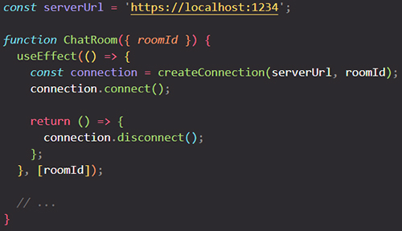

Your Effect’s body specifies how to **start synchronizing:**

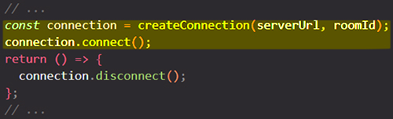

The cleanup function returned by your Effect specifies how to **stop synchronizing:**

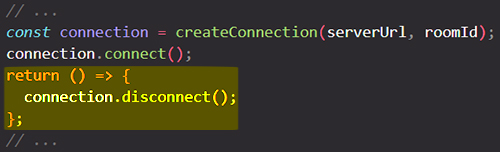

==Intuitively, you might think that React would _start synchronizing_ when your component mounts and _stop synchronizing_ when your component unmounts. However, this is not the end of the story! Sometimes, it may also be necessary to **start and stop synchronizing multiple times while the component remains mounted**==.

> **Note**: ==Your Effect’s body specifies how to _start synchronizing_, and your cleanup function specifies how to _stop synchronizing_==. 
>
> Some Effects don’t return a cleanup function at all. [More often than not,](https://beta.reactjs.org/learn/synchronizing-with-effects#how-to-handle-the-effect-firing-twice-in-development) you’ll want to return one — but if you don’t, React will behave as if you returned an empty cleanup function that doesn’t do anything.

When you looked at an Effect from the component’s perspective, it is tempting to think of Effects as “callbacks” or “lifecycle events” that fire at a specific time like “after a render” or “before unmount”. This way of thinking gets complicated very fast, so it’s best to avoid it. ==Instead, always focus on a single start/stop cycle at a time. It shouldn’t matter whether a component is mounting, updating, or unmounting. **All you need to do is to describe how to start synchronization and how to stop it**==. If you do it well, your Effect will be resilient to being started and stopped as many times as it’s needed.

This might remind you how you don’t think whether a component is mounting or updating when you write the rendering logic that creates JSX. You describe what should be on the screen, and React figures out the rest.

## How React verifies that your Effect can re-synchronize

Let say you have a `ChatRoom` component, an in it you have an Effect that synchronize with an external system:

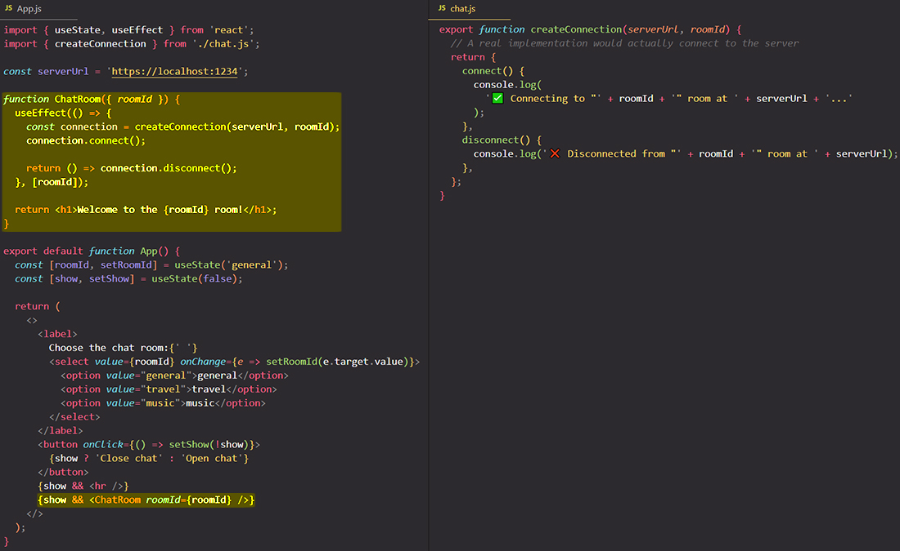

Notice that when the `ChatRoom` component _mounts for the first time_, you see three logs:

1. `✅ Connecting to "general" room at https://localhost:1234...` *(development-only)*
2. `❌ Disconnected from "general" room at https://localhost:1234.` *(development-only)*
3. `✅ Connecting to "general" room at https://localhost:1234...`

The first two logs are development-only. ==**In development, React always remounts each component once**. In other words, React verifies that your Effect can re-synchronize by forcing it to do that immediately in development. React starts and stops your Effect one extra time in development to check [you’ve implemented its cleanup well](https://beta.reactjs.org/learn/synchronizing-with-effects#how-to-handle-the-effect-firing-twice-in-development)==.

==The main reason your Effect will re-synchronize in practice is **if some data it uses has changed**==.

## How React knows that it needs to re-synchronize the Effect

You might be wondering how React knew that your Effect needed to re-synchronize after `roomId` changes. It’s because *you told React* that this Effect’s code depends on `roomId` by including it in the list of dependencies:

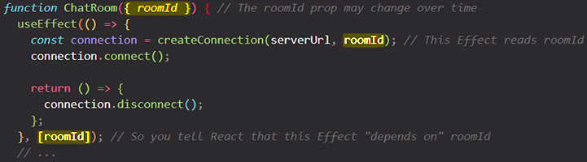

Here’s how this works:

1. You knew `roomId` is a prop, which means it can change over time.
2. You knew that your Effect reads `roomId` (so its logic depends on a value that may change later).
3. This is why you specified it as your Effect’s dependency (so that it re-synchronizes when `roomId` changes).

==Every time _after_ your component re-renders, React will look at the array of dependencies that you have passed. If any of the values in the array is different from the value at the same spot that you passed during the previous render, React will re-synchronize your Effect==.

## Each Effect represents a separate synchronization process 

Resist adding unrelated logic to your Effect only because this logic needs to run at the same time as an Effect you already wrote. For example, let’s say you want to send an analytics event when the user visits the room. You already have an Effect that depends on `roomId`, so you might feel tempted to add the analytics call right there:

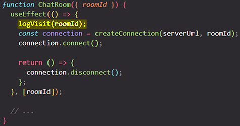

But imagine you later add another dependency to this Effect that needs to re-establish the connection. If this Effect re-synchronizes, it will also call `logVisit(roomId)` for the same room, which you did not intend. _Logging the visit **is a separate process** from connecting. This is why they should be written as two separate Effects_:

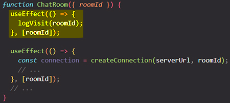

==Each Effect in your code should represent a **separate and independent synchronization process**==.

==In the above example, deleting one Effect wouldn’t break the other Effect’s logic. This is a good indication that they synchronize different things, and so it made sense to split them up.== On the other hand, if you split up a cohesive piece of logic into separate Effects, the code may look “cleaner” but will be more difficult to maintain. This is why ==you should think whether the processes are same or separate, not whether the code looks cleaner==.

## Effects “react” to reactive values 

Your Effect reads two variables (`serverUrl` and `roomId`), but you only specified `roomId` as a dependency:

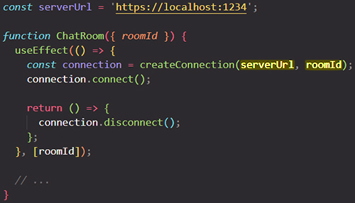

Why doesn’t `serverUrl` need to be a dependency? This is because the `serverUrl` never changes due to a re-render. It’s always the same no matter how many times the component re-renders and why. Since `serverUrl` never changes, it wouldn’t make sense to specify it as a dependency. ==After all, dependencies only do something when they change over time!== 

On the other hand, `roomId` may be different on a re-render. ==Props, state, and other values declared inside the component are _reactive_ because they’re calculated during rendering and participate in the React data flow==. If `serverUrl` was a state variable, it would be reactive. ==Reactive values must be included in dependencies==:

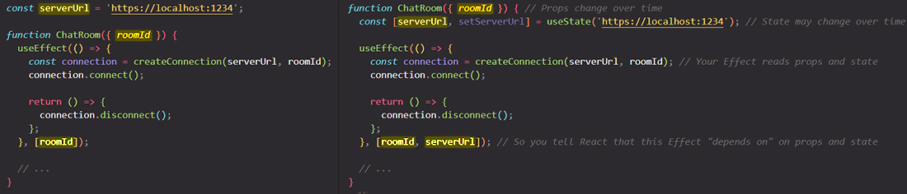

By including `serverUrl` as a dependency, you ensure that the Effect re-synchronizes after it changes.

## What an Effect with empty dependencies means 

What happens if you move both `serverUrl` and `roomId` outside the component?

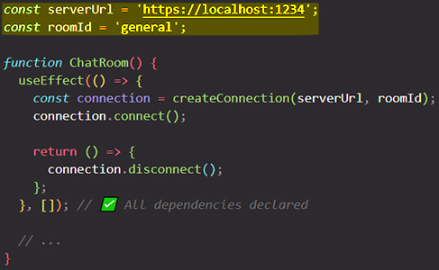

Now your Effect’s code does not use *any* reactive values, so its dependencies can be empty (`[]`).

==**Thinking from the component’s perspective**, the empty `[]` dependency array means this Effect connects to the chat room only when the component mounts, and disconnects only when the component unmounts (keep in mind that React would still re-synchronize it an extra time in development to stress-test your Effect’s logic)==.

However, if you **think from the Effect’s perspective**, you don’t need to think about mounting and unmounting at all. What’s important is you’ve specified what your Effect does to start and stop synchronizing. Today, it has no reactive dependencies. But if you ever want the user to change `roomId` or `serverUrl` over time (and so they’d have to become reactive), your Effect’s code won’t change. You will only need to add them to the dependencies.

## All variables declared in the component body are reactive 

==**Props and state aren’t the only reactive values. Values that you calculate from them are also reactive**. If the props or state change, your component will re-render, and the values calculated from them will also change. This is why all variables from the component body used by the Effect should also be in the Effect dependency list==.

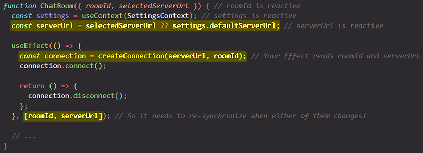

In this example, `serverUrl` is not a prop or a state variable. It’s a regular variable that you calculate during rendering. ==But it’s calculated during rendering, so it can change due to a re-render. This is why it’s reactive.==

==All values inside the component (including props, state, and variables in your component’s body) are reactive. Any reactive value can change on a re-render, so you need to include reactive values as Effect’s dependencies. In other words, Effects “react” to all values from the component body.==

> #### Can global or mutable values be dependencies?
>
> Mutable values (including global variables) aren’t reactive.
>
> **A mutable value like [`location.pathname`](https://developer.mozilla.org/en-US/docs/Web/API/Location/pathname) can’t be a dependency.** It’s mutable, so it can change at any time completely outside of the React rendering data flow. Changing it wouldn’t trigger a re-render of your component. Therefore, even if you specified it in the dependencies, React *wouldn’t know* to re-synchronize the Effect when it changes. This also breaks the rules of React because reading mutable data during rendering (which is when you calculate the dependencies) breaks [purity of rendering.](https://beta.reactjs.org/learn/keeping-components-pure) Instead, you should read and subscribe to an external mutable value with [`useSyncExternalStore`.](https://beta.reactjs.org/learn/you-might-not-need-an-effect#subscribing-to-an-external-store)
>
> **A mutable value like [`ref.current`](https://beta.reactjs.org/reference/react/useRef#reference) or things you read from it also can’t be a dependency.** The ref object returned by `useRef` itself can be a dependency, but its `current` property is intentionally mutable. It lets you [keep track of something without triggering a re-render.](https://beta.reactjs.org/learn/referencing-values-with-refs) But since changing it doesn’t trigger a re-render, it’s not a reactive value, and React won’t know to re-run your Effect when it changes.
>
> As you’ll learn, a linter will check for these issues automatically.

## React verifies that you specified every reactive value as a dependency 

If your linter is [configured for React,](https://beta.reactjs.org/learn/editor-setup#linting) it will check that every reactive value used by your Effect’s code is declared as its dependency.

> **Note**: In some cases, React *knows* that a value never changes even though it’s declared inside the component. For example, the [`set` function](https://beta.reactjs.org/reference/react/useState#setstate) returned from `useState` and the ref object returned by [`useRef`](https://beta.reactjs.org/reference/react/useRef) are *stable* — they are guaranteed to not change on a re-render. Stable values aren’t reactive, so the linter lets you omit them from the list. However, including them is allowed: they won’t change, so it doesn’t matter.

## What to do when you don’t want to re-synchronize

==**You could “prove” to the linter that a value isn't a reactive value** (that it *can’t* change as a result of a re-render) by move it outside the component==. For example, if `serverUrl` and `roomId` don’t depend on rendering and always have the same values, you can move them outside the component. Now they don’t need to be dependencies:

You can also move them *inside the Effect.* They aren’t calculated during rendering, so they’re not reactive:

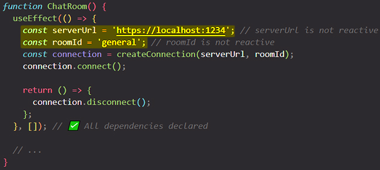

==**Effects are reactive blocks of code**. They re-synchronize when the values you read inside of them change. Unlike event handlers, which only run once per interaction, Effects run whenever synchronization is necessary.==

==**You can’t “choose” your dependencies.** Your dependencies must include every reactive value you read in the Effect.== The linter enforces this. Sometimes this may lead to problems like infinite loops and to your Effect re-synchronizing too often. Don’t fix these problems by suppressing the linter! Here’s what to try instead:

- ==**Check that your Effect represents an independent synchronization process.**== If your Effect doesn’t synchronize anything, it might be unnecessary. If it synchronizes several independent things, split it up.
- ==**If you want to read the latest value of props or state without “reacting” to it and re-synchronizing the Effect,**== you can split your Effect into a reactive part (which you’ll keep in the Effect) and a non-reactive part (which you’ll extract into something called an *Event function*). [Read more about separating Events from Effects.](https://beta.reactjs.org/learn/separating-events-from-effects)
- ==**Avoid relying on objects and functions as dependencies.**== If you create objects and functions during rendering and then read them from an Effect, they will be different on every render. This will cause your Effect to re-synchronize every time. [Read more about removing unnecessary dependencies from your Effects.](https://beta.reactjs.org/learn/removing-effect-dependencies)

> **Note**: The linter is your friend, but its powers are limited. The linter only knows when the dependencies are *wrong*. It doesn’t know *the best* way to solve each case. If the linter suggests a dependency, but adding it causes a loop, it doesn’t mean the linter should be ignored. It means you need to change the code inside (or outside) the Effect so that that value isn’t reactive and doesn’t *need* to be a dependency.

## Summary

- Components can mount, update, and unmount.
- Each Effect has a separate lifecycle from the surrounding component.
- Each Effect describes a separate synchronization process that can *start* and *stop*.
- When you write and read Effects, you should think from each individual Effect’s perspective (how to start and stop synchronization) rather than from the component’s perspective (how it mounts, updates, or unmounts).
- Values declared inside the component body are “reactive”.
- Reactive values should re-synchronize the Effect because they can change over time.
- The linter verifies that all reactive values used inside the Effect are specified as dependencies.
- All errors flagged by the linter are legitimate. There’s always a way to fix the code that doesn’t break the rules.

## References

1 [Lifecycle of Reactive Effects - beta.reactjs.org](https://beta.reactjs.org/learn/lifecycle-of-reactive-effects)