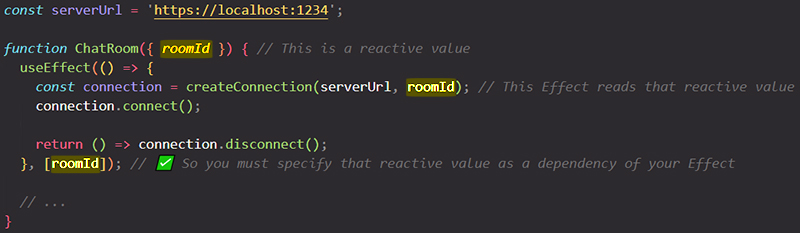
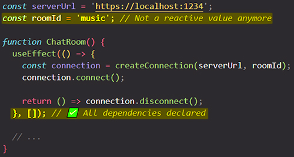
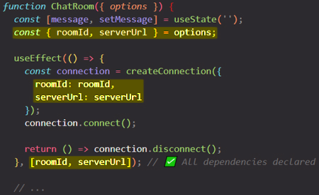
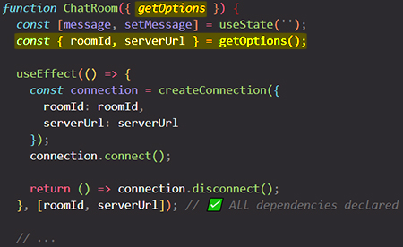

# Removing Effect Dependencies

==When you write an Effect, the linter will verify that you’ve included every reactive value (like props and state) that the Effect reads in the list of your Effect’s dependencies. This ensures that your Effect remains synchronized with the latest props and state of your component. _Unnecessary dependencies may cause your Effect to run too often_, or even create an infinite loop==. The way you remove them depends on the case.

Think of the dependency list as a list of all the reactive values used by your Effect’s code. You don’t intentionally choose what to put on that list. The list describes your code. To change the dependency list, change the code.

You will learn:

- How to fix infinite Effect dependency loops
- What to do when you want to remove a dependency
- How to read a value from your Effect without “reacting” to it
- How and why to avoid object and function dependencies
- Why suppressing the dependency linter is dangerous, and what to do instead

## Dependencies should match the code

When you write an Effect, you first specify how to [start and stop](https://beta.reactjs.org/learn/lifecycle-of-reactive-effects#the-lifecycle-of-an-effect) whatever you want your Effect to be doing:

Then, if you leave the Effect dependencies empty (`[]`), the linter will suggest the correct dependencies. Fill them in according to what the linter says:

==**Effects “react” to reactive values**. Since `roomId` is a reactive value (it can change due to a re-render), the linter verifies that you’ve specified it as a dependency==.

## To remove a dependency, prove that it’s not a dependency

==Notice that you can’t “choose” the dependencies of your Effect. Every _reactive value_ used by your Effect’s code must be declared in your dependency list. Your Effect’s dependency list is determined by the surrounding code==:

==Reactive values include props and all variables and functions declared directly inside of your component==. Since `roomId` is a reactive value, you can’t remove it from the dependency list. The linter wouldn’t allow it:

And the linter would be right! Since `roomId` may change over time, this would introduce a bug in your code.

==To remove a dependency, you need to “prove” to the linter that it doesn’t need to be a dependency==. For example, you can move `roomId` out of your component to prove that it’s not reactive and won’t change on re-renders:

Now that `roomId` is not a reactive value (and can’t change on a re-render), it doesn’t need to be a dependency. This is why you could now specify an empty (`[]`) dependency list. Your Effect *really doesn’t* depend on any reactive value anymore, so it *really doesn’t* need to re-run when any of the component’s props or state change.

## To change the dependencies, change the code

You might have noticed a pattern in your workflow:

1. First, you **change the code** of your Effect or how your reactive values are declared.
2. Then, you follow the linter and adjust the dependencies to **match the code you have changed.**
3. If you’re not happy with the list of dependencies, you **go back to the first step** (and change the code again).

The last part is important. ==If you want to change the dependencies, change the surrounding code first. You can think of the dependency list as a list of all the reactive values used by your Effect’s code. **You don’t intentionally _choose_ what to put on that list. The list _describes_ your code**. To change the dependency list, change the code==.

## Removing unnecessary dependencies

==Every time you adjust the Effect’s dependencies to reflect the code, look at the dependency list. Does it make sense for the Effect to re-run when any of these dependencies change? Sometimes, the answer is “no”:==

- You might want to re-execute *different parts* of your Effect under different conditions.
- You might want to only read the *latest value* of some dependency instead of “reacting” to its changes.
- A dependency may change too often *unintentionally* because it’s an object or a function.

To find the right solution, you’ll need to answer a few questions about your Effect:

- [Should this code move to an event handler?](https://react.dev/learn/removing-effect-dependencies#should-this-code-move-to-an-event-handler)
- [Is your Effect doing several unrelated things?](https://react.dev/learn/removing-effect-dependencies#is-your-effect-doing-several-unrelated-things)
- [Are you reading some state to calculate the next state?](https://react.dev/learn/removing-effect-dependencies#are-you-reading-some-state-to-calculate-the-next-state)
- [Do you want to read a value without “reacting” to its changes?](https://react.dev/learn/removing-effect-dependencies#do-you-want-to-read-a-value-without-reacting-to-its-changes)
- [Does some reactive value change unintentionally?](https://react.dev/learn/removing-effect-dependencies#does-some-reactive-value-change-unintentionally)

## Avoid objects and functions as Effect dependencies

Object and function dependencies can make your Effect re-synchronize more often than you need. ==In JavaScript, each newly created object and function is considered distinct from all the others. It doesn’t matter that the content inside of them may be the same! **Object and function dependencies create a risk that your Effect will re-synchronize more often than you need**. This is why, whenever possible, you should try to avoid objects and functions as your Effect’s dependencies==.

Instead, try:

- moving them outside the component
- moving them inside the Effect
- extracting primitive values out of them.

### Move static objects and functions outside your component

==If the object does not depend on any props and state, you can move that object outside your component:==

This way, you _prove_ to the linter that it’s not reactive. It can’t change as a result of a re-render, so it doesn’t need to be a dependency of your Effect. Now re-rendering `ChatRoom` won’t cause your Effect to re-synchronize.

This works for functions too:

### Move dynamic objects and functions inside your Effect

==If your object depends on some reactive value that may change as a result of a re-render, like a `roomId` prop, you can’t pull it _outside_ your component. You can, however, move its creation _inside_ of your Effect’s code:==

Now that `options` is declared inside of your Effect, it is no longer a dependency of your Effect. Instead, the only reactive value used by your Effect is `roomId`. Since `roomId` is not an object or function, you can be sure that it won’t be _unintentionally_ different.

This works for functions, too:

In JavaScript, numbers and strings are compared by their content:

### Read primitive values from objects

Sometimes, you may receive an object from props:

The risk here is that the parent component will create the object during rendering:

This would cause your Effect to re-connect every time the parent component re-renders. To fix this, read all the necessary information from the object _outside_ the Effect, and avoid having objects and functions dependencies:

The logic gets a little repetitive (you read some values from an object outside an Effect, and then create an object with the same values inside the Effect). But it makes it very explicit what information your Effect _actually_ depends on. If an object is re-created unintentionally by the parent component, the chat would not re-connect. However, if `options.roomId` or `options.serverUrl` actually change, the chat would re-connect as you’d expect.

### Calculate primitive values from functions

The same approach can work for functions. For example, suppose the parent component passes a function:

To avoid making it a dependency (and thus causing it to re-connect on re-renders), call it outside the Effect. This gives you the `roomId` and `serverUrl` values that aren’t objects, and that you can read from inside your Effect:

This only works for [pure](https://beta.reactjs.org/learn/keeping-components-pure) functions because they are safe to call during rendering. If your function is an event handler, but you don’t want its changes to re-synchronize your Effect, [wrap it into an Effect Event instead.](https://beta.reactjs.org/learn/removing-effect-dependencies#do-you-want-to-read-a-value-without-reacting-to-its-changes)

## Summary

- Dependencies should always match the code.
- When you’re not happy with your dependencies, what you need to edit is the code.
- To remove a dependency, you need to “prove” to the linter that it’s not necessary.
- If the code in your Effect should run in response to a specific interaction, move that code to an event handler.
- If different parts of your Effect should re-run for different reasons, split it into several Effects.
- If you want to update some state based on the previous state, pass an updater function.
- If you want to read the latest value without “reacting” it, extract an Effect Event from your Effect.
- In JavaScript, objects and functions are considered different if they were created at different times.
- Try to avoid object and function dependencies. Move them outside the component or inside the Effect.

## References

1. [Removing Effect Dependencies - beta.reactjs.org](https://beta.reactjs.org/learn/removing-effect-dependencies)
