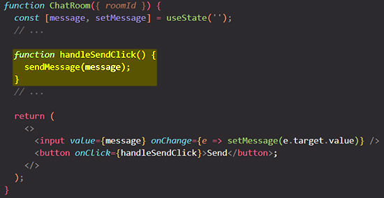
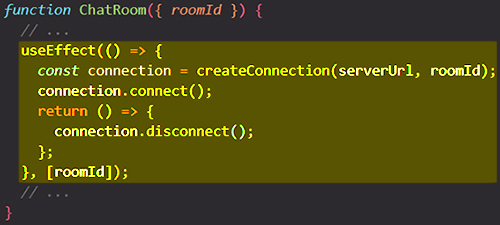
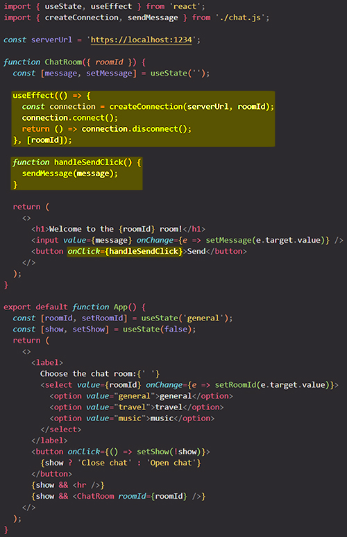
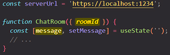
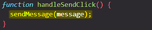
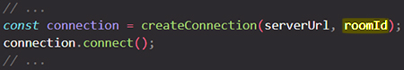
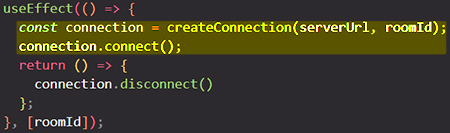
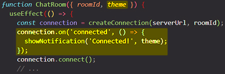
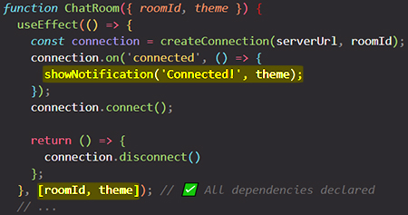

# Separating Events from Effects

==Event handlers only re-run when you perform the same interaction again. Unlike event handlers, Effects re-synchronize if some value they read, like a prop or a state variable, is different from what it was during the last render==. Sometimes, you also want a mix of both behaviors: an Effect that re-runs in response to some values but not others.

All code inside Effects is *reactive.* It will run again if some reactive value it reads has changed due to a re-render.

You will learn:

- How to choose between an event handler and an Effect
- Why Effects are reactive, and event handlers are not
- What to do when you want a part of your Effect’s code to not be reactive
- What Effect Events are, and how to extract them from your Effects
- How to read the latest props and state from Effects using Effect Events

## Choosing between event handlers and Effects 

Imagine you’re implementing a `chatRoom` component. Your requirements look like this:

1. Your component should automatically connect to the selected chat room.
2. When you click the “Send” button, it should send a message to the chat.

Let’s say you’ve already implemented the code for them, but you’re not sure where to put it. Should you use event handlers or Effects? ==Every time you need to answer this question, consider [**_why_ the code needs to run**](https://beta.reactjs.org/learn/synchronizing-with-effects#what-are-effects-and-how-are-they-different-from-events).==

### Event handlers run in response to specific interactions 

From the user’s perspective, sending a message should happen *because* the particular “Send” button was clicked. The user will get rather upset if you send their message at any other time or for any other reason. This is why sending a message should be an event handler. ==Event handlers let you handle specific interactions==:



With an event handler, you can be sure that `sendMessage(message)` will *only* run if the user presses the button.

### Effects run whenever synchronization is needed 

Recall that you also need to keep the component connected to the chat room. Where does that code go?

==The *reason* to run this code is not some particular interaction.== It doesn’t matter why or how the user navigated to the chat room screen. Now that they’re looking at it and could interact with it, the component needs to stay connected to the selected chat server. Even if the chat room component was the initial screen of your app, and the user has not performed any interactions at all, you would *still* need to connect. This is why it’s an Effect:



With this code, you can be sure that there is always an active connection to the currently selected chat server, *regardless* of the specific interactions performed by the user. Whether the user has only opened your app, selected a different room, or navigated to another screen and back, your Effect will ensure that the component will *remain synchronized* with the currently selected room, and will [re-connect whenever it’s necessary.](https://beta.reactjs.org/learn/lifecycle-of-reactive-effects#why-synchronization-may-need-to-happen-more-than-once)



## Reactive values and reactive logic 

==Intuitively, you could say that event handlers are always triggered “manually”, for example by clicking a button. Effects, on the other hand, are “automatic”: they run and re-run as often as it’s needed to stay synchronized==.

There is a more precise way to think about this. ==Props, state, and variables declared inside your component’s body are called **reactive values**==. In this example, `serverUrl` is not a reactive value, but `roomId` and `message` are. They participate in the rendering data flow:



==Reactive values like these can change due to a re-render==. For example, the user may edit the `message` or choose a different `roomId` in a dropdown.

==Event handlers and Effects are different in **how they respond to changes**==:

- ==**Logic inside event handlers is _not reactive_**. It will not run again unless the user performs the same interaction (for example, a click) again. Event handlers can read reactive values, but they don’t “react” to their changes==.
- ==**Logic inside Effects is _reactive_**. If your Effect reads a reactive value, you have to specify it as a dependency. Then, if a re-render causes that value to change, React will re-run your Effect’s logic again with the new value==.

### Logic inside event handlers is not reactive 

Take a look at this line of code. Should this logic be reactive or not?


_From the user’s perspective, a change to the `message` does not mean that they want to send a message. It only means that the user is typing_. In other words, the logic that sends a message should not be reactive. It should not run again only because the reactive value has changed. That’s why you placed this logic in the event handler:



### Logic inside Effects is reactive 

Now let’s return to these lines:



_From the user’s perspective, a change to the `roomId` does mean that they want to connect to a different room. In other words, the logic for connecting to the room should be reactive. You *want* these lines of code to “keep up” with the reactive value, and to run again if that value is different_. That’s why it belongs in an Effect:



Effects are reactive, so `createConnection(serverUrl, roomId)` and `connection.connect()` will run for every distinct value of `roomId`. Your Effect keeps the chat connection synchronized to the currently selected room.

## Extracting non-reactive logic out of Effects 

Things get more tricky when you want to mix reactive logic with non-reactive logic.

For example, imagine that you want to show a notification when the user connects to the chat. You read the current theme (dark or light) from the props so that you can show the notification in the correct color:



However, `theme` is a reactive value (it can change as a result of re-rendering), and every reactive value read by an Effect must be declared as its dependency. So now you have to specify `theme` as a dependency of your Effect:



When the `roomId` changes, the chat re-connects as you would expect. But since `theme` is also a dependency, the chat *also* re-connects every time you switch between the dark and the light theme. That’s not great!

In other words, you *don’t* want this line to be reactive, even though it is inside an Effect (which is reactive):

```react
// ...
showNotification('Connected!', theme);
// ...
```

[You need a way to separate this non-reactive logic from the reactive Effect around it](https://beta.reactjs.org/learn/separating-events-from-effects#declaring-an-effect-event).

## Summary

- Event handlers run in response to specific interactions.
- Effects run whenever synchronization is needed.
- Logic inside event handlers is not reactive.
- Logic inside Effects is reactive.
- You can move non-reactive logic from Effects into Effect Events.
- Only call Effect Events from inside Effects.
- Don’t pass Effect Events to other components or Hooks.

## References

1. [Separating Events from Effects - beta.reactjs.org](https://beta.reactjs.org/learn/separating-events-from-effects)