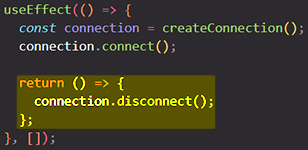

# Synchronizing with Effects

==Some components need to synchronize with external systems==. For example, you might want to control a non-React component based on the React state, set up a server connection, or send an analytics log when a component appears on the screen. ==Effects let you run some code **after rendering** so that you can synchronize your component with some system outside of React==.

You will learn:

- What Effects are
- How Effects are different from events
- How to declare an Effect in your component
- How to skip re-running an Effect unnecessarily
- Why Effects run twice in development and how to fix them

## What are Effects and how are they different from events?

Before getting to Effects, you need to be familiar with ==two types of logic inside React components==:

- ==**Rendering code**== lives at the top level of your component. This is where you take the props and state, transform them, and return the JSX you want to see on the screen. [Rendering code must be pure.](https://beta.reactjs.org/learn/keeping-components-pure) Like a math formula, it should only *calculate* the result, but not do anything else.
- ==**Event handlers**== are nested functions inside your components that *do* things rather than just calculate them. An event handler might update an input field, submit an HTTP POST request to buy a product, or navigate the user to another screen. ==Event handlers contain ["side effects"](https://en.wikipedia.org/wiki/Side_effect_(computer_science)) (they change the program's state) and are caused by a specific user action== (for example, a button click or typing).

Sometimes this isn't enough. Consider a `ChatRoom` component that must connect to the chat server _whenever it’s visible on the screen_. Connecting to a server is not a pure calculation (it’s a side effect) so _it can’t happen during rendering_. However, there is no single particular event like a click that causes `ChatRoom` to be displayed.

==Effects let you specify **side effects that are caused by rendering itself, rather than by a particular event**==. Sending a message in the chat is an *event* because it is directly caused by the user clicking a specific button. However, setting up a server connection is an *Effect* because it needs to happen regardless of which interaction caused the component to appear. ==**Effects run at the end of a [commit](https://react.dev/learn/render-and-commit) _after_ the screen updates**==. This is a good time to synchronize the React components with some external system (like network or a third-party library).

> **Note**: Here and later in this text, capitalized “Effect” refers to the React-specific definition above, i.e. _a side effect caused by rendering_. To refer to the broader programming concept, we’ll say “side effect”.

## You might not need an Effect 

Don’t rush to add Effects to your components. ==Keep in mind that Effects are typically used to “step out” of your React code and synchronize with some *external* system. This includes browser APIs, third-party widgets, network, and so on.== _If your Effect only adjusts some state based on other state, [you might not need an Effect](https://beta.reactjs.org/learn/you-might-not-need-an-effect)_.

## How to write an Effect 

To write an Effect, follow these three steps:

1. ==**Declare** an Effect. By default, your Effect will run _after_ every render.==
2. ==Specify the **Effect dependencies**. Most Effects should only re-run *when needed*, rather than after every render.== For example, a fade-in animation should only trigger when a component appears. Connecting and disconnecting to a chat room should only happen when the component appears and disappears, or when the chat room changes. You will learn how to control this by specifying **dependencies**.
3. ==Add **cleanup** if needed. Some Effects need to specify how to stop, undo, or clean up whatever they were doing==. For example, “connect” needs “disconnect”, “subscribe” needs “unsubscribe”, and “fetch” needs either “cancel” or “ignore”. You will learn how to do this by returning a **_cleanup_ function**.

### Step 1: Declare an Effect 

To declare an Effect in your component, import the [`useEffect` hook](https://beta.reactjs.org/reference/react/useEffect) from React. Then, call it at the top level of your component and put some code inside your Effect:


==Every time your component renders, React will update the screen *and then* run the code inside `useEffect`. In other words, **`useEffect` "delays" a piece of code from running until that render is reflected on the screen**==.

Let’s see _how you can use an Effect to synchronize with an external system_. Consider a `<VideoPlayer>` React component. It would be nice to control whether it’s playing or paused by passing an `isPlaying` prop to it:

```react
<VideoPlayer isPlaying={isPlaying} />;
```

Your custom `VideoPlayer` component renders the built-in browser [`<video>`](https://developer.mozilla.org/en-US/docs/Web/HTML/Element/video) tag:

```react
function VideoPlayer({ src, isPlaying }) {
  // TODO: do something with isPlaying
  return <video src={src} />;
}
```

However, the browser `<video>` tag does not have an `isPlaying` prop. The only way to control it is to manually call the [`play()`](https://developer.mozilla.org/en-US/docs/Web/API/HTMLMediaElement/play) and [`pause()`](https://developer.mozilla.org/en-US/docs/Web/API/HTMLMediaElement/pause) methods on the DOM element. **You need to synchronize the value of `isPlaying` prop, which tells whether the video _should_ currently be playing, with imperative calls like `play()` and `pause()`.** 

We’ll need to first [get a ref](https://beta.reactjs.org/learn/manipulating-the-dom-with-refs) to the `<video>` DOM node. You might be tempted to try to call `play()` or `pause()` during rendering, but that isn’t correct:


==The reason this code isn’t correct is that it **tries to do something with the DOM node during rendering. In React, [rendering should be a pure calculation](https://beta.reactjs.org/learn/keeping-components-pure) of JSX and should not contain side effects like modifying the DOM**==. Moreover, when `VideoPlayer` is called for the first time, its DOM does not exist yet! There isn’t a DOM node yet to call `play()` or `pause()` on, because React doesn’t know what DOM to create until after you return the JSX.

The solution here is to **wrap the side effect with `useEffect` to move it out of the rendering calculation:**


==By wrapping the DOM update in an Effect, you let React update the screen first. Then your Effect runs==. When your `VideoPlayer` component renders (either the first time or if it re-renders), a few things will happen. First, React will update the screen, ensuring the `<video>` tag is in the DOM with the right props. Then React will run your Effect. Finally, your Effect will call `play()` or `pause()` depending on the value of `isPlaying`.

In this example above, the “external system” you synchronized to React state was the browser media API. You can use a similar approach to wrap legacy non-React code (like jQuery plugins) into declarative React components.

>==By default, Effects run after *every* render==. This is why code like below will **produce an infinite loop:**
>
>```react
>const [count, setCount] = useState(0);
>useEffect(() => {
>    	setCount(count + 1);
>});
>```
>
>Effects run as a *result* of rendering. Setting state *triggers* rendering. Setting state immediately in an Effect is like plugging a power outlet into itself. The Effect runs, it sets the state, which causes a re-render, which causes the Effect to run, it sets the state again, this causes another re-render, and so on.
>
>==Effects should usually synchronize your components with an *external* system. If there’s no external system and you only want to adjust some state based on other state, [you might not need an Effect](https://beta.reactjs.org/learn/you-might-not-need-an-effect)==.

### Step 2: Specify the Effect dependencies

==By default, Effects run after *every* render. Often, this is _not what you want_==:

- **Sometimes, it’s slow**. Synchronizing with an external system is not always instant, so you might want to skip doing it unless it’s necessary. For example, you don’t want to reconnect to the chat server on every keystroke.
- **Sometimes, it’s wrong**. For example, you don’t want to trigger a component fade-in animation on every keystroke. The animation should only play once when the component appears for the first time.

==You can tell React to **skip unnecessarily re-running the Effect by specifying an _array of dependencies_** as the second argument to the `useEffect` call==:

```react
useEffect(() => {
  // ...
}, []);
```


Specifying `[isPlaying]` as the dependency array tells React that it ==should skip re-running your Effect **if `isPlaying` is the same as it was during the previous render**==.

> **Note**: ==The dependency array can contain multiple dependencies. React will only skip re-running the Effect **if _all_** of the dependencies you specify have exactly the same values as they had during the previous render==. React compares the dependency values using the [`Object.is`](https://developer.mozilla.org/en-US/docs/Web/JavaScript/Reference/Global_Objects/Object/is) comparison.

Notice that ==**you can’t "choose" your dependencies**. You will get a lint error _if the dependencies you specified don’t match what React expects based on the code inside your Effect_. This helps catch many bugs in your code. If your Effect uses some value but you _don’t_ want to re-run the Effect when it changes, you’ll need to [*edit the Effect code itself* to not “need” that dependency](https://beta.reactjs.org/learn/lifecycle-of-reactive-effects#what-to-do-when-you-dont-want-to-re-synchronize)==. If the linter lets you omit a dependency without errors, that means it is safe to do.

==Omitting **_always-stable_ dependencies** only works when the linter can "see" that the object is stable==. This Effect uses *both* `ref` and `isPlaying`, but only `isPlaying` is declared as a dependency:


This is because the `ref` object has a ==**stable identity**==: React guarantees [you’ll always get the same object](https://beta.reactjs.org/reference/react/useRef#returns) from the same `useRef` call on every render. It never changes, so it will never by itself cause the Effect to re-run. Therefore, it does not matter whether you include it or not. Including it is fine too.

Omitting always-stable dependencies only works when the linter can “see” that the object is stable. For example, if `ref` was passed from a parent component, you would have to specify it in the dependency array. However, this is good because you can’t know whether the parent component always passes the same ref, or passes one of several refs conditionally. So your Effect *would* depend on which ref is passed.

>**Note**: The behaviors *without* the dependency array and with an *empty* `[]` dependency array are very different:
>
>```react
>useEffect(() => {
>  	// This runs after every render
>});
>
>
>useEffect(() => {
>  	// This runs only on mount (when the component appears)
>}, []);
>
>
>useEffect(() => {
>  	// This runs on mount *and also* if either a or b have changed since the last render
>}, [a, b]);
>```

### Step 3: Add cleanup if needed

==In the `useEffect()` function you can return only one specific thing, and that thing is a function. The function that you return from the `useEffect()` is called **cleanup function**. This function that you return from `useEffect()` will **run as a cleanup process _before_ `useEffect()` will be re-executed**. _The cleanup function will not run when the `useEffect()` is **executed for the first time**_==.

The `useEffect()` will be re-executed only if the dependencies changes or the component unmounts from the DOM (is removed from the DOM). In those cases the `useEffect()` is re-executed, and the first thing that will be executed inside the `useEffect()` function will be the cleanup function.

> **Note**: ==React will call your cleanup function each time before the Effect runs again, and one final time when the component unmounts from DOM (gets removed from DOM)==.

When you implement the cleanup well, there should be no user-visible difference between running the Effect once vs running it, cleaning it up, and running it again.

#### Add cleanup if needed - a little example:

You’re writing a `ChatRoom` component that needs to connect to the chat server when it appears. You are given a `createConnection()` API that returns an object with `connect()` and `disconnect()` methods. How do you keep the component connected while it is displayed to the user?

Start by writing the Effect logic:


The code inside the Effect does not use any props or state, so your dependency array is `[]` (empty). This tells React to only run this code when the component “mounts”, i.e. appears on the screen for the first time. This Effect only runs on mount, so you might expect `"✅ Connecting..."` to be printed once in the console. **However, if you check the console, `"✅ Connecting..."` gets printed twice. Why does it happen?**

Imagine the `ChatRoom` component is a part of a larger app with many different screens. The user starts their journey on the `ChatRoom` page. The component mounts and calls `connection.connect()`. Then imagine the user navigates to another screen — for example, to the Settings page. The `ChatRoom` component unmounts. Finally, the user clicks Back and `ChatRoom` mounts again. This would set up a second connection — but the first connection was never destroyed! As the user navigates across the app, the connections would keep piling up.

==Bugs like this are easy to miss without extensive manual testing. To help you spot them quickly, **in development** React remounts every component once immediately after its initial mount==. **Seeing the `"✅ Connecting..."` log twice helps you notice the real issue: your code doesn’t close the connection when the component unmounts.**

To fix the issue, return a *cleanup function* from your Effect:



==React will call your cleanup function each time before the Effect runs again, and one final time when the component unmounts (gets removed).==

Now you get three console logs in development:

1. `"✅ Connecting..."`
2. `"❌ Disconnected."`
3. `"✅ Connecting..."`

==**This is the correct behavior in development**. By remounting your component, React verifies that navigating away and back would not break your code. Disconnecting and then connecting again is exactly what should happen! **When you implement the cleanup well, there should be no user-visible difference between running the Effect once vs running it, cleaning it up, and running it again**. There’s an extra connect/disconnect call pair because React is probing your code for bugs in development. This is normal and you shouldn’t try to make it go away==.

==**In production, you would only see `"✅ Connecting..."` printed once.** Remounting components only happens in development to help you find Effects that need cleanup.== You can turn off [Strict Mode](https://beta.reactjs.org/reference/react/StrictMode) to opt out of the development behavior, but we recommend keeping it on. This lets you find many bugs like the one above.

## How to handle the Effect firing twice in development? 

==React intentionally remounts your components in development to help you find bugs like in the last example. **The right question isn’t “how to run an Effect once”, but “how to fix my Effect so that it works after remounting”.** Usually, the answer is to implement the cleanup function.==

The cleanup function should stop or undo whatever the Effect was doing. The rule of thumb is that the user shouldn’t be able to distinguish between the Effect running once (as in production) and a *setup → cleanup → setup* sequence (as you’d see in development).

Most of the Effects you’ll write will fit into one of the common patterns below.

### Controlling non-React widgets 

Sometimes you need to add UI widgets that aren’t written to React. For example, let’s say you’re adding a map component to your page. It has a `setZoomLevel()` method, and you’d like to keep the zoom level in sync with a `zoomLevel` state variable in your React code. Your Effect would look like similar to this:

```react
useEffect(() => {
  const map = mapRef.current;
  map.setZoomLevel(zoomLevel);
}, [zoomLevel]);
```

Note that there is no cleanup needed in this case. In development, React will call the Effect twice, but this is not a problem because calling `setZoomLevel` twice with the same value does not do anything. It may be slightly slower, but this doesn’t matter because the remounting is development-only and won’t happen in production.

Some APIs may not allow you to call them twice in a row. For example, the [`showModal`](https://developer.mozilla.org/en-US/docs/Web/API/HTMLDialogElement/showModal) method of the built-in [`<dialog>`](https://developer.mozilla.org/en-US/docs/Web/API/HTMLDialogElement) element throws if you call it twice. Implement the cleanup function and make it close the dialog:

```react
useEffect(() => {
  const dialog = dialogRef.current;
  dialog.showModal();
  
  return () => dialog.close();
}, []);
```

In development, your Effect will call `showModal()`, then immediately `close()`, and then `showModal()` again. This has the same user-visible behavior as calling `showModal()` once, as you would see in production.

### Subscribing to events 

If your Effect subscribes to something, the cleanup function should unsubscribe:

```react
useEffect(() => {
  function handleScroll(e) {
    console.log(e.clientX, e.clientY);
  }
  window.addEventListener('scroll', handleScroll);

  return () => window.removeEventListener('scroll', handleScroll);
}, []);
```

In development, your Effect will call `addEventListener()`, then immediately `removeEventListener()`, and then `addEventListener()` again with the same handler. So there would be only one active subscription at a time. This has the same user-visible behavior as calling `addEventListener()` once, as in production.

### Triggering animations 

If your Effect animates something in, the cleanup function should reset the animation to the initial values:

```react
useEffect(() => {
  const node = ref.current;
  node.style.opacity = 1; // Trigger the animation

  return () => {
    node.style.opacity = 0; // Reset to the initial value
  };
}, []);
```

In development, opacity will be set to `1`, then to `0`, and then to `1` again. This should have the same user-visible behavior as setting it to `1` directly, which is what would happen in production. If you use a third-party animation library with support for tweening, your cleanup function should reset the tween’s timeline to its initial state.

### Fetching data 

If your Effect fetches something, the cleanup function should either [abort the fetch](https://developer.mozilla.org/en-US/docs/Web/API/AbortController) or ignore its result:

```react
useEffect(() => {
  let ignore = false;

  async function startFetching() {
    const json = await fetchTodos(userId);
    if (!ignore) {
      setTodos(json);
    }
  }
  startFetching();

  return () => {
    ignore = true;
  };
}, [userId]);
```

You can’t “undo” a network request that already happened, but your cleanup function should ensure that the fetch that’s *not relevant anymore* does not keep affecting your application. For example, if the `userId` changes from `'Alice'` to `'Bob'`, cleanup ensures that the `'Alice'` response is ignored even if it arrives after `'Bob'`.

**In development, you will see two fetches in the Network tab.** There is nothing wrong with that. With the approach above, the first Effect will immediately get cleaned up so its copy of the `ignore` variable will be set to `true`. So even though there is an extra request, it won’t affect the state thanks to the `if (!ignore)` check.

**In production, there will only be one request.**

> #### What are good alternatives to data fetching in Effects?
>
> Writing `fetch` calls inside Effects is a [popular way to fetch data](https://www.robinwieruch.de/react-hooks-fetch-data/), especially in fully client-side apps. This is, however, a very manual approach and it has significant downsides:
>
> - **Effects don’t run on the server.** This means that the initial server-rendered HTML will only include a loading state with no data. The client computer will have to download all JavaScript and render your app only to discover that now it needs to load the data. This is not very efficient.
> - **Fetching directly in Effects makes it easy to create “network waterfalls”.** You render the parent component, it fetches some data, renders the child components, and then they start fetching their data. If the network is not very fast, this is significantly slower than fetching all data in parallel.
> - **Fetching directly in Effects usually means you don’t preload or cache data.** For example, if the component unmounts and then mounts again, it would have to fetch the data again.
> - **It’s not very ergonomic.** There’s quite a bit of boilerplate code involved when writing `fetch` calls in a way that doesn’t suffer from bugs like [race conditions.](https://maxrozen.com/race-conditions-fetching-data-react-with-useeffect)
>
> This list of downsides is not specific to React. It applies to fetching data on mount with any library. Like with routing, data fetching is not trivial to do well, so we recommend the following approaches:
>
> - **If you use a [framework](https://react.dev/learn/start-a-new-react-project#production-grade-react-frameworks), use its built-in data fetching mechanism.** Modern React frameworks have integrated data fetching mechanisms that are efficient and don’t suffer from the above pitfalls.
> - **Otherwise, consider using or building a client-side cache.** Popular open source solutions include [React Query](https://tanstack.com/query/latest), [useSWR](https://swr.vercel.app/), and [React Router 6.4+.](https://beta.reactrouter.com/en/main/start/overview) You can build your own solution too, in which case you would use Effects under the hood, but add logic for deduplicating requests, caching responses, and avoiding network waterfalls (by preloading data or hoisting data requirements to routes).
>
> You can continue fetching data directly in Effects if neither of these approaches suit you.

### Not an Effect: Initializing the application 

Some logic should only run once when the application starts. You can put it outside your components:

```react
if (typeof window !== 'undefined') { // Check if we're running in the browser.
  checkAuthToken();
  loadDataFromLocalStorage();
}

function App() {
  // ...
}
```

This guarantees that such logic only runs once after the browser loads the page.

### Not an Effect: Buying a product 

Sometimes, even if you write a cleanup function, there’s no way to prevent user-visible consequences of running the Effect twice. For example, maybe your Effect sends a POST request like buying a product:

```react
useEffect(() => {
  // 🔴 Wrong: This Effect fires twice in development, exposing a problem in the code.
  fetch('/api/buy', { method: 'POST' });
}, []);
```

You wouldn’t want to buy the product twice. However, this is also why you shouldn’t put this logic in an Effect. What if the user goes to another page and then presses Back? Your Effect would run again. You don’t want to buy the product when the user *visits* a page; you want to buy it when the user *clicks* the Buy button.

Buying is not caused by rendering; it’s caused by a specific interaction. It only runs once because the interaction (a click) happens once. **Delete the Effect and move your `/api/buy` request into the Buy button event handler:**

```react
function handleClick() {
  // ✅ Buying is an event because it is caused by a particular interaction.
  fetch('/api/buy', { method: 'POST' });
}
```

**This illustrates that if remounting breaks the logic of your application, this usually uncovers existing bugs.** From the user’s perspective, visiting a page shouldn’t be different from visiting it, clicking a link, and then pressing Back. React verifies that your components don’t break this principle by remounting them once in development.

## Development-only behaviors 

When [Strict Mode](https://beta.reactjs.org/reference/react/StrictMode) is on, React remounts every component once after mount (state and DOM are preserved). This [helps you find Effects that need cleanup](https://beta.reactjs.org/learn/synchronizing-with-effects#step-3-add-cleanup-if-needed) and exposes bugs like race conditions early. Additionally, React will remount the Effects whenever you save a file in development. Both of these behaviors are development-only.

## Summary

- Unlike events, Effects are caused by rendering itself rather than a particular interaction.
- Effects let you synchronize a component with some external system (third-party API, network, etc).
- By default, Effects run after every render (including the initial one).
- React will skip the Effect if all of its dependencies have the same values as during the last render.
- You can’t “choose” your dependencies. They are determined by the code inside the Effect.
- An empty dependency array (`[]`) corresponds to the component “mounting”, i.e. being added to the screen.
- When Strict Mode is on, React mounts components twice (in development only!) to stress-test your Effects.
- If your Effect breaks because of remounting, you need to implement a cleanup function.
- React will call your cleanup function before the Effect runs next time, and during the unmount.

## References

1. [Synchronizing with Effects - beta.reactjs.org](https://beta.reactjs.org/learn/synchronizing-with-effects)
