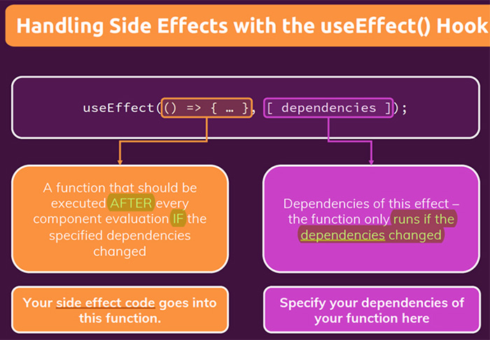

# Using the `useEffect()` hook

Sometimes, ==we want to run some additional code **_after_** React has updated the DOM==. What does `useEffect()` do? By using this hook, you tell React that your component needs to do something _**after** render_. React will remember the function you passed (we’ll refer to it as our "effect"), and _call it later **after** performing the DOM updates_.

The `useEffect()` hook is ==called with **two arguments**==, with two parameters. The first argument is a ==**function**== that should be executed **_after_** every component evaluation, **_if_** the specified dependencies changed. The specified ==**dependencies**== are the second argument that you pass in `useEffect()`. The specified dependencies are an _array_ full of dependencies, and whenever such a dependency changes that first function will re-run.

Therefore, _in that first function you can put any side effect code_, and that code will then _only execute when the dependencies specified by you changed_, and not when the component re-renders. If you update the state in your component, the JSX code in that component is re-evaluated and the entire component is re-executed, but `useEffect()` will run _**after**_ every component re-execution (re-evaluation) _**only if**_ the dependencies changed.

`useEffect()` will run no matter what only when your app is run for the first time. After your app run for the first time, `useEffect()` will only executed _**if**_ the dependencies changes. `useEffect()` function runs _**after**_ every component render cycle, not before it, not during it, but _**after**_ it. `useEffect()` function runs depends of dependencies changes.

> **Note**: `useState()` run when the state change vs `useEffect()` run when the dependencies change.

==`useEffect()` in general, is a hook that helps you deal with _code_ that should be executed in response to something==, and something could be the component being loaded, it could be the email address being updated, it could be anything. Whenever you have _an action that should be executed in response to some other action_, that is a side effect, and that is where a `useEffect()` is able to help you.

## What happens when you don't pass an array of dependencies

In this sub-chapter I will explain what `useEffect()` behavior is when you don't pass an array of dependencies.

==Does `useEffect()` run after every render? Yes! By default, if you don't pass an array of dependencies, `useEffect()` runs both _after the first render and after every component render cycle_== (we will later talk about how to customize this with the help of dependencies). Instead of thinking in terms of "mounting" and "updating", you might find it easier to think that _effects happen "after render"_. ==React guarantees the DOM has been updated by the time it runs the effects==.

## References

1. [React - The Complete Guide (incl Hooks, React Router, Redux) - Maximilian Schwarzmüller](https://www.udemy.com/course/react-the-complete-guide-incl-redux/)
