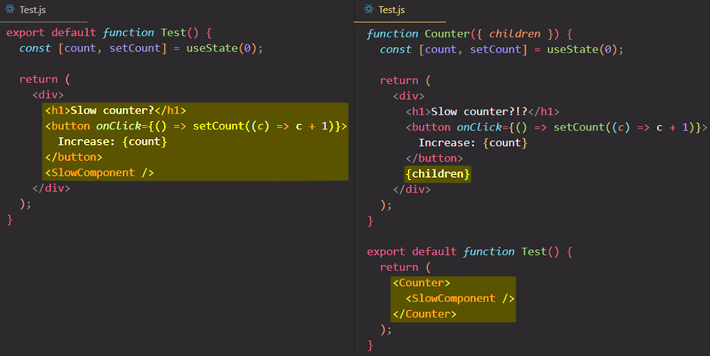

# A surprising optimization trick with `children`

Let's now learn about a simple performance optimization technique which leverages the `children` prop in order to prevent some components from re-rendering. Now, this isn't the most used technique out there, but it gives us actually surprising insights into how React works internally.

**In the first example**, each time you click the button, the state updates, and `<Test/>` component needs to get re-rendered, and so therefore the `<SlowComponent/>` is also re-rendered each time that we click the button, even though the `<SlowComponent/>` actually isn't really dependent on the state. So the `<SlowComponent/>` does not need the state at all but still it is being re-rendered because it is inside the `<Test/>` component.

So, if you ever find yourself in a situation like this, where you have one kind of `<SlowComponent/>` inside another one which updates the `<SlowComponent/>` without it needing it, this is where you can then use the `children` prop optimization technique.

**In the second example**, we take the counter functionality out and put it inside a new component called `<Counter/>`, but instead of passing the `<SlowComponent/>`, I will now render the `children` prop because we will now pass the `<SlowComponent/>` into the `<Counter/>` as children.

This two examples actually looks exactly the same, so ==the component tree will also be exactly the same==. However, it will now work in a completely different way. In the second example, when you click the button, the `<Counter/>` component is updated, but then the `<SlowComponent/>` did not re-render. So why is that? Why does this work this way? Why is suddenly React no longer re-rendering  the `<SlowComponent/>` component?

Even though our JSX is very similar, so the structure of the output is similar, ==the `<SlowComponent/>` has been passed in `<Counter/>` component as a `children` prop, This means that **the `<SlowComponent/>` was actually already created before the `<Counter/>` component re-rendered**, so therefore, there's no way in which `<SlowComponent/>` could have been affected by the state change in the `<Counter/>`==.



So again, as React sees this piece of JSX markup:

```react
<Counter>
  <SlowComponent/>
</Counter>
```

it will basically ==immediately create the `<SlowComponent/>` and then pass it as a prop into the `<Counter/>`==, so all while rendering. Then as we click on the button, the `<Counter/>` is of course re-rendered, but ==`<SlowComponent/>` component has already been **pass in as a prop, so it has already been created before `<Counter/>` state changes**== and so it cannot be affected by the `<Counter/>` state update, because ==React would already have been created the `<SlowComponent/>` component _before_ anything ever happens inside the `<Counter/>`==.

> **Note**: ==This optimization technique works even with the components passed via <code>children</code> to Context Providers, _only if_ that children components don't use (consume) the Provider context `value`==. So we are in the exact same situation as before where all the child components were _already created_ before they were passed into the Context Provider component. So then React once again bails out of re-rendering all of them because they couldn't have possibly been affected by any state change, unless, of course, they do actually consume the Context itself.
>
> ```react
> <Context.Provider value={{}}>
>     <Component1>
>         <Component2/>
>     </Component1>
>     <SlowComponent/>
> </Context.Provider>
> ```

## References

1. [The Ultimate React Course: React, Redux & More - Jonas Schmedtmann](https://www.udemy.com/course/the-ultimate-react-course/)