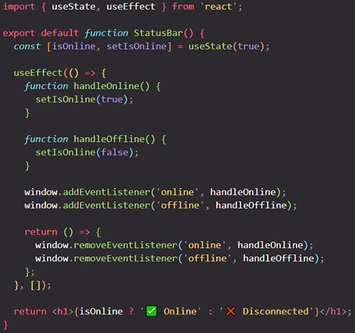
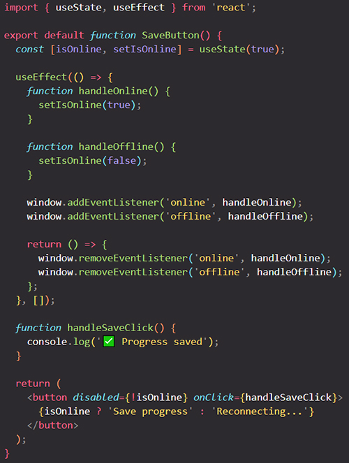
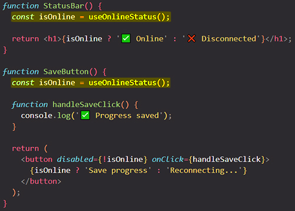
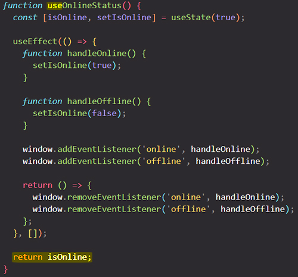
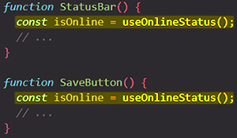
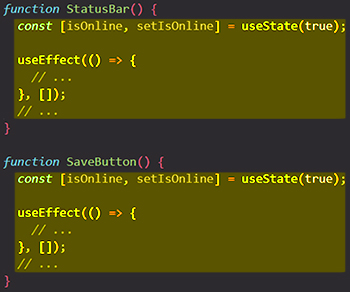
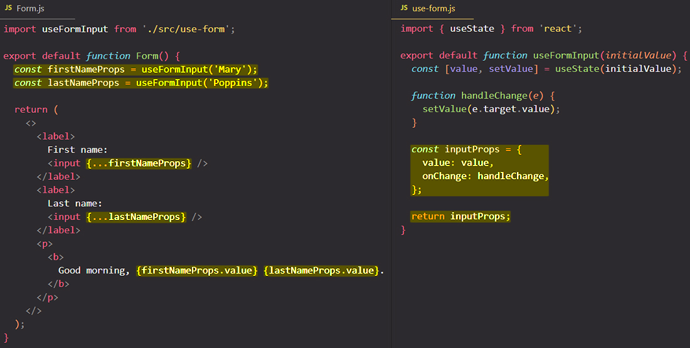
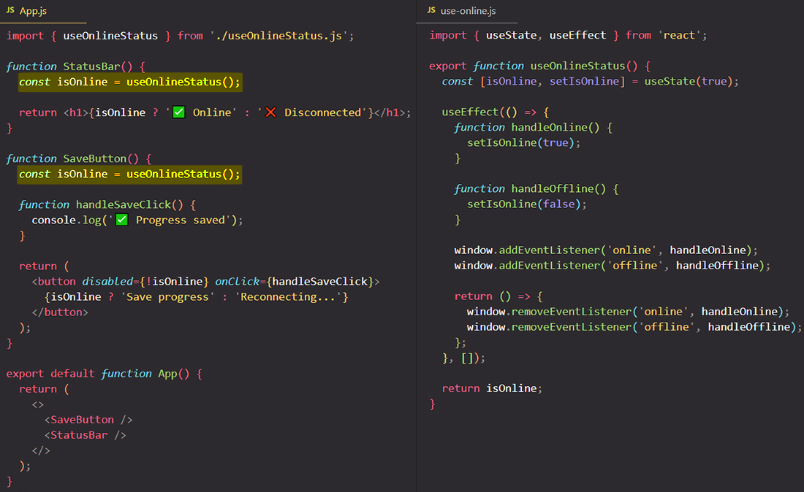
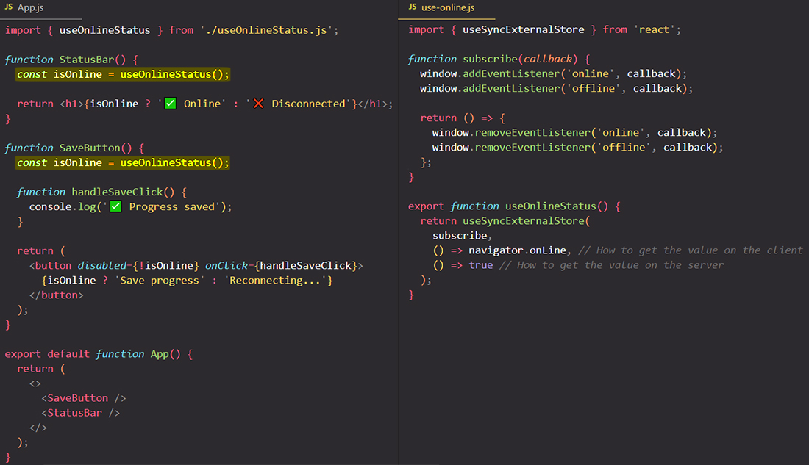

# Reusing Logic with Custom Hooks

React comes with several built-in Hooks like `useState`, `useContext`, and `useEffect`. Sometimes, you’ll wish that there was a Hook for some more specific purpose: for example, to fetch data, to keep track of whether the user is online, or to connect to a chat room. You might not find these Hooks in React, but ==you can create your own Hooks for your application’s needs.==

==You can create custom Hooks, compose them together, pass data between them, and reuse them between components. As your app grows, you will write fewer Effects by hand because you’ll be able to reuse custom Hooks you already wrote.== There are also many excellent custom Hooks maintained by the React community.

You will learn:

- What custom Hooks are, and how to write your own
- How to **reuse logic** between components
- How to name and structure your custom Hooks
- When and why to extract custom Hooks

## Custom Hooks: _Sharing logic_ between components

Imagine you’re developing an app that heavily relies on the network (as most apps do). You want to warn the user if their network connection has accidentally gone off while they were using your app. How would you go about it? It seems like you’ll need two things in your component:

1. A piece of state that tracks whether the network is online.
2. An Effect that subscribes to the global [`online`](https://developer.mozilla.org/en-US/docs/Web/API/Window/online_event) and [`offline`](https://developer.mozilla.org/en-US/docs/Web/API/Window/offline_event) events, and updates that state.

This will keep your component synchronized with the network status. You might start with something like this:



Now imagine you *also* want to **use the same logic in a different component**. You want to implement a "Save" button that will become disabled and show “Reconnecting…” instead of “Save” while the network is off.

To start, you can copy and paste the `isOnline` state and the Effect into `SaveButton`:



These two components work fine, but ==the duplication in logic between them is unfortunate. It seems like **even though they have _different visual appearance_, you want to reuse the logic between them**==.

## Extracting your own custom Hook from a component

Imagine for a moment that, similar to [`useState`](https://react.dev/reference/react/useState) and [`useEffect`](https://react.dev/reference/react/useEffect), there was a built-in `useOnlineStatus` Hook. Then both of these components could be simplified and you could remove the duplication between them:



Although there is no such built-in Hook, you can write it yourself. Declare a function called `useOnlineStatus` and move all the duplicated code into it from the components you wrote earlier:



At the end of the function, return `isOnline`. This lets your components read that value. Now when you switching the network on and off updates both components.

==Now your components don’t have as much _repetitive logic_. More importantly, the code inside them describes **what they want to do** (use the online status!) rather than **how to do it** (by subscribing to the browser events).== When you extract logic into custom Hooks, you can hide the gnarly details of how you deal with some external system or a browser API. The code of your components expresses your intent, not the implementation.

> #### Hook names always start with `use`
>
> React applications are built from components. Components are built from Hooks, whether built-in or custom. You’ll likely often use custom Hooks created by others, but occasionally you might write one yourself!
>
> You must follow these naming conventions:
>
> 1. ==_React component_ names must start with a capital letter==, like `StatusBar` and `SaveButton`. React components also need to return something that React knows how to display, like a piece of JSX.
>
> 2. ==_Hook names_ must start with `use` followed by a capital letter==, like `useState` (built-in) or `useOnlineStatus` (custom, like earlier on the page). Hooks may return arbitrary values.
>
> This convention guarantees that you can always look at a component and know where its state, effects, and other React features might “hide”. For example, if you see a `getColor()` function call inside your component, you can be sure that it can’t possibly contain React state inside because its name doesn’t start with `use`. However, a function call like `useHttp()` will most likely contain calls to other Hooks inside!
>
> If your linter is [configured for React,](https://beta.reactjs.org/learn/editor-setup#linting) it will enforce this naming convention.

==Custom hooks are just regular functions, just as the built-in hooks like `useState`, but they are functions which can contain **stateful logic**. You can build custom hooks to **outsource stateful logic into reusable functions**==.

_Unlike regular functions, custom hooks can use other React hooks, including other custom hooks_, and they can, therefore, also leverage React state managed with `useState` or `useReducer`; they can access `useEffect` and so on.

With custom hooks you can ==outsource logic, which you might be using in different components==, into a custom hook, which you can then call from all these various components. So, it is simply ==a mechanism of **reusing logic**, just as regular functions are, with the special thing that in these custom hook functions you can use React hooks and other hooks==.

## Custom Hooks let you share _stateful logic_ but not _state itself_

In the earlier example, when you turned the network on and off, both components updated together. However, it’s wrong to think that a single `isOnline` state variable is shared between them. Look at this code:



It works the same way as before you extracted the duplication:



==These are two completely independent state variables and Effects! They happened to have the same value at the same time _because you synchronized them with the same external value_ (whether the network is on).==

To better illustrate this, we’ll need a different example. Consider this `Form` component:



Notice that it only declares *one* state variable called `value`. However, the `Form` component calls `useFormInput` *two times:*

```react
function Form() {
  const firstNameProps = useFormInput('Mary');
  const lastNameProps = useFormInput('Poppins');
  // ...
```

This is why it works like declaring two separate state variables!

==Custom Hooks let you share **stateful logic** but not **state itself**. Each call to a Hook is completely independent from every other call to the same Hook.== If you call a custom hook in one of your components and that custom hook registers a state or an effect, then the state and the effect that you have in your custom hook will be tied to the component in which you use your custom hook. If you use that custom hook in multiple components every component will receive its own separate state.

So just because you use a custom hook does not mean that you share state or effects across components. Instead for every component the custom hook is executed again and every component instance then receives its own state, so ==it's just the logic which is shared, not the concrete state==.

When you need to share the state itself between multiple components, [lift it up and pass it down](https://react.dev/learn/sharing-state-between-components) instead.

## Passing reactive values between Hooks

==The code inside your custom Hooks will re-run during every re-render of your component.== This is why, like components, custom Hooks need to be pure. ==Think of custom Hooks’ code **as part of your component’s body**!==

==Because custom Hooks re-render together with your component, they always receive the latest props and state.==

## Should all functions called during rendering start with the use prefix?

==No. Functions that don’t *call* Hooks don’t need to *be* Hooks.==

==If your function doesn’t call any Hooks, avoid the `use` prefix. Instead, write it as a regular function *without* the `use` prefix.== For example, `useSorted` below doesn’t call Hooks, so call it `getSorted` instead:

```react
// 🔴 Avoid: A Hook that doesn't use Hooks
function useSorted(items) {
  return items.slice().sort();
}

// ✅ Good: A regular function that doesn't use Hooks
function getSorted(items) {
  return items.slice().sort();
}
```

This ensures that your code can call this regular function anywhere, including conditions:

```react
function List({ items, shouldSort }) {
  let displayedItems = items;
  if (shouldSort) {
    // ✅ It's ok to call getSorted() conditionally because it's not a Hook
    displayedItems = getSorted(items);
  }
  // ...
}
```

==You should give `use` prefix to a function (and thus make it a Hook) if it uses at least one Hook inside of it:==

```react
// ✅ Good: A Hook that uses other Hooks
function useAuth() {
  return useContext(Auth);
}
```

Technically, this isn’t enforced by React. In principle, you could make a Hook that doesn’t call other Hooks. This is often confusing and limiting so it’s best to avoid that pattern. However, there may be rare cases where it is helpful. For example, maybe your function doesn’t use any Hooks right now, but you plan to add some Hook calls to it in the future. Then it makes sense to name it with the `use` prefix:

```react
// ✅ Good: A Hook that will likely use some other Hooks later
function useAuth() {
  // TODO: Replace with this line when authentication is implemented:
  // return useContext(Auth);
  return TEST_USER;
}
```

Then components won’t be able to call it conditionally. This will become important when you actually add Hook calls inside. If you don’t plan to use Hooks inside it (now or later), don’t make it a Hook.

## When to use custom Hooks 

You don’t need to extract a custom Hook for every little duplicated bit of code. Some duplication is fine. For example, extracting a `useFormInput` Hook to wrap a single `useState` call like earlier is probably unnecessary.

However, whenever you write an Effect, consider whether it would be clearer to also wrap it in a custom Hook. [You shouldn’t need Effects very often,](https://react.dev/learn/you-might-not-need-an-effect) so if you’re writing one, it means that you need to “step outside React” to synchronize with some external system or to do something that React doesn’t have a built-in API for. Wrapping it into a custom Hook lets you precisely communicate your intent and how the data flows through it.

## Keep your custom Hooks focused on concrete high-level use cases

Start by choosing your custom Hook’s name. If you struggle to pick a clear name, it might mean that your Effect is too coupled to the rest of your component’s logic, and is not yet ready to be extracted.

Ideally, your custom Hook’s name should be clear enough that even a person who doesn’t write code often could have a good guess about what your custom Hook does, what it takes, and what it returns:

- ✅ `useData(url)`
- ✅ `useImpressionLog(eventName, extraData)`
- ✅ `useChatRoom(options)`

When you synchronize with an external system, your custom Hook name may be more technical and use jargon specific to that system. It’s good as long as it would be clear to a person familiar with that system:

- ✅ `useMediaQuery(query)`
- ✅ `useSocket(url)`
- ✅ `useIntersectionObserver(ref, options)`

## Custom Hooks help you migrate to better patterns 

Effects are an [“escape hatch”](https://react.dev/learn/escape-hatches): you use them when you need to “step outside React” and when there is no better built-in solution for your use case. With time, the React team’s goal is to reduce the number of the Effects in your app to the minimum by providing more specific solutions to more specific problems. Wrapping your Effects in custom Hooks makes it easier to upgrade your code when these solutions become available.

Let’s return to this example:



In the above example, `useOnlineStatus` is implemented with a pair of [`useState`](https://react.dev/reference/react/useState) and [`useEffect`.](https://react.dev/reference/react/useEffect) However, this isn’t the best possible solution. There is a number of edge cases it doesn’t consider. For example, it assumes that when the component mounts, `isOnline` is already `true`, but this may be wrong if the network already went offline. You can use the browser [`navigator.onLine`](https://developer.mozilla.org/en-US/docs/Web/API/Navigator/onLine) API to check for that, but using it directly would not work on the server for generating the initial HTML. In short, this code could be improved.

Luckily, React 18 includes a dedicated API called [`useSyncExternalStore`](https://react.dev/reference/react/useSyncExternalStore) which takes care of all of these problems for you. Here is how your `useOnlineStatus` Hook, rewritten to take advantage of this new API:



Notice how **you didn’t need to change any of the components** to make this migration. This is another reason for why wrapping Effects in custom Hooks is often beneficial:

1. You make the data flow to and from your Effects very explicit.
2. You let your components focus on the intent rather than on the exact implementation of your Effects.
3. When React adds new features, you can remove those Effects without changing any of your components.

## Summary

- Custom Hooks let you share logic between components.
- Custom Hooks must be named starting with `use` followed by a capital letter.
- Custom Hooks only share stateful logic, not state itself.
- You can pass reactive values from one Hook to another, and they stay up-to-date.
- All Hooks re-run every time your component re-renders.
- The code of your custom Hooks should be pure, like your component’s code.

## References

1. [React - The Complete Guide (incl Hooks, React Router, Redux) - Maximilian Schwarzmüller](https://www.udemy.com/course/react-the-complete-guide-incl-redux/)
1. [Reusing Logic with Custom Hooks - beta.reactjs.org](https://beta.reactjs.org/learn/reusing-logic-with-custom-hooks)
