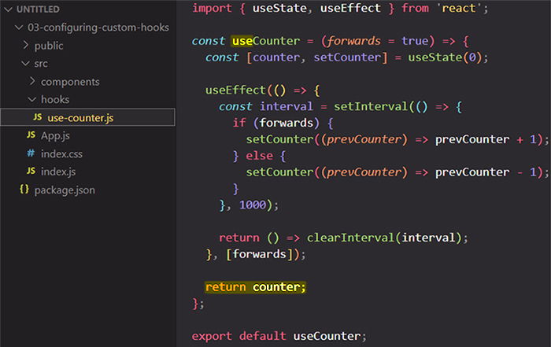
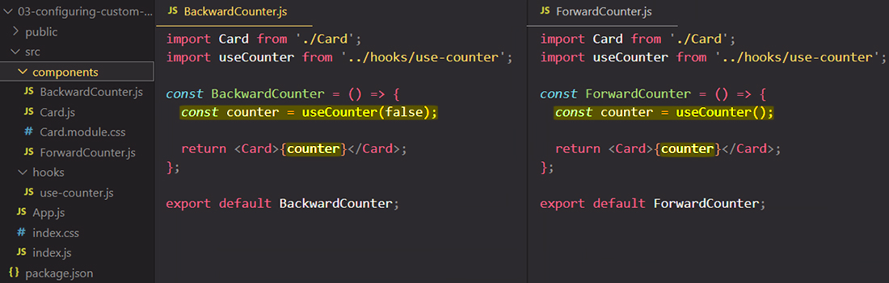

# What are "Custom Hooks"?

React comes with several built-in Hooks like `useState`, `useContext`, and `useEffect`. Sometimes, you’ll wish that there was a Hook for some more specific purpose: for example, to fetch data, to keep track of whether the user is online, or to connect to a chat room. You might not find these Hooks in React, but you can create your own Hooks for your application’s needs.

You can create custom Hooks, compose them together, pass data between them, and reuse them between components. As your app grows, you will write fewer Effects by hand because you’ll be able to reuse custom Hooks you already wrote. There are also many excellent custom Hooks maintained by the React community.

You will learn:

- What custom Hooks are, and how to write your own
- How to **reuse logic** between components
- How to name and structure your custom Hooks
- When and why to extract custom Hooks

## Custom Hooks: _Sharing logic_ between components

==Custom hooks are just regular functions, just as the built-in hooks like `useState`, but they are functions which can contain **stateful logic**. You can build custom hooks to **outsource stateful logic into reusable functions**==.

_Unlike regular functions, custom hooks can use other React hooks, including other custom hooks_, and they can, therefore, also leverage React state managed with `useState` or `useReducer`; they can access `useEffect` and so on.

With custom hooks you can ==outsource logic, which you might be using in different components==, into a custom hook, which you can then call from all these various components. So, it is simply ==a mechanism of **reusing logic**, just as regular functions are, with the special thing that in these custom hook functions you can use React hooks and other hooks==.

## Creating a Custom React Hook function

How do you build a custom hook? Well, typically just as with components, ==you store every hook in a **standalone file**==. For the file name there is no specific rule, you could name it however you want:



==The function which you do create in that file has to start with a **'use'** in its name==, that is a must do, that is a hard rule which you have to follow. It will be a normal function in the end but the 'use' at their beginning signals to React that it will be a custom hook and it gives React the guarantee that you will use that function by respecting the rules of hooks, so that you will use this custom hook function just as you use to build-in hooks.

And that is a guarantee React needs because otherwise if you start using React hooks in your custom hook and you would use your custom hook in a wrong, in a forbidden place, you would implicitly also use to build-in hooks in a wrong place. That's why you started with 'use' because React can look out for that and actually this project set up will give you a warning if you have a function starting with 'use' and you then start violating some of rules of hooks.

==Only Hooks and components can call other Hooks!==

### Hook names always start with `use`

React applications are built from components. Components are built from Hooks, whether built-in or custom. You’ll likely often use custom Hooks created by others, but occasionally you might write one yourself!

You must follow these naming conventions:

1. ==_React component_ names must start with a capital letter==, like `Header` and `Button`. React components also need to return something that React knows how to display, like a piece of JSX.
2. ==_Hook names_ must start with `use` followed by a capital letter==, like `useState` (built-in) or `useHttp` (custom). Hooks may return arbitrary values.

> **Note**: If your linter is [configured for React,](https://beta.reactjs.org/learn/editor-setup#linting) it will enforce this naming convention.

This convention guarantees that you can always look at a component and know where its state, effects, and other React features might “hide”. For example, if you see a `getColor()` function call inside your component, you can be sure that it can’t possibly contain React state inside because its name doesn’t start with `use`. However, a function call like `useHttp()` will most likely contain calls to other Hooks inside!

## Using Custom Hooks

==You are going to use a custom hook just as you use to build-in hooks.== You are just calling it like a function because it is just a function. So therefore you need to import your custom hook in the component that you want to use it.



## Custom Hooks let you share _stateful logic_ but not _state itself_

==Custom Hooks let you share **stateful logic** but not **state itself**. Each call to a Hook is completely independent from every other call to the same Hook.== If you call a custom hook in one of your components and that custom hook registers a state or an effect, then the state and the effect that you have in your custom hook will be tied to the component in which you use your custom hook. If you use that custom hook in multiple components every component will receive its own separate state.

So just because you use a custom hook does not mean that you share state or effects across components. Instead for every component the custom hook is executed again and every component instance then receives its own state, so ==it's just the logic which is shared, not the concrete state==.


Notice that it only declares *one* state variable called `value`. However, the `Form` component calls `useFormInput` *two times:*

```react
function Form() {
  const firstNameProps = useFormInput('Mary');
  const lastNameProps = useFormInput('Poppins');
  // ...
```

This is why it works like declaring two separate state variables!

## Passing reactive values between Hooks

==The code inside your custom Hooks will re-run during every re-render of your component.== This is why, like components, custom Hooks need to be pure. ==Think of custom Hooks’ code as part of your component’s body!==

==Because custom Hooks re-render together with your component, they always receive the latest props and state.==

## Should all functions called during rendering start with the use prefix?

==No. Functions that don’t *call* Hooks don’t need to *be* Hooks.==

==If your function doesn’t call any Hooks, avoid the `use` prefix. Instead, write it as a regular function *without* the `use` prefix.== For example, `useSorted` below doesn’t call Hooks, so call it `getSorted` instead:

```react
// 🔴 Avoid: A Hook that doesn't use Hooks
function useSorted(items) {
  return items.slice().sort();
}

// ✅ Good: A regular function that doesn't use Hooks
function getSorted(items) {
  return items.slice().sort();
}
```

This ensures that your code can call this regular function anywhere, including conditions:

```react
function List({ items, shouldSort }) {
  let displayedItems = items;
  if (shouldSort) {
    // ✅ It's ok to call getSorted() conditionally because it's not a Hook
    displayedItems = getSorted(items);
  }
  // ...
}
```

==You should give `use` prefix to a function (and thus make it a Hook) if it uses at least one Hook inside of it:==

```react
// ✅ Good: A Hook that uses other Hooks
function useAuth() {
  return useContext(Auth);
}
```

Technically, this isn’t enforced by React. In principle, you could make a Hook that doesn’t call other Hooks. This is often confusing and limiting so it’s best to avoid that pattern. However, there may be rare cases where it is helpful. For example, maybe your function doesn’t use any Hooks right now, but you plan to add some Hook calls to it in the future. Then it makes sense to name it with the `use` prefix:

```react
// ✅ Good: A Hook that will likely use some other Hooks later
function useAuth() {
  // TODO: Replace with this line when authentication is implemented:
  // return useContext(Auth);
  return TEST_USER;
}
```

Then components won’t be able to call it conditionally. This will become important when you actually add Hook calls inside. If you don’t plan to use Hooks inside it (now or later), don’t make it a Hook.

## Summary

- Custom Hooks let you share logic between components.
- Custom Hooks must be named starting with `use` followed by a capital letter.
- Custom Hooks only share stateful logic, not state itself.
- You can pass reactive values from one Hook to another, and they stay up-to-date.
- All Hooks re-run every time your component re-renders.
- The code of your custom Hooks should be pure, like your component’s code.

## References

1. [React - The Complete Guide (incl Hooks, React Router, Redux) - Maximilian Schwarzmüller](https://www.udemy.com/course/react-the-complete-guide-incl-redux/)
1. [Reusing Logic with Custom Hooks - beta.reactjs.org](https://beta.reactjs.org/learn/reusing-logic-with-custom-hooks)
