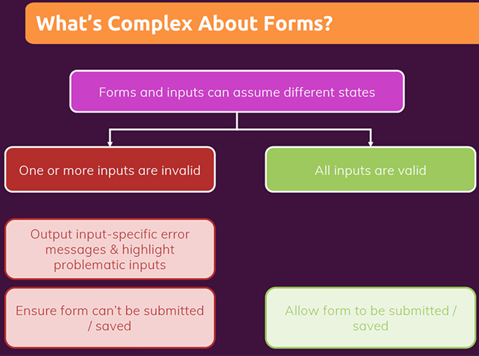
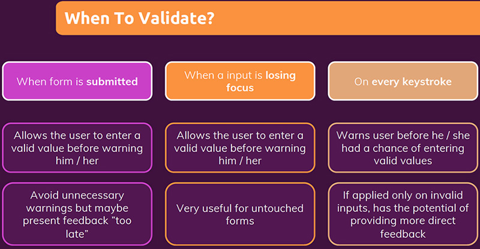

# What's so complex about forms

Forms might seem simple and trivial, but they are not. Forms can actually be complex from a developer's point of view because forms and their inputs can assume ==a broad variety of different states==. One or more inputs could be invalid or valid and these are only two states, it's even possible that you could have forms where the state is unknown because maybe you have some asynchronous validation where you need to send a request to a server behind the scenes to check something, to find out if a certain value is available, let's say an email address, to then find out whether the input is valid or not.

You must not forget that these states valid and invalid, don't just apply to the overall form, but to every individual input in the form, and is then the sum off the states of those inputs that make up the overall form state.

## When to validate

Now, when a form and its inputs are invalid you might want to output input specific error messages and highlight the problematic inputs, and you also want to ensure that the form can't be submitted or saved if one or more inputs are invalid. If the inputs are valid you of course want to make sure that the form can be submitted and saved.

Now, when we dive into showing error messages and highlighting invalid inputs things get even more complex because the question then is "When to validate?" or "When should you check the user input?". You can validate the user input when the _**form is submitted as a whole**_, you can also check the value entered by a user once an _**input loses focus**_, to then check what the user did enter in the input and find out if it is valid, and you can of course also do that on every _**keystroke**_ or on every _**change**_ to user makes to an input.

### Validation when form is submitted as a whole

When you validate once the form is submitted as a whole, you of course allow the user to enter a valid value before possibly warning him/her. That means if the user starts typing in, let's say the email field, you don't tell the user that the entered email address is wrong before the user even had a chance of entering one. So that's good, you wait until the user is done and then you possibly show an error.

==So this avoids **unnecessary warnings**, but as a downside **the feedback might come a little bit too late**.== If I press submit and you then tell me that something's wrong, I have to go back to that input where something was wrong and enter my value again.

### Validation when a input is losing focus

When you validate a input when it loses focus the good thing also is that you allow the user to enter a valid value before warning him/her, just as when you waited for the overall form, but you already do show an error then once the user is done with that specific input. So you don't wait for the overall form submission but you just wait until the user is done with one specific input. This can be very useful for untouched forms, so where your user hasn't entered anything yet.

The downside with this approach however, if you only validate on losing focus, is that if an input was invalid, so if the user did already enter something invalid and now comes back to fix it, you don't tell the user if it's now valid or not until he/she is done entering an input. That's where on keystroke validation might be better.

### Validation on every key stroke

With validation on every key stroke you provide direct feedback to the user, on whether the input is valid or not, on every keystroke.

The downside with this approach is you warn the user before even had a chance of entering valid values. So if the user visit a form for the first time and haven't entered anything, then he would be greeted with tons of errors if you only validate on keystroke, because initially everything is invalid and you haven't gives to the user any chance of entering anything valid.

If on the other hand you combine this with the other methods somehow and you only validate on keystroke if the input was invalid before, then you can provide direct feedback and therefore tell the user once the input is valid.

## References

1. [React - The Complete Guide (incl Hooks, React Router, Redux) - Maximilian Schwarzmüller](https://www.udemy.com/course/react-the-complete-guide-incl-redux/)
