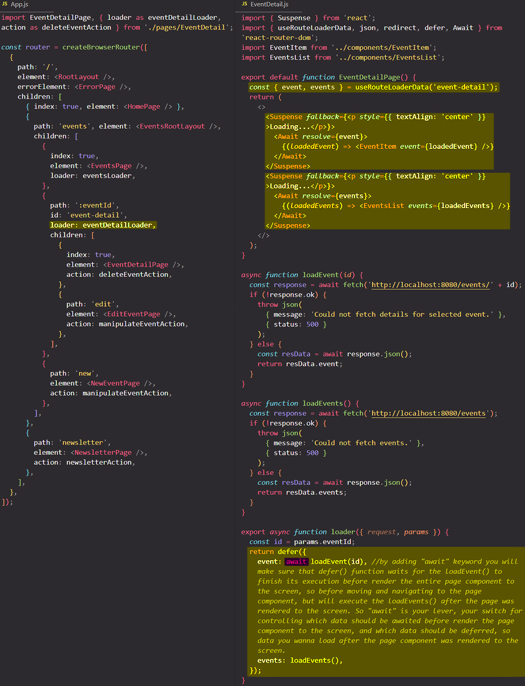

# Controlling which data should be deferred and which data should be loaded before navigation

So how does this `defer` feature shine if you have multiple requests with different speeds? You can use `defer` and `await` keyword to control which data is loaded before navigation and which data is deferred before navigation and loaded after the page component was rendered to the screen.

## References

1. [React - The Complete Guide (incl Hooks, React Router, Redux) - Maximilian Schwarzmüller](https://www.udemy.com/course/react-the-complete-guide-incl-redux/)
2. [`defer` - reactrouter.com](https://reactrouter.com/en/main/utils/defer)
3. [`Await` component - reactrouter.com](https://reactrouter.com/en/main/components/await)
4. [`<Suspense>` component - beta.reactjs.org](https://beta.reactjs.org/reference/react/Suspense)