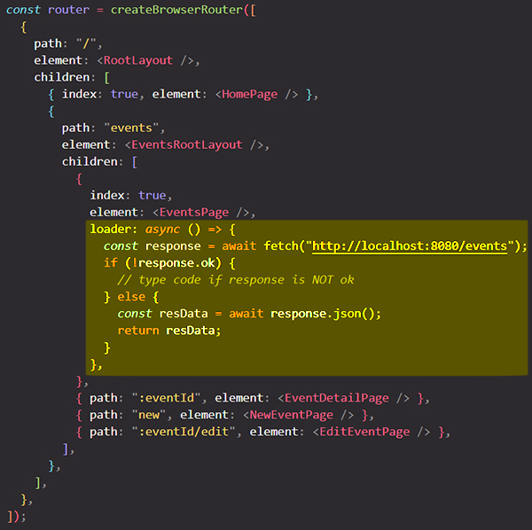
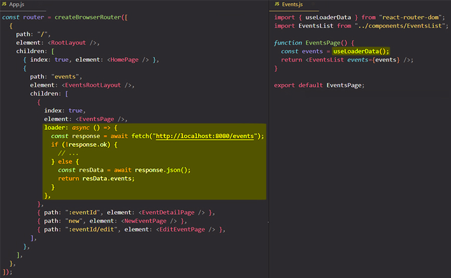

# Data fetching with a "loader" function

==Each route can define a "loader" function to **_provide data_ to the route element _before it renders_**==.

When you define a "loader" function, React Router will automatically take any value you return in that "loader" function and will make that data available in the page that's being rendered, as well as any other components where you need it.

With the help of a "loader" function you move all the fetch logic that you have in a component in that "loader" function, and this process make the component way leaner and easier to reason about.

## Use the returned data from a "loader" function with the help of `useLoaderData` hook

To get access to the data returned by a "loader" function for a specific page, we can import `useLoaderData` from `react-router-dom`. 

> **Note**: ==`useLoaderData` always get the final data returned by the "loader" function==, even if "loader" function is an async function. If the "loader" function is an async function, the `useLoaderData` won't return a Promise from the "loader" function, but will return the resolved/rejected value of that async "loader" function.

The `useLoaderData` is a hook which we can execute to get access to the closest "loader" data. So ==you can access "loader" function data with the help of `useLoaderData` in _any component on the same level or lower level than the component where you added the "loader" function_==, so the route on which you added the "loader" function.

> **Note**: ==**You can use `useLoaderData` in the element that's assigned to a route _and_ in all components that might be used inside that element**==. You just have to be careful that you're not allowed to use `useLoaderData` on a higher level than you're fetching the data.

## Where should "loader" function code be stored?

Is common pattern that you actually put the "loader" function code into your component file where you need it, so to the page component file where you want to add the "loader" function to be precise.

## When are "loader" functions executed?

The "loader" function for a page will be called right when we start navigating to that page, so _not after the page component has been rendered_, but before we actually go there.

Data fetching is initiated as soon as we initiate the route transition (URL changes). By default, React Router will wait for the data to be fetched, so for the "loader" function to be finished, and ==only when the "loader" function is finished the page component will be rendered with that fetched data==.

## Returning responses in a "loader" function

One important aspect of a "loader" function is to understand that you can return **any kind of data** in that "loader" function. You can return an array, object, number, string but what you can also return is a **response object**. Now what do I mean by that?

Well, in the browser you can create a new Response object, by instantiating the built-in `Response` constructor function. ==Whenever you return such a `Response` object in your "loader" function, the **React Router will automatically extract the data from your `Response` object when using `useLoaderData` hook**==. So the data returned by `useLoaderData` will still be the response data that was part of the response you returned in your "loader" function.

Because React Router's support `Response` objects and automatically extract data from them, that simply means that you can simply return the response in your "loader" function. You don't need to manually extract the data from the response, instead ==you can just return your response and `useLoaderData` will automatically give you the data that's part of the response==. With the behavior of `useLoaderData` we can reduce our "loader" function code and leverage this built-in support for `Response` objects.

## Which kind of code goes into a "loader" function?

You can use any browser APIs in your "loader" function. You can, for example, access `localStorage`, you can access cookies, you can do anything you can do in the other JavaScript code as well. What you can't do in your "loader" function is, for example, use React Hooks like `useState`. That doesn't work because those Hooks are only available in React components and the "loader" function is not a React component, but that's the only limitation; any other default browser features can be used in "loader" functions.

## References

1. [React - The Complete Guide (incl Hooks, React Router, Redux) - Maximilian Schwarzmüller](https://www.udemy.com/course/react-the-complete-guide-incl-redux/)
2. [`loader` - reactrouter.com](https://reactrouter.com/en/main/route/loader)