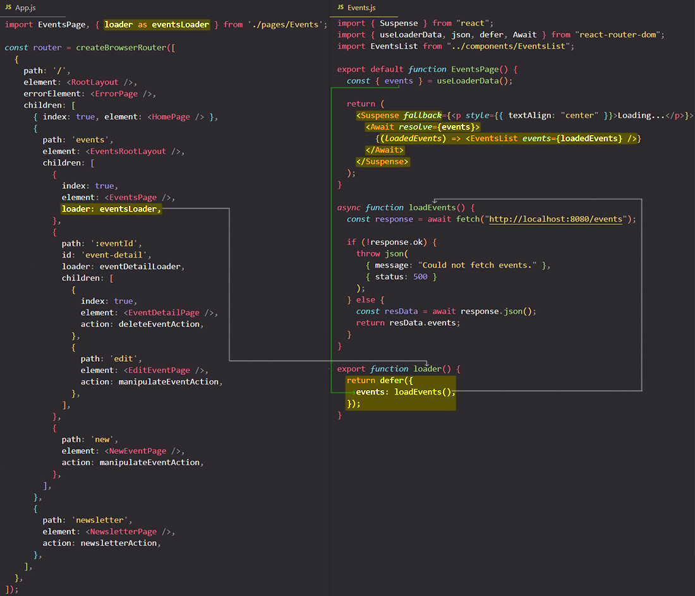

# Deferring data fetching with `defer()`

==React Router provides a feature that allows you to **defer when data is loaded**==. What this that means? ==Sometimes you wanna **load a page component with some data before fetching the data**, and show some parts of the that page component already until all the data is fetched. You can defer data loading and tell React Router that you actually wanna render a page component already, even though the data is not fully there yet==.

Imagine a scenario where one of your routes' loaders needs to retrieve some data that for one reason or another is quite slow. We'll assume that `eventsLoader` is slow. This will lead to initial page load times and transitions to the `/events` route to take as long as the slowest bit of data.

React Router takes advantage of React 18's [`<Suspense>`](https://beta.reactjs.org/reference/react/Suspense) component for data fetching using the [`defer`](https://reactrouter.com/en/main/utils/defer) utility and [`<Await>`](https://reactrouter.com/en/main/components/await) component to solve this kind of problems.

==To `defer()` function we pass an **object**==. In that object you bundle all the different HTTP requests you might have going on on the `Events` page component. In the case of `Events` component it's only one request though, the request for all events, but you can have multiple request per one component. You'll give that request a key of `events` for example (though to that key you can give it any name you want), and then in that key you'll point at `loadEvents()` function, and not just point at it, instead you execute it. So you execute the `loadEvents()` function and that key store now the data returned by `loadEvents()`.

You can only use `defer` if you have call an async function because the idea behind `defer` is that we have a Promise that will eventually resolve to a value; and that you wanna load a component and render a component even though that future value isn't there yet. So `loadEvents` must be an async function and you store the parsed Promise as a value under the `events` key in the object which you pass to `defer()` function. And it's now that value returned by `defer()` which you return in our "loader" function.

> **Note**: If you use `defer()`, in your "loader" function you need to manually parse the response and return from "loader" function the resolved value, not the response (Promise). `defer()` doesn't parse your Response automatically, `defer()` need a parsed Response.

As your next step, you have to go to the component where you want to use the deferred data and you still use `useLoaderData` but now the data will now actually be an object that gives you access to the deferred value keys in the `defer()` function, so to `events` key in your case, and in the component you now don't directly render the JSX markup that needs your data, instead what you do in is to return another component provided by `react-router-dom` and that's the `Await` component.

`<Await>` component has a special `resolve` prop which wants one of your deferred values as a value. Now the `<Await>` component will wait for the "loader" function data to be there, and then between the opening and closing tags, you output a dynamic value which must be a function that will be executed by a React Router once that data is there, so once that Promise resolved, once you have that data.

Now, as a last step, you have to add another component that must be wrapped around the `<Await>` component, and that's the `<Suspense>` component which is imported from `'react'`, so not from `'react-router-dom'`. The `<Suspense>` component is a component which can be used in certain situations to show a fallback whilst you're waiting for other data to arrive.

That's how you can defer data loading. A couple of steps as you can tell but now with that you'll load the `Events` page component and render it before you have the data and will show the fallback until the data is there. This defer feature can speed up your pages and make sure that you're already showing some content whilst you're waiting for other content. It especially shines if you have pages with multiple HTTP requests with different speeds though.

## References

1. [React - The Complete Guide (incl Hooks, React Router, Redux) - Maximilian Schwarzmüller](https://www.udemy.com/course/react-the-complete-guide-incl-redux/)
2. [`defer` - reactrouter.com](https://reactrouter.com/en/main/utils/defer)
3. [Deferred data guide - reactrouter.com](https://reactrouter.com/en/main/guides/deferred)
4. [`Await` component - reactrouter.com](https://reactrouter.com/en/main/components/await)
5. [`<Suspense>` component - beta.reactjs.org](https://beta.reactjs.org/reference/react/Suspense)