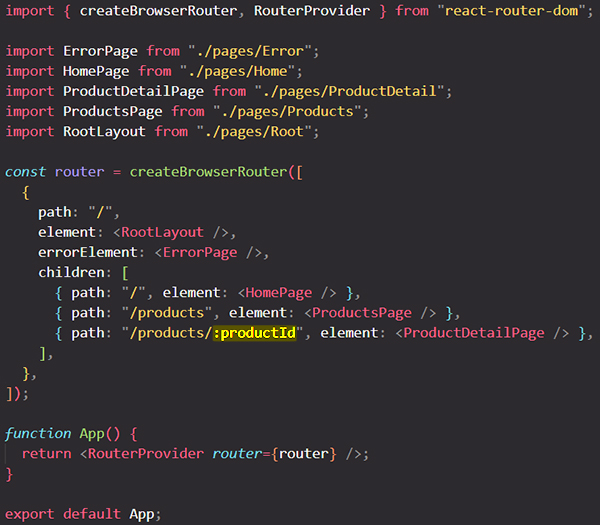

# Defining dynamic path segments (path parameter) & using them with `useParams` hook

`react-router-dom` supports ==**dynamic path segments** or **path parameters**. If a path segment starts with `:` then it becomes a "dynamic segment"==. When the route matches the URL, the dynamic segment will be parsed from the URL and provided as `params` to other router APIs.

You add a path parameter by adding a `:` and then any identifier of you choice:

```react
{ path: "/products/:productId" }
```

The `:` signals to `react-router-dom` that the part _after_ the `:` is dynamic. You could thereafter have more hard coded segments if you needed to, but the segment with the `:` is dynamic:

```react
{ path: "/products/:productId/newseg" } // only the :productId is a dynamic path segment, newseg is a hardcoded segment path
```

You can have multiple dynamic segments in one route path:

```react
{ path="/c/:categoryId/p/:productId" }
```

==Dynamic path segments (path parameters) helps us to always **render the same component for different paths (dynamic paths)**==.



## The `useParams` hook

==The `useParams` hook returns an object of key/value pairs of the dynamic params from the current URL that were matched by the `<Route path>`. Child routes inherit all params from their parent routes==. The `useParams` hook returns a JavaScript object which contains every dynamic path segment we defined in our route definition as a property.

==With `useParams` hook we can get the dynamic path data that's encoded in the URL==.


## References

1. [React - The Complete Guide (incl Hooks, React Router, Redux) - Maximilian Schwarzmüller](https://www.udemy.com/course/react-the-complete-guide-incl-redux/)
2. [Dynamic segments - reactrouter.com](https://reactrouter.com/en/main/route/route#dynamic-segments)
3. [`useParams` - reactrouter.com](https://reactrouter.com/en/main/hooks/use-params)
