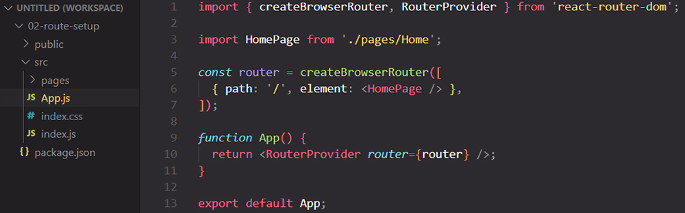
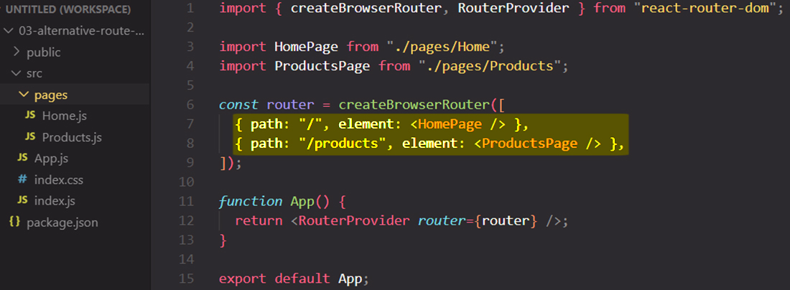
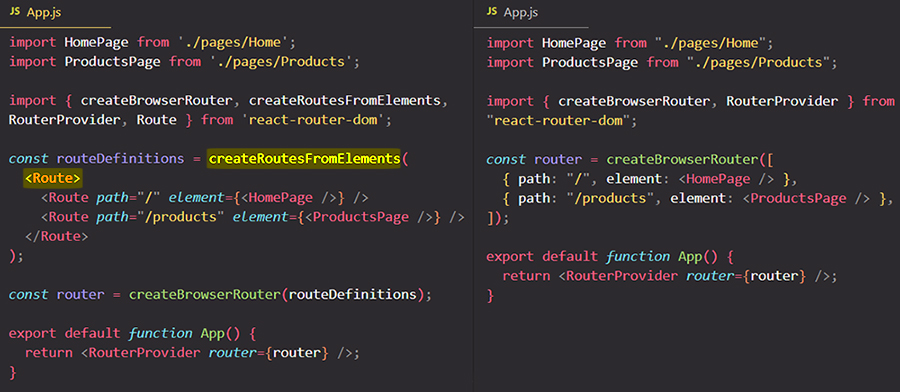
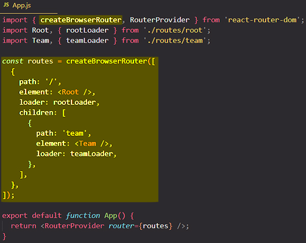

# Defining & using Routes

## Step 1. Define the route: import the `createBrowserRouter` function

The first step is to import the `createBrowserRouter` from `react-router-dom` package:

```react
import {createBrowserRouter} from 'react-router-dom';
```

==The `createBrowserRouter` is a function provided by `react-router-dom` package which allows us to **define our routes** that we wanna support in our application. Routes are simply **path<=>component mappings**; so for which path (`/products`) should which component (`<Products/>`) be loaded?==

To the `createBrowserRouter()` function we pass as an argument an ==array of **routes objects**==, where **every object represents _one_ route**. _To every object we add some properties to define the route characteristics, so these route objects take a couple of properties with which we configure the routes_.

### The `path` property

==One key property, which you will almost always add, is the `path` property. With `path` you **define the path for which the route should be active**==:

```react
const router = createBrowserRouter([{path: "/"}]);
const router = createBrowserRouter([{path: "/products"}]);
```

> **Note**: Just to be clear, the path is the part after the domain. So if you have a website like `https://example.com`, you can have a path like `/products`, or maybe only `/` if you're just on `https://example.com`.
>
> However, ==`https://example.com/` is a path, just as `https://example.com/products` is a path==.

### The `element` property

To establish a connection between your path and your component, you add another key property and that's the `element` property. ==The `element` property contains the JSX markup that should be loaded when the path is active==, so for the `element` property you set some JSX markup that should be rendered to the screen when the route is active.

```react
import Home from './components'

const router = createBrowserRouter([{
    path: "/",
    element: <Home/>
}]);
```

> **Note**: You could have any JSX markup in the `element` property, but very often you will simply render a single component that then represents the entire page that should be loaded.
>
> ```react
> const router = createBrowserRouter([
>   {
>     path: "/",
>     element: (
>       <div>
>         <h1>
>           <Home/>
>         </h1>
>       </div>
>     ),
>   },
> ]);
> ```

These are the first steps: we created the route object with its path, and we defined which component should be loaded when the route is active.

## Step 2. Use the route: the `RouterProvider` component

Another step is to use the router. To use it, we need store the returned value of the `createBrowserRouter()` function in a variable. We use that variable to tell React that the router stored in it should be rendered to the screen. To tell React that the stored router should be used, we need to import the `RouterProvider` component from the `react-router-dom` package.

==The `RouterProvider` has a special prop which we must set, and that is the **`router`** prop. The value we pass to the `router` prop should be a router created with `createBrowserRouter()` function==.



==Typically, you add a folder named 'pages' to hold the _components that will be **loaded as pages** by the router_==:



> Note: You don't have to name folder 'pages'. You can use the 'components' folder you already know, you could name it 'routes' or whatever you want. ==Is a good practice to separate pages folder with a name of 'pages' to clearly indicate that the components stored in there, whilst being regular React components, will be loaded with help of Routing==

`RouterProvider` is a regular component which we can use in our JSX markup, and we could of course wrap it with other JSX markup or add more JSX markup:

```react
function App() {
  return
    (<div>
       <p>
          <RouterProvider router={router}>
             <h1>This is wrapped!</h1>
          </RouterProvider>
       </p>
    </div>)
};
```

## Adding more routes



## Exploring an alternative way of defining routes

If you worked with older versions of `react-router-dom`, you defined all your routes with help of components and JSX markup instead of JavaScript objects in array.

In older versions of `react-router-dom`, instead of using JavaScript objects in array, you will import a function called `createRoutesFromElements` and a `Route` component for defining your application routes.



## References

1. [React - The Complete Guide (incl Hooks, React Router, Redux) - Maximilian Schwarzmüller](https://www.udemy.com/course/react-the-complete-guide-incl-redux/)
