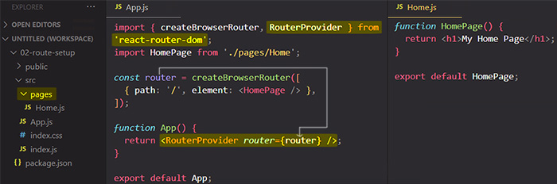

# Defining & using routes: `createBrowserRouter` function & `RouterProvider` component

## Step 1. Defining routes by importing the [`createBrowserRouter`](https://reactrouter.com/en/main/routers/create-browser-router) function

The first step is to import the `createBrowserRouter` from `react-router-dom` package:

```react
import {createBrowserRouter} from 'react-router-dom';
```

> **Note**: ==The `createBrowserRouter` is the recommended router for all React Router web projects==. It uses the [DOM History API](https://developer.mozilla.org/en-US/docs/Web/API/History) to update the URL and manage the history stack.


==The `createBrowserRouter` is a function provided by `react-router-dom` package which allows you to **define your routes** that you wanna support in your application. Routes are simply **path<=>component mappings**; so for which path (`/products`) should which component (`<Products/>`) be loaded?==

==To the `createBrowserRouter()` function you pass as an argument an **array of _routes objects_**, where **every object represents _one_ route**. To every object you add some properties to define the route characteristics, so these route objects take a couple of properties with which you configure every route==.

Routes are perhaps the most important part of a React Router app. They ==couple URL segments to components, data loading and data mutations==. Through route nesting, complex application layouts and data dependencies become simple and declarative.

Routes are objects passed to the router creation functions:


> **Note**: You can also declare your routes with JSX markup, [`createRoutesFromElements`](https://reactrouter.com/en/main/utils/create-routes-from-elements) and `<Route>` component, the props to the element are identical to the properties of the route objects:
>
> 
>
> Neither style is discouraged and behavior is identical.

### The `path` property

==One key property which you will almost always add is the `path` property. With `path` you **define the path for which the route should be active**==:

```react
const router = createBrowserRouter([{path: "/"}]);
const router = createBrowserRouter([{path: "/products"}]);
```

> **Note**: Just to be clear, the path is the part after the domain. So if you have a website like `https://example.com`, you can have a path like `/products`, or maybe only `/` if you're just on `https://example.com`.
>
> However, ==`https://example.com/` is a path, just as `https://example.com/products` is a path==.

### The `element` property

To establish a connection between your route path and your component, you add another key property and that's the `element` property. ==The `element` property contains the JSX markup that should be loaded when the route path is active==, so for the `element` property you set some JSX markup that should be rendered to the screen when the route is active.

```react
import Home from './components'

const router = createBrowserRouter([{
    path: "/",
    element: <Home/>
}]);
```

> **Note**: You could have any JSX markup in the `element` property, but very often you will simply render a single component that then represents the entire page that should be rendered on the screen.
>
> ```react
> const router = createBrowserRouter([
>   {
>     path: "/",
>     element: (
>       <div>
>         <h1>
>           <Home/>
>         </h1>
>       </div>
>     ),
>   },
> ]);
> ```

These are the first steps: you created the route object with its path, and you defined which component should be loaded when the route path is active.

## Step 2. Use the route object with the help of `RouterProvider` component

Another step is to use the router object. To use it, you need store the returned value of the `createBrowserRouter()` function in a variable. You use that variable to tell React that the router stored in it should be rendered to the screen. To tell React that the stored router should be used, you need to import the `RouterProvider` component from the `react-router-dom` package. All router objects are passed to `RouterProvider` component to render your app and enable the rest of the APIs.

==The `RouterProvider` has a special prop which you must set, and that is the **`router`** prop. The value you pass to the `router` prop should be a router created with `createBrowserRouter()` function==.



> **Note**: ==Typically, you add a folder named 'pages' to hold the _components that will be **loaded as pages** by the router_==. You don't have to name folder 'pages'. You can use the 'components' folder you already know, you could name it 'routes' or whatever you want. ==Is a good practice to separate pages folder with a name of 'pages' to clearly indicate that the components stored in there, _whilst being regular React components_, will be loaded with help of React Router==.

`RouterProvider` is a regular component which you can use in our JSX markup, and you could of course wrap it with other JSX markup or add more JSX markup:

```react
function App() {
  return
    (<div>
       <p>
          <RouterProvider router={router}>
             <h1>This is wrapped!</h1>
          </RouterProvider>
       </p>
    </div>)
};
```

## Adding more routes


## References

1. [React - The Complete Guide (incl Hooks, React Router, Redux) - Maximilian Schwarzmüller](https://www.udemy.com/course/react-the-complete-guide-incl-redux/)
1. [`createBrowserRouter` - reactrouter.com](https://reactrouter.com/en/main/routers/create-browser-router)
1. [`Route` - reactrouter.com](https://reactrouter.com/en/main/route/route)
