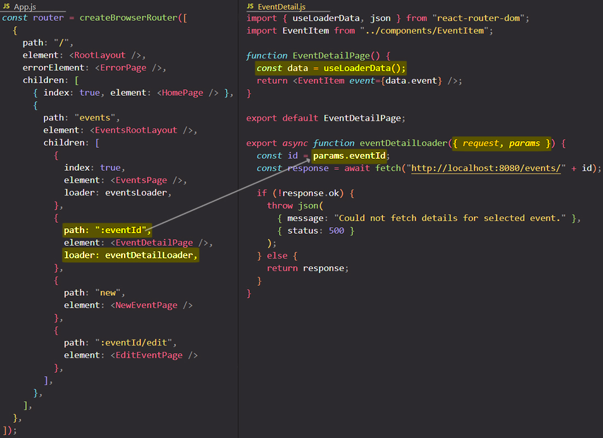

# Dynamic Routes & "loader" function

With a "loader" function you can get access to the route parameters because ==when the React Router will call the "loader" function passes to it an _object_ parameter that contains two important pieces of data which contains a `request` object and a `params` object.==

The `request` object parameter in a "loader" function could be used to access the URL to, for example, extract query parameters or anything like that.

==The `params` object contains all your route parameters==. With it, you can get access to all the route parameter values as you could do it with help of `useParams` hooks, but `useParams` hook could only be used inside a component function, not inside a "loader" function.

## References

1. [React - The Complete Guide (incl Hooks, React Router, Redux) - Maximilian Schwarzmüller](https://www.udemy.com/course/react-the-complete-guide-incl-redux/)