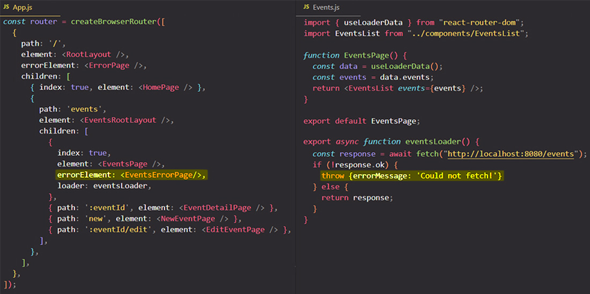
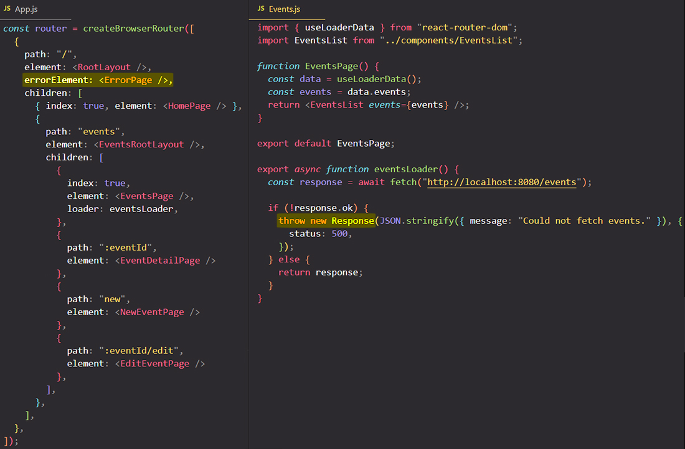
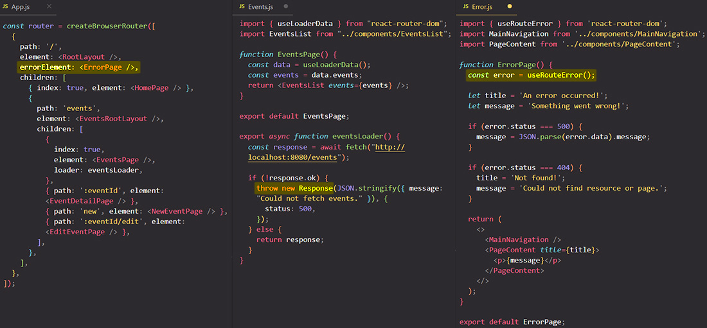
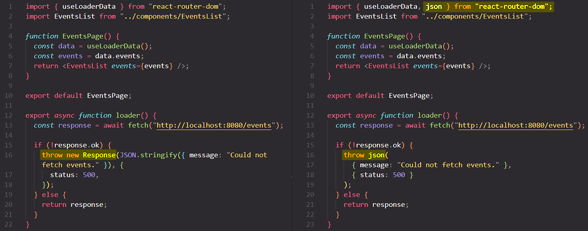
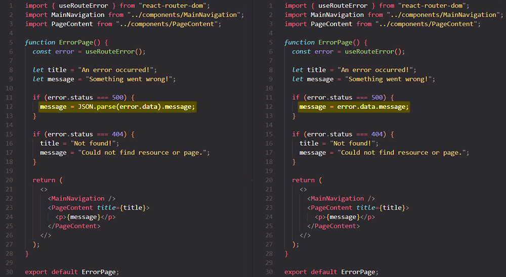
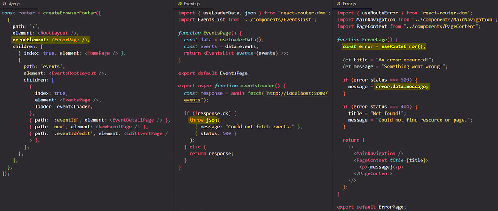

# Error handling within a "loader" function

You can [`throw`](https://developer.mozilla.org/en-US/docs/Web/JavaScript/Reference/Statements/throw) in your "loader" function to break out of the current call stack (stop running the current code) and React Router will start over down the "error path".

In your "loader" function you can `throw` an error. For this you can construct a new `Error` object with the built-in `Error` constructor, or **you can `throw` any other kind of object as an error**. ==When you `throw` in a "loader" function something special happens: React Router will simply render the closest `errorElement`==. 

You might remember we covered `errorElement`s earlier when we added an `errorElement` to the root route definitions to have a fallback page that would be displayed in case of 404 errors, so if we navigated to paths that aren't supported. Well, turns out that `errorElement` is not just there to show a fallback page in case of invalid route paths (that is one use case but not the only one). Instead, ==the `errorElement` page component will be shown to the screen whenever an error is generated in any route related code, including "loader" functions==.

You can add a single `errorElement` to the parent route because **errors bubbles up to the route chain**.

## Throwing `Response`s and extract error data with `useRouteError` hook

To differentiate between different errors like `404` or `500`, you can `throw` in your "loader" function a `Response` object and you can include some data into that `Response`.

You thrown an `Response` object with some data attached to it because ==you can actually get hold of the data that's being thrown as an error inside of the component that's being rendered as an `errorElement`== and for that `react-router-dom` gives you an hook called `useRouteError`. ==Inside of an `errorElement`], this hook returns anything thrown during an "loader"/"action" function or rendering==.

==The `useRouteError` returns an object, and the returned object depends on whether you threw a `Response` or any other kind of object or data==. If you threw a `Response` in your "loader" function, the `useRouteError` return an object that include a `status` property. This `status` property reflects the status of the `Response` you threw in the "loader" function.

If you threw a regular JavaScript object, then the object returned by `useRouteError` would be that thrown object, so then there would not be that special `status` property. But that's why you might wanna throw `Response` instead of regular objects because `Response` allow you to include the extra `status` property which helps with building a generic error handling page component.

## The `json()` utility function

When using React Router, you will from time to time construct `Response`, especially when it comes to throwing errors. Now constructing `Response` manually is possible but a bit annoying, that's why React Router gives you a little helper utility: the `json` function. `json` is function that can be imported from `react-router-dom`.

Instead of creating your `Response` manually and return it, you can return the result of calling `json`. ==`json` is a function that creates a `Response` object that includes data in the json format==.

Now with the `json` function you don't just have to type less code, but in the place where you use that `Response` data you also **don't have to parse the `json` format manually**. Instead, you can simplify the code because the parsing will now be done by React Router for you, so it is quite common to use the `json` function for building `Response`s with less effort.

## Final code example

## References

1. [React - The Complete Guide (incl Hooks, React Router, Redux) - Maximilian Schwarzmüller](https://www.udemy.com/course/react-the-complete-guide-incl-redux/)
2. [Throwing in Loaders - reactrouter.com](https://reactrouter.com/en/main/route/loader#throwing-in-loaders)
3. [`useRouteError` - reactrouter.com](https://reactrouter.com/en/main/hooks/use-route-error)
4. [`json` - reactrouter.com](https://reactrouter.com/en/main/fetch/json)