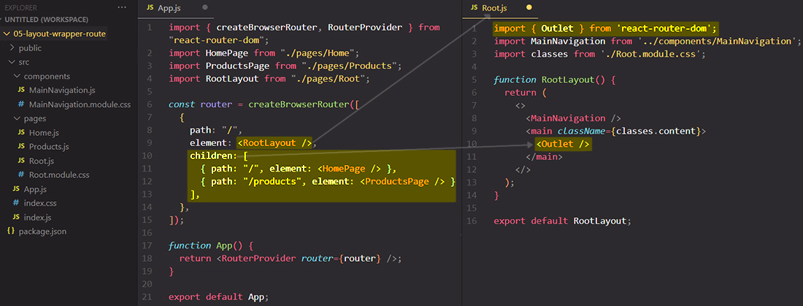

# Layouts & nested routes

The `<Outlet/>` component specifies ==where the content of the child routes should be rendered==.

## References

1. [React - The Complete Guide (incl Hooks, React Router, Redux) - Maximilian Schwarzmüller](https://www.udemy.com/course/react-the-complete-guide-incl-redux/)
