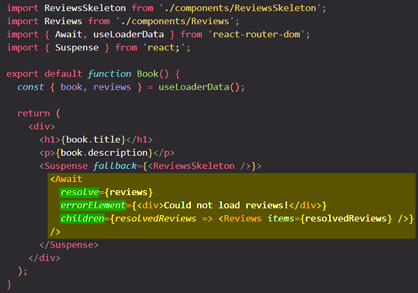
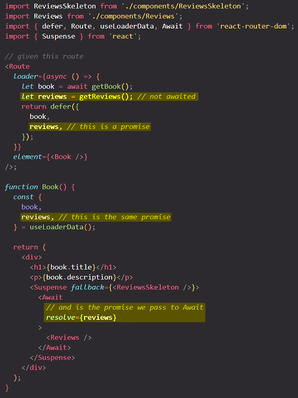
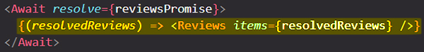
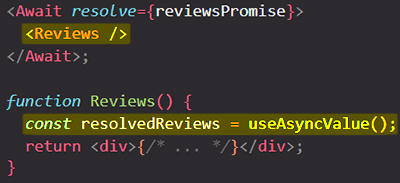
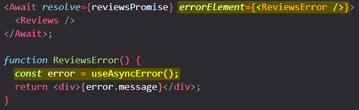

# More about the `<Await>` component

==`<Await>` component is used to **render [deferred](https://reactrouter.com/en/main/utils/defer) values** with _automatic error handling_==.

> **Note:** `<Await>` expects to be rendered inside of a `<React.Suspense>` or `<React.SuspenseList>` parent to enable the fallback UI.

## The `resolve` prop

==The `resolve` prop takes a promise returned from a [deferred](https://reactrouter.com/en/main/utils/defer) [loader](https://reactrouter.com/en/main/route/loader) value to be resolved and rendered==.

## `<Await>` children

==`<Await>` children can either be **React elements** _or_ a **function**==.

When using a function, the value is provided as the only parameter:

When using React elements, [`useAsyncValue`](https://reactrouter.com/en/main/hooks/use-async-value) will provide the data:

## The `errorElement` prop

==The error element renders instead of the children when the promise rejects. You can access the error with [`useAsyncError`](https://reactrouter.com/en/main/hooks/use-async-error).==

If the promise rejects, you can provide an optional `errorElement` to handle that error in a contextual UI via the `useAsyncError` hook.

==If you do not provide an `errorElement` prop, the rejected value will bubble up to the nearest route-level [`errorElement`](https://reactrouter.com/en/main/route/error-element) and be accessible via the [`useRouteError`](https://reactrouter.com/en/main/hooks/use-route-error) hook==.

## References

1. [`Await` component - reactrouter.com](https://reactrouter.com/en/main/components/await)