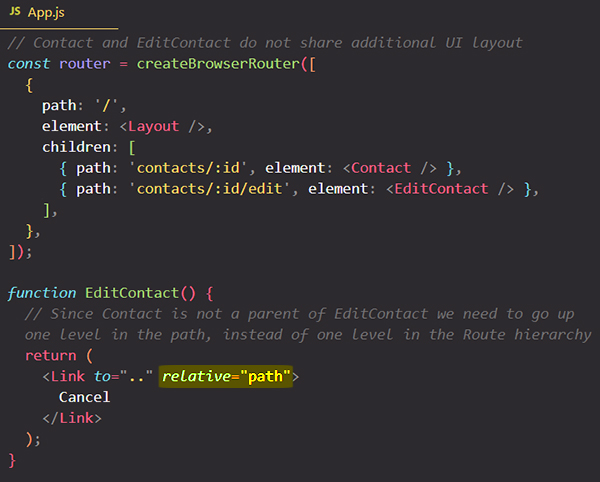

# Navigating between pages with `<Link>` component

When the [URL](https://reactrouter.com/en/main/start/concepts#url) changes we call that a "navigation". There are two ways to navigate in React Router:

- [`Link`](https://reactrouter.com/en/main/components/link)
- [`useNavigate`](https://reactrouter.com/en/main/hooks/use-navigate) hook

`<Link>` is the primary means of navigation. Rendering a `<Link>` allows the user to change the URL when they click it. React Router will prevent the browser's default behavior and tell the [history](https://reactrouter.com/en/main/start/concepts#history) to push a new entry into the [history stack](https://reactrouter.com/en/main/start/concepts#history-stack). The [location](https://reactrouter.com/en/main/start/concepts#location) changes and the new [matches](https://reactrouter.com/en/main/start/concepts#match) will render.

However, links are accessible in that they:

- still render a `<a href>` so all default accessibility concerns are met (like keyboard, focusability, SEO, etc.)
- don't prevent the browser's default behavior if it's a right click or command/control click to "open in new tab"

==A **`<Link>`** is an **element** that lets the user navigate to another page by clicking or tapping on it, without sending a new HTTP request==. In `react-router-dom`, ==**a** `<Link>` **renders an accessible** `<a>` **element with a real `href`** that points to the resource it's linking to==. This means that things like right-clicking a `<Link>` work as you'd expect.

Instead of setting a path with the `href` attribute (like you do for `<a>` tag),  ==`<Link>` component uses a `to` prop to setting a path==.

```react
import { Link } from "react-router-dom";

const ProductsPage = () => {
  return (
    <div>
      <h1>This is the Products Page</h1>
      <p>
        Go back to <Link to="/">Home Page</Link>
      </p>
    </div>
  );
};

export default ProductsPage;
```

```react
import { Link } from "react-router-dom";

const HomePage = () => {
  return (
    <>
      <h1>My Home Page</h1>
      <p>
        Go to <Link to="/products">the list of products</Link>
      </p>
    </>
  );
};

export default HomePage;
```

## Absolute & relative links paths

If a `<Link>` path starts with `/`, it is an absolute path. Paths that don't start with `/` are relative paths.

### Absolute links

==A link that have an absolute path it's added directly after the domain name==, not after the currently active route path (the route path they are rendered in):

```react
// Clicking the <Link> in the example below will always visit /products page
function ProductsPage() {
  return (
    <p>
      Go to <Link to="/products">the list of products</Link>.
    </p>
  );
}
```

### Relative links

==A relative link resolves relative to the parent route, which means that it builds upon the URL path that was matched by the _route that rendered that link_==.

```react
const routes = createBrowserRouter([
  {
    path: 'teams',
    element: <Teams />,
    children: [
      { path: ':teamId', 
      element: <Team /> 
    }],
  },
]);
```

The `<Teams>` component can render relative links like:

```react
<Link to="psg" />
<Link to="new" />
```

The full path it links to will be `/teams/psg` and `/teams/new`. ==Relative links _inherit the route within which they are rendered_==. This makes it so your route components don't have to really know anything about the rest of the routes in the app.

==By default relative links paths will be added after the currently active routes path (the route path they are rendered in). **Relative links are always relative to the route path they are *rendered in*, not to the full URL**==.

### Relative links & theirs `relative` prop

==When using the `<Link>` component, you also have a special `relative` prop which you can add to it. The `relative` prop can be set to one of two values, to `path` or `route`. With these values you control whether the segment defined on `<Link>` (in our case `products`) is _added relative_ to the **currently active _parent route path (the route path they are rendered in)**_ _or_ to the **currently active path in the _browser URL_**==.

```react
<Link to="products" relative="route" />	//the route path they are rendered in (default)
<Link to="products" relative="path" />	//the browser URL path
```

> Note: ==The `relative` prop does not matter if you have an absolute path==, always that absolute path is added after the domain name.
>
> ```react
> <Link to="/products" relative="path" />	// has no effect, the absolute path is ALWAYS added after the domain name
> ```

#### A short example:

Let say we have this routes definitions below :

```react
const router = createBrowserRouter([
  {
    path: "/",
    element: <RootLayout />,
    errorElement: <ErrorPage />,
    children: [
      { path: "", element: <HomePage /> },
      { path: "products", element: <ProductsPage /> },
      { path: "products/:productId", element: <ProductDetailPage /> },
    ],
  },
]);
```

==If you have a relative path, like `..` path which simply goes back, then the `relative` prop can be used to control the behavior of React Router. **A link can set to be "relative" to the _routes definitions_, or "relative" to the _browser URL_**. By default, the `..` in relative links traverse the route hierarchy, not the URL segments. Adding `relative="path"` allows you to traverse the path segments instead==.

```react
function ProductDetailPage() {
  return <Link to=".." relative="route">Go back!</Link> //remove one segment from the currently active parent route path. This path is resolved relative to the route definitions, so goes up one level to the parent route "/", because <ProductDetailPage> is a children of a parent route "/"
};

function ProductDetailPage() {
  return <Link to=".." relative="path">Go back!</Link> //remove one segment from the currently active path in the browser URL. This path is resolved relative to the browser URL, so goes up one level to the browser URL "/products"
};
```

```react
<Link to=".." relative="route" />   !==   <Link to=".." relative="path" />
// 		  goes to "/"						    goes to "/products"
```

> **Note**: `..` is a relative path that goes back _one level_ to the _previously_ active route/URL path. By default, links are relative to the route hierarchy, so `..` will go up one route level. Occasionally, you may find that you have matching URL patterns that do not make sense to be nested, and you'd prefer to use `relative="path"` routing. You can opt into this behavior with `relative`:

## References

1. [React - The Complete Guide (incl Hooks, React Router, Redux) - Maximilian Schwarzmüller](https://www.udemy.com/course/react-the-complete-guide-incl-redux/)
2. [`Link` - reactrouter.com](https://reactrouter.com/en/main/components/link)
3. [Navigating - reactrouter.com](https://reactrouter.com/en/main/start/concepts#navigating)