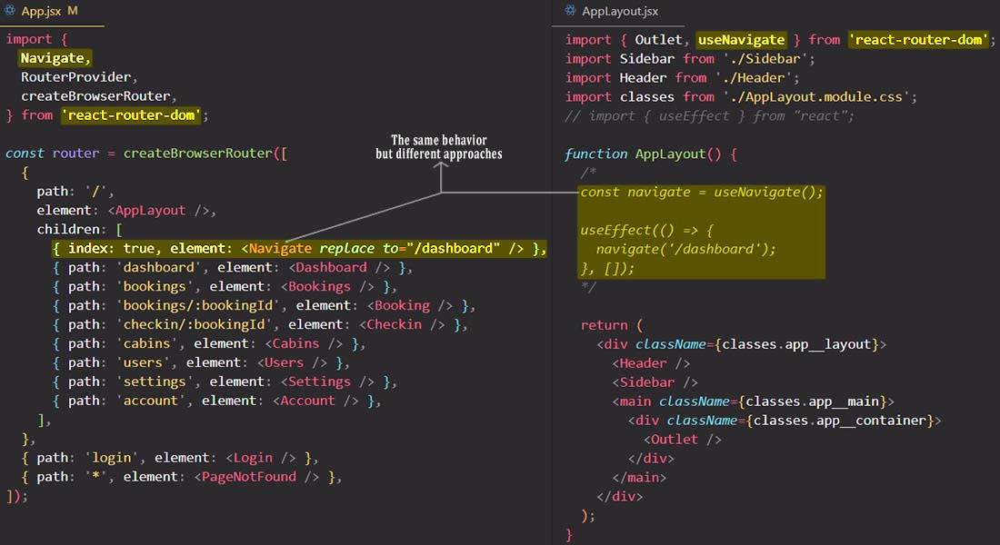

# Navigating programmatically with `<Navigate>` component

A `<Navigate>` element changes the current location when it is rendered. It's a component wrapper around [`useNavigate`](https://reactrouter.com/en/main/hooks/use-navigate), and accepts all the same arguments as props.

> **NOTE**: Having a component-based version of the `useNavigate` hook makes it easier to use this feature in a [`React.Component`](https://reactjs.org/docs/react-component.html) subclass where hooks are not able to be used.

If using `replace: true`, the navigation will replace the current entry in the history stack instead of adding a new one. Add only `replace` is the same as adding `replace: true`.

## References

1. [The Ultimate React Course: React, Redux & More - Jonas Schmedtmann](https://www.udemy.com/course/the-ultimate-react-course/)