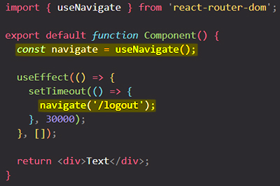
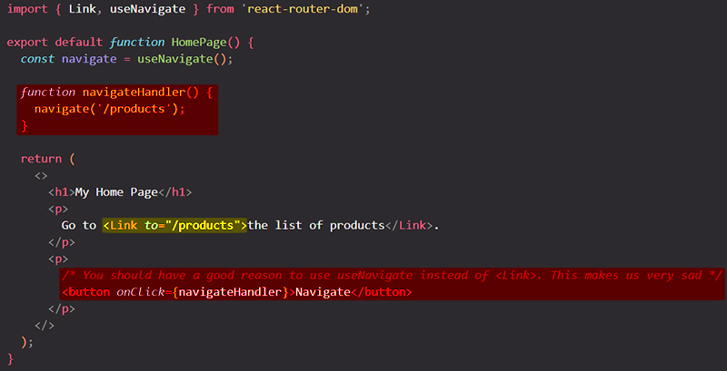

# Navigating programmatically with `useNavigate` hook

Up until now you only use **imperative routing**. You allow users to navigate between your app pages by providing links which can be clicked. This is the default way of providing navigation to users, but it's not the only way.

When the [URL](https://reactrouter.com/en/main/start/concepts#url) changes we call that a "navigation". There are ==two ways to navigate in React Router==:

- [`Link`](https://reactrouter.com/en/main/components/link)
- [`navigate`](https://reactrouter.com/en/main/hooks/use-navigate) hook

In some situations, for example maybe because some form was submitted or because some timer expired, ==you as a programmer (not the user) might want to trigger a navigation action from inside your React code==, and you can do this by using a hook provided by `react-router-dom`. To trigger a navigation action from inside your React code, you can import the `useNavigate` hook and use it in your components to get access to a navigate function. ==This navigate function can be called to trigger a navigation action, so to **switch to a different route from inside your code**==, so **programmatically**.

==**The `useNavigate` hook returns a function that allows you, the programmer, to change the URL whenever you want**==. You could do it on a timeout: 



> **Important**: You should have a good reason to use `navigate` instead of `<Link>`. This makes us very sad:
>
> ```react
> <li onClick={() => navigate("/somewhere")} />
> ```

Aside from links and forms, very few interactions should change the URL because it introduces complexity around accessibility and user expectations.

## Example



> **Note**: You should not create buttons and then navigate programmatically, simply use a links instead. I only use a button to show you how `useNavigate` function generally works.
>
> The button click triggered a function, and inside that function we then had the actual code, the programmatic imperative navigation code for moving to a different page.
>
> Again, you should use a link instead of a button but this is how you would navigate programmatically, if you would need to do so, for example, because some timer expired or anything like that.

## The `navigate` function has two signatures

- Either pass a `to` value (same type as `<Link to>`) with an optional second `options` argument (similar to the props you can pass to [`<Link>`](https://reactrouter.com/en/main/components/link)), or
- Pass the delta you want to go in the history stack. For example, ==`navigate(-1)` is equivalent to hitting the back button==.

#### `options.replace`

Specifying `replace: true` will cause the navigation to ==replace the current entry in the history stack instead of adding a new one==.

```react
import { useNavigate } from 'react-router-dom'

function Component() {
	const navigate = useNavigate();
  navigate("/account", { replace: true });
}
```

#### `options.state`

You may include an optional state value in to store in [history state](https://developer.mozilla.org/en-US/docs/Web/API/History/state).

#### `options.relative`

By default, navigation is relative to the route hierarchy (`relative: "route"`), so `..` will go up one `Route` level. Occasionally, you may find that you have matching URL patterns that do not make sense to be nested, and you'd prefer to use relative *path* routing. You can opt into this behavior with `relative: "path"`:

```react
// Contact and EditContact do not share additional UI layout
<Route path="/" element={<Layout />}>
  <Route path="contacts/:id" element={<Contact />} />
  <Route
    path="contacts/:id/edit"
    element={<EditContact />}
  />
</Route>;

function EditContact() {
  // Since Contact is not a parent of EditContact we need to go up one level in the path, instead of one level in the Route hierarchy
  navigate("..", { relative: "path" });
}
```

## References

1. [React - The Complete Guide (incl Hooks, React Router, Redux) - Maximilian Schwarzmüller](https://www.udemy.com/course/react-the-complete-guide-incl-redux/)
2. [Navigate function - reactrouter.com](https://reactrouter.com/en/main/start/concepts#navigate-function)
3. [`useNavigate` - reactrouter.com](https://reactrouter.com/en/main/hooks/use-navigate)