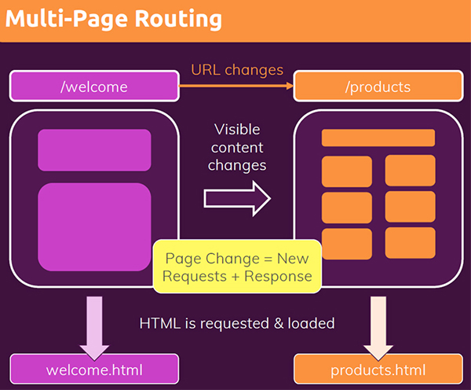
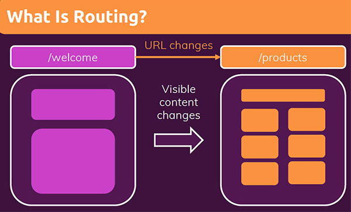

# Routing: multiple pages in single-page applications

To understand Routing, it's important to keep in mind how the web generally works. When you visit websites you can typically append a path like `/welcome` after the domain name and that loads, for example, the welcome page of a website. If you then type a different URL into the browser address bar, or if you click a link that changes the URL, for example `/products`, a different page gets loaded, so the visible content of the website changes. ==That's what Routing is all about: different **URL paths** load different content on the screen==.

In traditional websites, the browser requests a document from a web server, downloads and evaluates CSS and JavaScript assets, and renders the HTML sent from the server. When the user clicks a link, it starts the process all over again for a new page. The disadvantage is that you always have to request from the server a new HTML document (a new HTTP request is sent and a new response is received) and that can kind of break the user flow, it can introduce some lag and slow down your website, and it can therefore lead to a suboptimal user experience.

## Client Side Routing

React Router enables "client side routing". ==Client side routing allows your app to **update the URL** from a link click **without making another request for another document from the server**==. Instead, your app can immediately render some new UI and make data requests with `fetch` to update the page with new information. This enables faster user experiences because the ==browser doesn't need to request an entirely new document or re-evaluate CSS and JavaScript assets for the next page==. It also enables more dynamic user experiences with things like animation.

==Instead of loading new HTML files from the backend, we could add some client-side code that simply **watches the URL** and then loads a different React component when that URL changes==. With that, we're still in a SPA but we nonetheless support different URLs and therefore Routing.

Client side routing is enabled by creating a `Router` and linking/submitting to pages with `Link` and `<Form>`.

## References

1. [React - The Complete Guide (incl Hooks, React Router, Redux) - Maximilian Schwarzmüller](https://www.udemy.com/course/react-the-complete-guide-incl-redux/)
