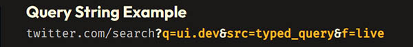
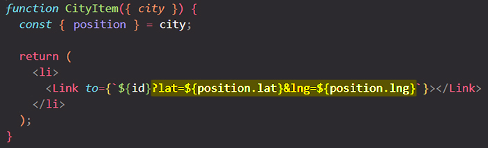

# Setting and reading a query string (search params)

You must have seen long URLs and looks a bit strange with something you type, for example:



 ==They're the **`?`** and **`&`** you see appended onto URLs.== They're a fundamental aspect of how the Web works as ==they allow you to **pass state via the URL**==. Above is an example of a query string you'd see if you searched for `ui.dev` on Twitter.

What's nice about this is it's ==**sharable**. You could copy and paste that URL into your browser right now and it would work.== All the data Twitter needs to properly render the UI is right there in the URL.

## How do you add a query string to your URL?



## How to read a query string from an URL?

You can read a query string by importing and using the [`useSearchParams`](https://reactrouter.com/en/main/hooks/use-search-params) hook from `react-router-dom`.

The `useSearchParams` hook is used to ==read and modify the query string in the URL for the current location==.

Like React's own `useState` hook, ==`useSearchParams` **returns an array of two values**: the **current location's** [search params](https://developer.mozilla.org/en-US/docs/Web/API/URL/searchParams) and a **function** that may be used to update them==. Just as React's `useState` hook, `setSearchParams` also supports [functional updates](https://reactjs.org/docs/hooks-reference.html#functional-updates). Therefore, you may provide a function that takes a `searchParams` and returns an updated version.

```react
import { useSearchParams } from 'react-router-dom'

const Results = () => {
  const [searchParams, setSearchParams] = useSearchParams();

  // Your example URL was twitter.com/search?q=ui.dev&src=typed_query&f=live
  // Here's how you would get the values from your query string
  const q = searchParams.get('q')
  const src = searchParams.get('src')
  const f = searchParams.get('f')

  return (
    ...
  )
}
```

> **Note**: `useSearchParams` is a bit similar to React `useState` hook, because it returns an array with the first element being the current state which you usually call the `searchParams`, and the second element being a function with which you can update the query string (`searchParams`).

## How to update a query string from an URL?

If you needed to update the query string, you could ==use `setSearchParams`, passing it an object whose key/value pair will be added to the url as `&key=value`==:

```react
import { useSearchParams } from 'react-router-dom'

const Results = () => {
  const [searchParams, setSearchParams] = useSearchParams();

  const q = searchParams.get('q')
  const src = searchParams.get('src')
  const f = searchParams.get('f')

  const updateOrder = (sort) => {
    setSearchParams({ sort })
  }

  return (
    ...
  )
}
```

> **Note**: The `setSearchParams` function works like [`navigate`](https://reactrouter.com/en/main/hooks/use-navigate), but only for the [search portion](https://developer.mozilla.org/en-US/docs/Web/API/Location/search) of the URL. Also note that the second arg to `setSearchParams` is the same type as the second arg to `navigate`.

## References

1. [The Ultimate React Course: React, Redux & More - Jonas Schmedtmann](https://www.udemy.com/course/the-ultimate-react-course/)
1. [A Guide to Query Strings with React Router - Tyler McGinnis](https://ui.dev/react-router-query-strings)
1. [ `useSearchParams` - reactrouter.com](https://reactrouter.com/en/main/hooks/use-search-params)