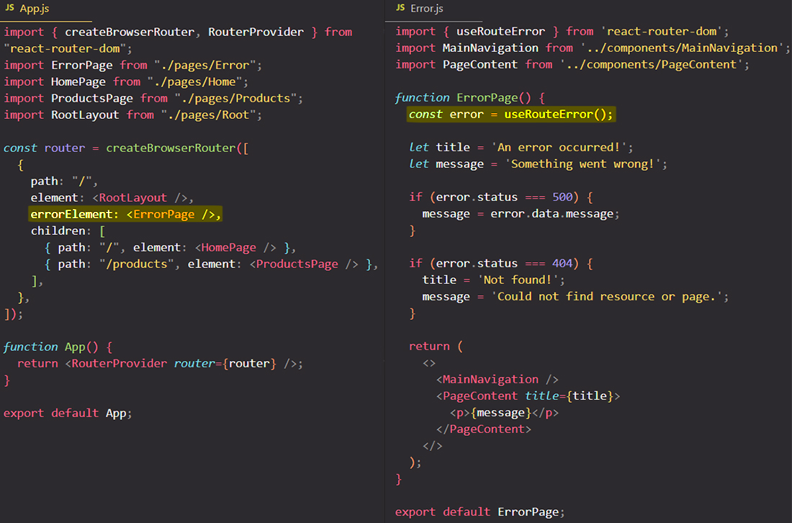

# Showing error pages with `errorElement` property & `useRouteError` hook

When you enter a URL that doesn't exist or when exceptions/errors are thrown in [loader](https://reactrouter.com/en/main/route/loader)/[action functions](https://reactrouter.com/en/main/route/action) or component rendering, the <code>react-router-dom</code> package will automatically generate an error. Instead of generate a default error, you can render a custom `ErrorPage` component. The error made/thrown will be available with [`useRouteError`](https://reactrouter.com/en/main/hooks/use-route-error).

With the <code>errorElement</code> property in your route definitions, you can specify a ==fallback page component that will be rendered if an error is created==.

Instead of generate a default error, render a custom `ErrorPage` component:

> **Important**: We recommend *always* providing at least a root-level `errorElement` before shipping your application to production, because the UI of the default `errorElement` is ugly and not intended for end-user consumption.

## Error bubbling

==When we enter a URL that doesn't exist or when exceptions/errors are thrown in "loader"/"action" functions or component rendering, the `react-router-dom` package will automatically generate an error, and that **error will automatically bubble up to the root route definition**, so to the route that is defined `path: "/"`==.

When a route does not have an `errorElement`, errors will bubble up through parent routes. If you do not provide an `errorElement` in your route tree to handle a given error, errors will bubble up and be handled by a default `errorElement` which will print the error message and stack trace.

> **Important**: Put an `errorElement` at the top of your route tree and handle nearly every error in your app in one place. Or, put them on all of your routes and allow the parts of the app that don't have errors to continue to render normally. This gives the user more options to recover from errors instead of a hard refresh.
>
> Is recommend to always providing at least a root-level <code>errorElement</code> before shipping your application to production, because the UI of the default <code>errorElement</code> is ugly and not intended for end-user consumption. If you do not provide an <code>errorElement</code> in your route tree to handle a given error, errors will bubble up and be handled by a default <code>errorElement</code> which will print the error message and stack trace.

##  Throwing errors manually

==While `errorElement` handles unexpected errors, it can also be used to handle exceptions you expect==. Particularly in "loader"/"action" function, where you work with external data not in your control, you can't always plan on the data existing, the service being available, or the user having access to it. In these cases you can `throw` your own exceptions. As soon as you know you can't render the route with the data you're loading, you can throw to break the call stack.

==You can throw anything from a "loader"/"action" function, just like you can return anything: responses, errors, or plain objects==.

### Throwing Responses

==While you can throw anything and it will be provided back to you through `useRouteError`, if you throw a [`Response`](https://developer.mozilla.org/en-US/docs/Web/API/Response), React Router will automatically parse the response data before returning it to your components. Coupled with [`json`](https://reactrouter.com/en/main/fetch/json), you can easily throw responses with some data and render different cases in your boundary. This makes it possible to create a general error boundary, usually on your root route, that handles many cases==.

## The `useRouteError` hook

==Inside of an `errorElement`, the `useRouteError` hook returns anything thrown during a "loader"/"action" function or rendering==:

## References

1. [React - The Complete Guide (incl Hooks, React Router, Redux) - Maximilian Schwarzmüller](https://www.udemy.com/course/react-the-complete-guide-incl-redux/)
2. [`errorElement` - reactrouter.com](https://reactrouter.com/en/main/route/error-element)
3. [`useRouteError` - reactrouter.com](https://reactrouter.com/en/main/hooks/use-route-error)
